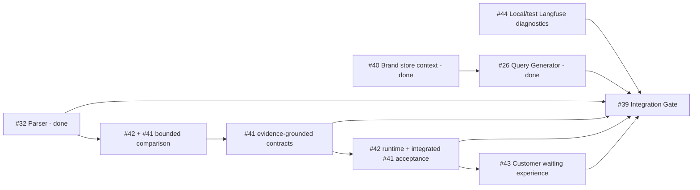

# Design: M4 Parent Contract and Integration Gate

## Design role

This is an architectural parent contract, not a shared implementation module.
It fixes ownership, dependency direction and final evidence while leaving each
Schema, Prompt, task graph, page and telemetry adapter in its child Change.
Creating a parent service, generic workflow engine, second attempt store or
cross-module database access is outside this design.

## Affected slice

The initial native relationships were recorded on 2026-09-02. The 2026-09-04
execution reconciliation keeps only dependencies that block the next Issue-level
action:

- #39 has native Sub-Issues #26, #32 and #40–#44;
- #40 and #26 are complete, so their stale native blocker is removed;
- #32 is complete and its stale activation blocker has been removed;
- #41 is not a native blocker of #42 because the two owners first compare
  context/Prompt/task candidates and then integrate the selected contract;
- #42 blocks #43;
- #44 is complete and has no child dependency.

Parent/Sub-Issue represents one M4 outcome. Native Dependency represents the
next Issue-level block, not every phase exchange inside an open architectural
Issue. #42 therefore remains one Issue with two independently reviewable PR
slices rather than creating another Issue or two opposing blockers.

## Cross-task interface registry

| Producer | Stable handoff | Consumer | Producer owns | Must not cross the seam |
| --- | --- | --- | --- | --- |
| #40 Brand Knowledge | Versioned `EvaluationPurposeBrandView` and immutable Evaluation Brand Snapshot v3 containing validated store-location semantics, chosen Query locality, main product/service and peer characteristics; semantic fingerprint | #26 and existing GEO definition preparation | Editable Brand facts, external location adapter, validation, fingerprint, projection, authorized empty-development v3 activation | Query cannot call AMap, read Brand tables/reference JSON, reinterpret locality or rewrite old snapshots |
| #26 Query Generator | One accepted immutable ordered Definition with the existing four question kinds and generator identity | Official evaluation start and the 20 logical sample positions | Prompt/model contract, one durable preparation per fingerprint, retry/fallback and final question content | No extra official questions, refresh on unchanged fingerprint, customer editing, map access or fact research |
| #32 Sample Parser | One accepted per-sample semantic record with hard literal mention/rank evidence and customer-safe `cardInterpretation`, or explicit unavailable state | Report projection and #41 synthesis context | Prompt, model-output projection and only evidence-backed recovery for per-sample semantics | No metric calculation, cross-sample grouping, frontend-only masking, invented mention/rank or resampling to repair copy |
| #41 Overall Synthesis | Accepted report semantic proposal: customer narratives, evidence-linked themes/directions and obvious brand entity groups | Deterministic report assembly and #42's selected task topology | Compact synthesis input, Prompt/model contract, source-grounded grouping proposal and customer quality | No deterministic metric rewrite, global brand master, default web research, raw internal enum/ID/field exposure or #32 parser ownership |
| #42 Performance | Purpose-level task graph plus authoritative stage timing/budget evidence and a customer-safe progress projection with per-platform expected/acquired/analyzed/available counts | #43 waiting UI and #39 Gate | Scheduling/orchestration at existing owner seams, route budget, limiter, timeout, retry, idempotency and performance evidence | Queue or telemetry cannot own business truth; parallelism cannot issue concurrent duplicate Provider requests or duplicate accepted evidence or reports; no speculative workflow platform |
| #43 Waiting UI | Responsive presentation over generated REST/OpenAPI progress types and existing notification reads | Terminal customer | Per-platform status display, truthful stage-local easing, long-wait content, responsive/accessibility behavior | No scheduling policy, fabricated platform completion, Provider/retry/queue detail, new WebSocket authority or report-page redesign |
| #44 AI telemetry | Explicit local/test diagnostic projection for versioned task input, normalized output/failure and correlation; production metadata-only default | Human debugging only | Environment gate, allowlist/mask, non-blocking exporter behavior and telemetry tests | Langfuse cannot drive retry, report, evidence, progress or history; no credentials/raw envelopes/unneeded answers; no production content without a new approval |

## Ownership and dependency direction

- Brand Knowledge remains the only owner of editable and externally validated
  store facts. GEO Intelligence freezes only the Brand-owned projection.
- GEO Intelligence remains the owner of Definition, Run, samples, accepted
  semantics, deterministic metrics, synthesis acceptance and report history.
- AI Execution owns append-oriented attempts and provider-neutral execution
  envelopes. It does not accept business evidence or report truth.
- Background Work/BullMQ owns delivery and resumption only. #42 may partition
  purpose work but may not introduce a second lifecycle authority.
- Notification remains the durable customer-result inbox. #43 consumes normal
  durable reads and the existing refresh hint rather than creating realtime truth.
- Langfuse remains optional observability. Content capture is an environment-
  gated projection, not a copy of the business evidence model.

## Compatibility, failure and rollback boundary

| Reachable boundary | Owner | Required protection before integration |
| --- | --- | --- |
| Location provider unavailable, ambiguous or forged client result | #40 | Customer-actionable fallback, server validation, source identity and no partial Brand write |
| Current v3 history or evaluation opportunity is changed | GEO owners | Preserve frozen accepted records and semantic fingerprint; #40 empty-development activation does not require v1/v2 compatibility |
| Query preparation duplicates paid calls or yields incomplete Definition | #26 | Durable idempotency, bounded retry/fallback, no startable partial question set |
| Parser returns structural debris or recoverable optional noise | #32 | Prompt-first correction and narrow owner-local projection/fallback while hard evidence still rejects unsupported meaning |
| Synthesis leaks internals or misses obvious name grouping | #41 | Customer-copy contract, evidence/reference checks, obvious grouping replay and uncertain-name independence |
| Parallel tasks duplicate work, amplify rate limits or change metrics | #42 | Purpose budgets, concurrency/limiter, business idempotency, timing/cost evidence and same-report semantic comparison |
| Waiting page gets ahead of durable work | #42 + #43 | Server-derived counts/stage; easing cannot cross the current stage or reach 100% before completion |
| Telemetry content or exporter crosses authority/privacy boundary | #44 | Explicit local/test mode, credential-safe mask, production metadata-only test and exporter-failure isolation |

Each child Change owns its own migration and application rollback. This parent
PR changes documentation only and can be reverted without data or runtime
effects. The final Gate must reject integration when a child cannot state a
safe rollback or compatible forward path.

## Integration sequence

1. **Parent and completed producers:** parent approval completed on 2026-09-02;
   #40, #26, #32 and #44 are integrated and reconciled on protected `main`.
2. **Source-quality comparison:** compare Parser instructions and then synthesis
   context/topology in bounded stages. Preserve sampling and inspect raw output
   separately from recovery. Route new Parser implementation by explicit owner.
3. **Evidence-led selection:** #41 and #42 compare the same accepted inputs;
   choose a task boundary after quality, cost and latency evidence and approval.
4. **Contracts and execution:** #41 owns semantic contracts; #42 owns required
   runtime. Use independently acceptable main slices or a genuine linear stack.
5. **Actual acceptance:** close #41 only after the selected contract is wired to
   the real report path and customer quality passes. #42 proves runtime recovery,
   timing, cost and truthful progress; no native dependency cycle is introduced.
6. **Waiting activation:** #43 starts its write only after #42's public progress
   contract is stable, then verifies the same generated contract across desktop,
   narrow viewport, refresh, leave/return, multi-brand and partial-unavailable
   states.
7. **Final parent Gate:** every child PR is rebased/merged through current
   protected `main`; one separately authorized representative-store run proves
   the integrated customer and operational outcome. Parent current-spec
   reconciliation and archive happen only after this Gate.

PR #45 remains a session-scoped Partial PR with the ordinary reference
`Part of #39 — does not close`; it is not the native closing link for the parent.
Only after every final Gate row passes may the final acceptance PR use bare
`Closes #39`, creating GitHub's native Linked PR/closing relationship for the
complete parent outcome.

## Final Integration Gate

The Gate is a review result over the integrated revision, not an extra feature
PR. It reports `ready`, `ready with follow-up`, or `not ready` and covers all
axes below.

| Gate claim | Smallest discriminating evidence | Blocking result |
| --- | --- | --- |
| Store context and four questions express the approved product meaning | Snapshot v3 contract/migration evidence plus product review of the exact four questions from one valid store | Missing/ambiguous locality or main product/service; mechanical or off-category open question |
| History and evaluation opportunity remain truthful | current-v3 frozen Definition/Run/report checks and relevant migration evidence | Rewritten historical JSON/report or a representation-only new opportunity |
| Per-sample and synthesis customer copy is safe | Protected replay for `}}}`, internal enum/UUID/field leakage and obvious/uncertain brand-name cases | Structural fragment or internal identifier reaches the public report; fuzzy grouping merges uncertain brands |
| Metrics and evidence semantics are unchanged | Before/after deterministic report reproduction plus 4×5 comparison over retained evidence | Agent/queue changes counts, index, rank, 17/20 meaning or accepted evidence |
| Performance change is material and explainable | Stage baseline and selected-budget table; same-store controlled run showing queue wait, Provider, projection, retry and assembly timing | No measured improvement, unexplained retry amplification, or missing cost/concurrency boundary |
| Waiting progress is truthful and usable | API/contract tests plus browser inspection for desktop/narrow, refresh, leave/return, multi-brand, partial unavailable, completion and terminal retry | Fabricated platform completion, leaked internal retry/Provider detail, or 100% before durable completion |
| Local diagnostics work without production content capture | Unit/integration evidence for metadata-only default, explicit local diagnostic, credential mask and exporter failure | Production mode exports content by default, secrets leak, or telemetry affects business outcome |
| Coordination and current truth are reconciled | All child Issues/PRs, native dependencies, Required Checks, fixed-diff reviews, owner-local specs and evolution markers agree on the final revision | Stale base, unresolved review, accepted design only in a Change/PR, or unowned residual work |

The controlled real 4×5 row remains `not run` until the product owner separately
authorizes Provider calls and supplies the evidence-retention boundary. Local
tests, a Draft PR or this proposal cannot satisfy that row.

## Current design impact and stopping condition

- Parent Propose documentation impact: `add` active Change; `update` transcript
  source inventory; current specs remain unchanged.
- Child acceptance impact: each child reconciles its owner-local current spec,
  executable contract and architecture overview as applicable.
- Parent stopping condition for this session: documents and hashes verify, fixed
  diff review has no unresolved material finding, product approval is recorded,
  PR #45 remains scoped to this session, and its Partial PR association with
  Issue #39 is verified without a closing relationship.
- Parent completion condition: every Integration Gate row passes or has explicit
  owner-approved risk disposition, current truth is reconciled, the Change is
  archived, the final PR has the native `Closes #39` relationship, and
  branch/worktree exit is recorded.
