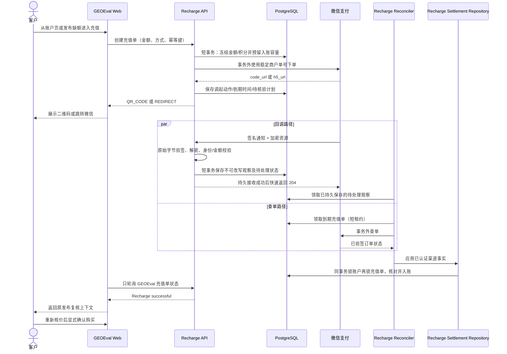
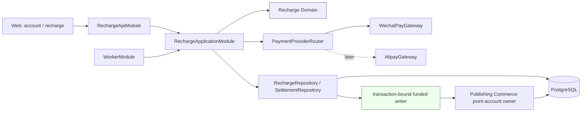
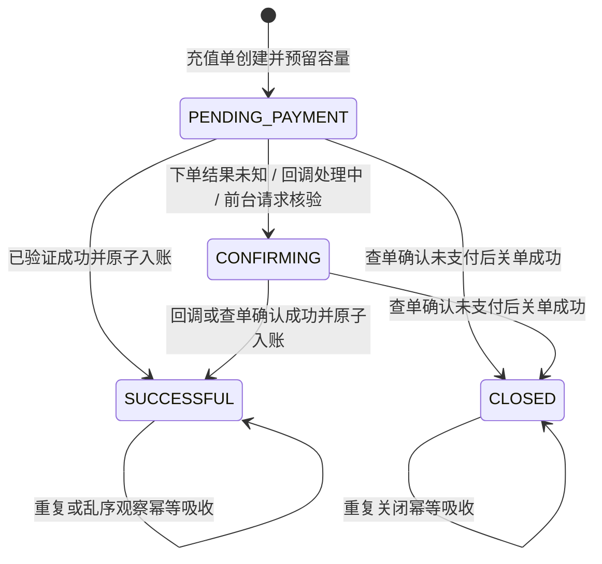

# Recharge payments design

方案日期：2026-09-08。架构 owner：[Issue #77《建立真实充值核心与微信网页支付链路》](https://github.com/ZETAVI/GEOEval/issues/77)；申请与资产准备继续属于 [Issue #75](https://github.com/ZETAVI/GEOEval/issues/75)。

Status: P0 proposed design with owner-confirmed module direction; no runtime activation. Control: [proposal](proposal.md). Sequence: [tasks](tasks.md). This file replaces the local research candidate and does not replace current specs.

本次批注已确认 PC Native → 手机外部浏览器 H5 的推进顺序，并明确认可在 Publishing Commerce 内独立装配积分能力。Node 实现已在协议例证验证后选用标准 crypto 与窄 HTTP Adapter；一个活动充值单和实际异常资金处置细节不视为自动获批。本文在原位置修正，不建立第二版架构文件；具体协议证据由 [微信 APIv3 接口简报](source-brief.md)持有。

## 1. 建议结论

建立一个业务能力明确的 `Recharge` 模块，由它拥有充值订单、支付渠道协调、支付事实核验、异常恢复和成功入账编排。微信支付、支付宝是 `Recharge` 内部的 Provider Adapter；不要先创建一个能处理任意资金业务的通用 `Payment Platform`。

Publishing Commerce 继续拥有积分账户和追加式积分流水，并向 Recharge 的 PostgreSQL 基础设施暴露一个窄的、事务绑定的 funded writer。支付成功的外部证据先在数据库事务外完成验签、解密或查单，随后由 Recharge settlement repository 打开一个短事务，在同一事务中锁定充值单和积分账户、推进充值成功、写一条 `RECHARGE` 类型的 funded 流水并更新余额。任何 Provider 网络调用都不得进入该事务；领域层和应用层也不暴露数据库 transaction client。

首批实现按两条独立验证切片推进：

1. 微信 Native：覆盖 PC 网页二维码、回调、查单、关单和一次入账；
2. 微信 H5：覆盖 iOS/Android 外部手机浏览器的跳转、返回确认和恢复。

微信内网页需要 JSAPI，不属于 H5 的兼容模式；只有产品确认首批必须在微信内闭环时才单独纳入。支付宝沿用同一个 `Recharge` 核心，后续增加电脑网站支付和手机网站支付适配器。

## 2. 当前项目事实与不变边界

当前受保护 `main@0552aa7e60d5aa6b99645692e6090e64544087d5` 已接受以下事实：

- 客户充值人民币整数，按 `1 元 = 10 积分`增加 funded 积分；只有确认支付成功才入账；
- 客户可见充值状态是 **待支付 / 确认中 / 充值成功 / 已关闭**；取消、失败和过期不入账；
- 充值成功后返回既有发布订单复核上下文，重新检查价格与可用性并要求客户再次确认，不能自动购买；
- Publishing Commerce 拥有账户级 `grantedBalance`、`fundedBalance`、账户序号和追加式 PointChange；
- 发布购买已经通过一个 PostgreSQL 短事务完成账户、选择、文章、套餐、媒体、流水和订单的一致提交；Provider、队列和用户交互都不得在其中发生；
- 当前真实支付未启用，前端充值入口仍禁用，当前规范也没有真实支付成功、退款或发票能力。

本方案不改变上述语义，也不把充值与发布购买合并为一个长事务。支付和消费是两个由客户明确触发、可分别恢复的业务过程。

## 3. 术语与所有权

| 名称 | 含义 | 所有者 |
| --- | --- | --- |
| Recharge Order | 客户以固定人民币金额购买固定 funded 积分的业务单 | Recharge |
| Payment Attempt | 针对某个充值单，在具体 Provider/产品上发起支付的可恢复尝试；首批一个充值单只允许一个活动尝试 | Recharge |
| Authenticated Payment Observation | 已证明来自渠道的事实；是否匹配本地充值单必须由 Recharge 再校验 | Provider Adapter 认证；Recharge 保存和应用 |
| Point Account / Point Change | 账户积分余额、序号和不可改写流水 | Publishing Commerce |
| Publishing Selection / Purchase | 保存的发布意图、重新报价和显式购买 | Publishing Commerce |

删除测试：如果未来删除微信适配器，Recharge Order、funded 入账、发布复核与支付宝适配器仍应成立；如果删除 Recharge，Publishing Commerce 的积分购买仍能工作。这个结果说明业务能力和渠道协议没有互相吞并。

首批不单建 PaymentAttempt 表；一个 RechargeOrder 上保存唯一活动渠道身份和调起状态即可。只有出现同一业务单多次独立扣款尝试、跨渠道切换或退款生命周期后，才根据真实复用需求拆出独立实体。

## 4. 端到端链路



浏览器不直接查 Provider，也不把二维码扫描、H5 返回、JS Bridge 返回或客户端文案视为成功。浏览器只读取 GEOEval 自己的充值订单状态。

## 5. 模块与依赖方向



建议目录形态：

```text
apps/backend/src/recharge/
  domain/
    recharge-order.ts
    payment-gateway.ts
    verified-payment-observation.ts
  application/
    recharge.service.ts
    payment-confirmation.service.ts
    recharge-reconciler.ts
  infrastructure/
    postgres-recharge.repository.ts
    postgres-recharge-settlement.repository.ts
    wechat-pay.gateway.ts
    alipay.gateway.ts              # 后续
  presentation/
    recharge.controller.ts
    wechat-pay-callback.controller.ts
  recharge-application.module.ts
  recharge-api.module.ts
```

`RechargeApplicationModule` 供 API 和 Worker 共用，不能依赖 HTTP Controller；`RechargeApiModule` 只装配客户接口和 Provider 回调。Worker 不应为复用 Recharge 而加载文章、媒体或 Web 表现层。

### 5.0 与现有模块的冲突及最小收束

基线除 main 外，另审阅 [PR #76 固定提交 2658295 的履约设计](https://github.com/ZETAVI/GEOEval/blob/2658295805238bef7a09d8047c6aafdf3632edc8/openspec/changes/establish-publication-delivery/design.md)。它是已批准的在研方案，尚未合入 main。

| 责任 | 明确 owner / 入口 | 跨模块边界 |
| --- | --- | --- |
| 登录、角色、用户停用、客户请求 CSRF | Identity | Recharge 消费 Principal；回调仅使用精确路由的公开访问/CSRF 豁免与渠道密码学验证 |
| 充值金额、订单、收款事实、收单恢复 | Recharge | 不拥有发布承诺、履约状态、积分消费规则 |
| 余额、积分来源、账务序号、流水、容量预留 | Publishing Commerce 内部的积分账户能力 | 赠点、购买、充值、订单退点都经过同一个账户规则；不能由 Recharge 另写一套余额算法 |
| 发布选择、价格复核、购买与原消费 | Publishing Commerce | 支付完成不直接调用购买命令 |
| 责任人、发布结果、协商退点意图/资格 | Publication Delivery | 不写积分余额；退点实际执行仍由 Commerce 拥有 |
| 公网通知解析、请求签名、响应验签 | Recharge 的渠道适配器 | 返回已认证渠道事实；与本地订单的最终匹配由 Recharge settlement 在事务中执行 |

现有 `PublishingCommerceModule` 把媒体、文章接缝、Controller 和积分 providers 一起装配且未导出窄入口。首批必要重构是从其中分出 `CommercePointsModule`（仍位于 publishing-commerce 内），仅装配账户/流水/预留策略及事务绑定 writer；购买与退点沿用，API/Worker 只导入所需装配。不要提前把它迁出为通用 Wallet 服务，也不要用 `forwardRef` 绕过循环。

原方案“RechargeOrder → PointAccount”的锁顺序统一改为 **PointAccount → RechargeOrder/Delivery settlement → 当前操作的观察或执行记录**，与购买 wallet-first 和 #73 退点 wallet-first 对齐。后台领取任务的短事务可以只锁任务行，但必须提交后才执行 settlement；禁止持有任务锁再反向获取钱包锁。

### 5.1 方案比较

| 方案 | 优点 | 主要代价 | 结论 |
| --- | --- | --- | --- |
| Recharge 拥有业务单，Commerce 暴露窄 funded writer | 充值语义集中；复用现有积分账本；Provider 可替换；发布购买不感知微信 | 需要固定一个跨模块事务端口 | **推荐** |
| 全部放进 Publishing Commerce | 少一个顶层模块 | 支付协议、回调、对账和发布购买耦合；Worker 需加载无关依赖 | 不采用 |
| 先建通用 Payment Platform，再由 Recharge 调用 | 理论上可扩到退款、订阅、分账 | 当前没有第二种稳定资金语义；接口会由猜测驱动 | 暂不采用；出现真实复用边界再提取 |

跨模块事务端口已经有先例：当前发布购买让文章和媒体窄 reader 使用 Commerce 打开的同一 transaction connection。这里沿用同一依赖原则，但写入所有者仍是积分账户模块。

## 6. 核心接口草案

### A0 实现卡：独立微信协议适配

- 已确认执行范围：[Decision](https://github.com/ZETAVI/GEOEval/issues/77#issuecomment-5582243258)。main-direct，base 0552aa7，唯一 #77 分支；运行时没有装配或环境变量读取，不依赖 Nest/Prisma/Commerce。
- 业务 gateway 拥有 Native 发起、按商户单号查单、关单；协议入口另接受原始通知和未合并头部。内部拆分成熟 crypto 原语、单次 HTTPS 传输和微信字段解释；测试在真实外部 I/O seam 替换 transport，生产默认固定官方 HTTPS origin/TLS。
- 查询携带被冻结的 merchant/app/order/amount 期望值。普通查单文档已成功读到：非成功状态可缺少 transaction_id/trade_type/amount；不得要求未支付单包含支付成功字段。SUCCESS 要形成可用支付证据则至少具备订单金额、币种、交易号和支付时刻；query 的选填 payer 字段保留 nullable，通知的必填 payer_total/payer_currency 不混用 query 规则。
- 下单结果只给 QR 动作与原订单到期时刻，不以调用时刻不断延长二维码期限。关闭只认对应请求上下文的已验签空 204。Notification 证明渠道来源并保留原商户身份，匹配本地充值与持久化仍由下一切片负责。
- 失败只返回有界类型码和必要 HTTP 状态；不带原文、Authorization、OpenID 或异常 cause。所有 Provider 调用最多一次，超时/错误不能释放容量。原始报文验签先于解码/字段解释，调用输入与配置快照不受外部后续修改影响。
- 配置只经明确构造参数进入，使用 Node KeyObject/32-byte APIv3 key 与复制的可信 key 集合；无 HTTP downgrade、通用 skip-signature 或不验证 TLS 的产品配置。测试 CA/路由改写只存在于测试传输替身。
- 无数据迁移；退出是移除未装配模块或保持不装配。最小反证：官方独立固定签名、成功/未支付字段差异、错身份/金额、204、密文/重复头/时效、请求体变更、TLS/截断/总时限、每次调用一个请求。实际 A0 测试不由旧 probe 成绩替代。

### 6.1 Provider 端口

A0 已实现的业务接口与类型由 [payment-gateway.ts](../../../apps/backend/src/recharge/application/payment-gateway.ts)持有，不在这里复制另一份签名。PaymentGateway 提供 Native initiate/query/close；PaymentNotificationVerifier 是独立协议入口，接受原始 Buffer 与未合并的头部值列表。WechatPayGateway 不依赖数据库或应用装配。

查询核对调用前复制的冻结 merchant/app/order/amount；通知返回原有渠道身份，允许后续 inbox 将未知/错配订单作为差异处理，不能直接入账。关单结果与支付事实分开，只有对应调用的已验签空 204 形成 CLOSE_ACKNOWLEDGED。QR 动作返回原订单支付期限，不承诺每次调用都获得新的二维码有效期。

内部 HTTPS transport 返回有界原始响应；gateway 验签后才交给具体操作解释。配置快照、严格类型错误、一次请求、总时限、原始字节、可信 key 和 TLS 限制以实现和 [验证](verification.md)为准。任何成功证据仍须由 Recharge 在后续 settlement 事务中匹配并应用。H5/支付宝扩展进入各自切片；JSAPI/通用支付平台不在当前接口中预置。

### 6.2 积分写入端口

```ts
interface RechargeSettlementRepository {
  reserve(command: ReserveRechargeCapacity): Promise<RechargeOrder>;
  applyVerifiedPayment(command: ApplyVerifiedPayment): Promise<RechargeSettlementResult>;
  closeVerifiedUnpaid(command: CloseVerifiedRecharge): Promise<RechargeOrder>;
}
```

这是应用层能看到的端口。它的 PostgreSQL 实现内部打开 Prisma transaction，并调用 Publishing Commerce 提供的 infrastructure-private transaction-bound funded writer；只有这两个基础设施对象能看到 `Prisma.TransactionClient`。`applyVerifiedPayment` 必须同时检查充值业务身份、账户、积分数和幂等引用，并创建唯一的 `RECHARGE` PointChange。这个形态与现有发布购买的事务绑定 reader 一致，避免把数据库连接提升成领域合同。

## 7. 数据模型与完整性约束

### 7.1 RechargeOrder 候选字段

| 字段组 | 候选字段 |
| --- | --- |
| 身份 | `id`、客户可见 `number`、`accountId`、`accountSequence`（如需要列表顺序） |
| 冻结商业事实 | `amountYuan` 整数、`amountFen` 整数、`fundedPoints` 整数、`pointRate=10`、`currency=CNY` |
| 渠道身份 | 不可变 `provider`、`providerMerchantId`、`providerAppId`、`method`、`merchantOrderNo`、`providerTransactionId?`；另保存凭证配置引用 |
| 状态 | `status`、`paidAt?`、`closedAt?`、`expiresAt`、`revision` |
| 调起与核验 | `actionKind?`、受限保存的调起 URL/到期时间、`nextVerificationAt?`、`verificationAttempts`、`verificationLeaseUntil?` |
| 恢复 | `lastErrorCategory?`、`operationalReviewReason?`、`createdAt`、`updatedAt` |

约束：

- `(accountId, idempotencyKey)` 唯一，并保存归一化请求摘要；同键同意图恢复原单，同键异意图冲突；
- 一个账户最多一个非终态 RechargeOrder 仍是待确认的产品限制，不把它混同为安全必要条件；必要条件是有界活动单数/总预留、限频、稳定原单恢复和取消核验；
- `merchantOrderNo` 在本系统唯一，并符合具体 Provider 长度/字符规则；
- `(provider, providerMerchantId, providerTransactionId)` 在非空时唯一；商户单号也按稳定商户身份约束。凭证 alias、key id 或版本轮换不能改变交易幂等身份；
- `amountYuan > 0`、`amountFen = amountYuan * 100`、`fundedPoints = amountYuan * 10`，全程检查整数溢出；
- `SUCCESSFUL` 必须有外部交易号、支付时间和唯一 PointChange 关联；
- 一个 RechargeOrder 最多对应一条成功入账 PointChange；新增独立 `RECHARGE` 关联并使用 `(rechargeOrderId, accountId)` 复合 FK，保留原购买负流水/退点专属关联约束；账本使用由业务引用生成且可恢复的系统请求键，不能让客户键先被另一种账户操作占用后再阻止已收款入账；
- 已保存的金额、汇率、商户订单号和成功外部交易身份不可修改。

### 7.2 预留 funded 入账容量

当前积分总额上限是 `2,147,483,647`。如果只在支付成功后检查上限，会出现“客户已经付款，但并发管理员赠点令账户无法入账”的资金完整性缺口。

建议由积分账户 owner 增加内部字段 `reservedFundedPoints`：

1. 创建 RechargeOrder 时，在同一短事务锁账户并预留 `fundedPoints` 容量；
2. 所有增加积分的命令都验证 `granted + funded + reserved + delta <= MAX_POINTS`；
3. 支付成功时把对应 reservation 原子转入 `fundedBalance`，总占用不增加；
4. Provider 明确关闭后释放 reservation；待支付、确认中或未知状态不能提前释放；
5. 客户可用余额不包含 reservation，发布购买也不消费 reservation。

还要覆盖两处原方案遗漏：#73 的订单退点也是增加 funded/granted 的命令，必须遵守 `余额 + 预留` 上限；受限退点继续显示为未履行的义务，不挪用充值预留。当前 `revision/sequence` 也有整数上限，因此预留入账要同时保留未来一条流水的序号容量，其他账务写入不能把该容量用完。建议由同一个账户策略检查 `revision + 未结算充值保留槽位 + 本次新增流水 <= 上限`，而非把数值迁为 BigInt 后声称不会溢出。具体 reservation 可用唯一充值引用的记录表示，账户持有汇总值并可对账。

如果不做预留，就必须接受“已收款但积分无法自动到账”的人工负债，这不符合首版资金链路的完整性目标。预留只保护积分数值容量，不锁价格、媒体库存或发布选择。创建接口还需设账户级速率限制、批准的单笔最小/最大充值额和到期恢复；否则攻击者可以用未支付订单长期占用容量。

### 7.3 支付观察日志

建议增加 append-only `PaymentObservation`：

- 来源：`INITIATION_RESPONSE` / `NOTIFICATION` / `QUERY` / `CLOSE_RESPONSE` / `BILL_RECONCILIATION`；
- 归一状态、商户单号、平台交易号、订单总额、付款人实付额及各自币种、支付时间、Provider 配置别名；
- 验签使用的公钥 ID/证书序列号、原始报文摘要、标准化事实版本与摘要、收到时间；处理状态由独立可更新游标承担，不改写原事实；
- 不保存完整回调原文、payer OpenID、身份证、银行卡、APIv3 密钥或私钥。

签名无效或无法解密的请求只进入受限安全遥测；验真成功但商户/订单/金额不匹配的通知进入受限差异记录，不入账。可信观察和实际入账是两个事实。

原始正文摘要只追踪本次报文，不充当业务相等性。标准化事实采用明确版本和固定字段顺序，包含稳定 merchant/app/order/transaction、tradeType/state、订单总额/实付额/币种和规范化支付时刻；排除签名时间、nonce、密文、JSON 排版、收到时间与配置 alias。同一通知身份、同版本同事实可幂等 ACK；同身份不同业务事实不得覆盖原记录，进入受限冲突处理。不同 notification id 的同一交易可保留多个观察，后续结算仍以稳定交易/充值/流水唯一约束防重。事实版本升级必须能比较旧投影，不能单凭版本变化判定付款冲突。

微信成功通知中的 total 与 payer_total/payer_currency 都有各自含义，不能用一个 amount 字段覆盖。积分额度匹配冻结订单总额；实际支付金额单独保留以支持未来获授权的发票/财务读取，不把“积分÷10”当真实付款证据，也不由此引入优惠活动或发票模块。商户优惠/出资与异常金额的财务处置在真实启用前另行核定；本轮只防止丢失已认证资金事实。

## 8. 状态机



`PENDING_PAYMENT` 与 `CONFIRMING` 都不是失败。调用 `time_expire`、浏览器超时、客户返回或关单请求成功发出，都不能单独把本地订单置为 `CLOSED`。只有已验证的 Provider 状态/关单结果才能关闭并释放预留。

晚到通知本身并不意味着 Provider 在成功关单后仍可付款。关单成功与同一外部交易成功相矛盾时，应先核对不可变商户身份、订单号、观察时序并主动查单；保存已收到的事实，禁止仅以到达顺序覆写终态。推荐对仍未关闭的正常晚到成功自动幂等入账；已确认关闭后的矛盾进入明确的财务差异处理，补入账或退款决策不由 webhook 自动猜测。

## 9. 事务、幂等与不确定结果

### 9.1 创建与下单

1. 验证当前 terminal customer、整数元、方式和幂等键；
2. 数据库短事务创建充值单、冻结金额/积分、生成稳定 `merchantOrderNo` 并预留容量；
3. 提交后调用 Provider 下单；
4. 通过对应下单接口验签与字段校验后保存 QR/redirect 动作；传输或协议异常保留原单并安排核验，诊断为权限/配置问题时停止自动发起并告警；只有独立确认的渠道状态/关单结果能够驱动关闭，不能凭 4xx 自动释放；
5. 重试同一客户幂等键必须恢复同一个 RechargeOrder 和商户单号，不能创建第二笔可能收费的订单。

增加持久发起状态与 claim generation：worker/API 只能在同一代有效发起权内发送请求；关闭意图先撤销后续发起权。一次 `ORDER_NOT_EXIST` 不能证明较早的超时请求永远不会创建外部订单。已有在途/歧义请求时保留预留并继续查单/关单；进程租约只能阻挡陈旧本地写入，不能取消已发送的外部请求。必须用“延迟发送/延迟应答与取消竞争”证明流程，再冻结最终终止条件。发起成功后即使保存 QR URL 失败，已有充值单仍可同号恢复。

Provider 文档允许某些系统异常按原参数重试，是否重试由 Recharge 在原商户单号、冻结参数和有效发起权下决定。删除混合认证和资金终态含义的 `DEFINITE_REJECTION` 分类：本次调用的本地预检失败仅证明本次未发送，不能抹去既有 MAY_EXIST；401/403 是访问配置诊断，404 是未找到诊断，429 是退避线索，5xx/断线/超时是可恢复未知，均不直接构成成功或关闭证据。即使错误报文带 `ORDER_NOT_EXIST` 或 `trade_state`，也不能绕过具体 query/close 合同和安全终止条件。未验签的错误正文不驱动账务状态，不进入客户页面或包含密钥的原始日志。

### 9.2 成功确认事务

1. 在事务外取得并验证 PaymentObservation；
2. Recharge settlement repository 先读取不可变订单账户引用，再开启事务按 PointAccount → RechargeOrder 顺序加锁并复核引用；
3. 恢复已经成功的同一结果；拒绝同商户单号出现不同金额、币种、商户、应用或外部交易身份；
4. 关联已保存的不可改写 observation，或为本次已认证查单结果插入观察；不能在此阶段因为同一通知已落库而跳过未完成入账；
5. 将 reservation 转成 funded，写一条 `RECHARGE` PointChange、推进账户序号和余额；
6. 将 RechargeOrder 置为 `SUCCESSFUL` 并关联 PointChange；
7. 一起提交或一起回滚。

重复回调、查单与回调竞争、进程在响应前退出，都只会恢复同一成功结果。

创建充值要求有效客户身份；支付后客户停用不能让已收款事实消失或被赠点的 `TARGET_INACTIVE` 规则拒绝。对已有合法订单推荐继续结算到原账户，保持停用状态；另外记录客户发起人和系统确认来源，不能把自动回调伪装成客户再次操作。Identity/财务有明确冻结规定时进入可见义务处理，不直接忽略付款。

## 10. 回调、查单、关单与后台恢复

### 10.1 微信回调入口

- Nest API 用 `rawBody: true` 保留原始字节；验签串严格使用 `timestamp + "\n" + nonce + "\n" + rawBody + "\n"`。框架可以解析传输 JSON，但业务只能在原始字节验签成功后使用其字段；
- 通过微信支付公钥 ID 或平台证书序列号选择可信公钥，未知或已吊销标识拒绝；
- 使用 APIv3 key 解密 `resource`，再核对 `mchid`、`appid`、`out_trade_no`、`transaction_id`、金额、币种和成功状态；
- 现有 `AccessGuard` 和 `CsrfGuard` 默认要求 session、Origin 和 `x-geoeval-request`；仅回调 handler 复用 `PublicAccess`/`CsrfExempt` 并强制渠道验签，客户 create/cancel/verify 仍保留认证、账户归属和 CSRF；
- 签名、解密和最低字段检查成功后，短事务持久保存通知 id、不可改写安全字段、摘要和待处理标记；提交后在官方 5 秒期限内应答 200/204，后台再入账。存储失败返回非 2xx；不能先 ACK 再依赖内存任务；
- 原有 PaymentObservation 复用为 durable inbox，不再增加第二份同义消息表：可信事实不可改写，处理游标/失败次数可以更新。Redis 不可用时数据库扫描仍能恢复；
- 同 notification id 同标准化事实快速确认；raw digest 改变本身不是业务冲突。同身份不同事实不能直接覆盖，须保留受限冲突与处置入口。签名无效或 SIGNTEST 拒绝；可信但未知订单/金额不匹配要保存受限差异证据并告警，不入账；签名不可信的噪声不进入业务 inbox。

接收仓储必须将不可改写观察和可恢复处理状态放在同一事务。PostgreSQL Read Committed 下，ON CONFLICT DO NOTHING 可能因另一事务的唯一键而跳过插入，但当前语句快照看不到那行；用随后语句读取已存在事实再判断幂等，不使用一条 CTE 中 fallback SELECT 的“没读到”作为未接收结论。只有事务提交完成才给成功 ACK；提交结果未知时不先 ACK，后续同通知重试恢复已有事实。工程实现用连接池/参数化查询和有界事务时限，不能照搬实验中的逐次 docker/psql 启动。

[通知持久性实验](verification.md)覆盖真实 raw HTTP/验签解密、并发唯一插入、提交前阻塞和接收进程 SIGKILL；它没有 Nest/Identity 装配、业务订单匹配、Worker lease 或 funded writer，不宣称上述后续链路已实现。实验使用观察与游标两张临时表，只验证逻辑原子性，不冻结最终 Prisma 物理表形态。

### 10.2 主动查单

微信官方建议前台在 Native 显示二维码后有界轮询商户系统，并要求商户后端在缺少通知时主动查单；H5 返回也必须查单。实现上：

- Web 只轮询 `GET /recharges/:id`，由 API 读取本地状态；“已完成支付”可发出一次受限的 `verify` 提示，但不直接扇出无界 Provider 请求；
- PostgreSQL 的 `nextVerificationAt`、attempt、短租约和状态是恢复权威；BullMQ 只负责唤醒/投递；
- Worker 短事务领取到期订单并提交，事务外调 Provider，再用第二个事务应用已验证观察；绝不持有数据库锁等待网络；
- 使用退避节奏和随机抖动，尊重 Provider 429；到期前后先查单、再关单、再查最终状态。

### 10.3 与现有 Background Work 的关系

现有 `ProductOutboxEvent`、`ProductWorkProcessor` 和队列语义由 Evaluation 工作拥有，事件类型和依赖都不是通用支付设施。不要为了代码复用把支付事件塞进该 owner。

| 候选 | 评价 |
| --- | --- |
| 扩展现有 evaluation outbox 为通用支付 outbox | 改变既有 owner 和失败语义，耦合无关模块；不推荐 |
| 独立 Recharge due-state reconciler，由 Worker 组合层定时唤醒 | DB 状态直接表达待查单事实，恢复路径清楚，改动小；**首批推荐** |
| 新建完整 payment outbox/queue 子系统 | 若后续出现退款、账单、事件订阅等多类 durable command 再评估；首批证据不足 |

## 11. 客户 API 与 Web 交互

候选 API：

| 方法 | 路径 | 语义 |
| --- | --- | --- |
| `POST` | `/recharges` | 以 `{amountYuan, method, idempotencyKey}` 创建或恢复充值单 |
| `GET` | `/recharges/:id` | 返回当前客户自己的安全详情与调起动作 |
| `GET` | `/recharges` | 分页返回客户自己的充值记录 |
| `POST` | `/recharges/:id/verify` | 用户返回或等待时提示后端尽快查单；限频、幂等、只调度 |
| `POST` | `/recharges/:id/cancel` | 请求取消；后端仍先查单/关单，不能直接置关闭 |
| `POST` | `/recharges/providers/wechat/notify` | 微信服务端回调；密码学鉴权、原始 body 验签 |

响应中的调起动作使用判别联合类型，不向 Web 暴露 Provider 密钥、签名中间材料或内部错误。

### 11.1 PC Native

- 服务器调用 `/v3/pay/transactions/native`，前端仅把返回的 `code_url` 生成二维码；
- 页面显示订单金额、积分数、商户提示、二维码剩余时间和“不要重复支付”；
- 前台有界轮询本地充值单；超时后停止高频轮询并保留订单记录与手动刷新；
- `code_url` 当前官方有效期 2 小时，支付单默认可支付时间可到 7 天。二维码链接过期与订单关闭是两个状态；需要时以原单参数重新取得链接。

### 11.2 手机外部浏览器 H5

- 服务器调用 `/v3/pay/transactions/h5`，准确传递真实用户 IP 和 H5 场景；
- 从已配置 H5 域名页面跳转完整 `h5_url`，不得截断或修改；如加 `redirect_url`，只作为页面返回位置；
- 当前 `h5_url` 有效期 5 分钟；`time_expire` 表示不能继续支付的时间，并不等同关单；
- 返回页展示“已完成支付”并触发后端核验，仍以回调/查单结果为准；
- iOS Safari、Android Chrome/系统浏览器和微信未安装/无法调起等真实路径分开验收。

若访问来自微信内浏览器，页面明确说明当前 H5 不支持该入口并提供外部浏览器指引；产品选择 JSAPI 后再增加 `BRIDGE` 动作和 OpenID/AppID 边界。

## 12. 支付宝后续适配

支付宝网站支付是页面签名链接/表单流程，不能因为官方 SDK 支持 API v3 就把 `page.pay/wap.pay` 当普通 REST JSON 下单。优先使用 SDK 页面链接能力映射 `REDIRECT`；若选表单模式，在受控支付跳转页消费，避免通用前端渲染任意 HTML。通知的表单解码与验签独立于微信的 raw JSON + AES-GCM，只有业务事实归一后才复用 Recharge 入账；`return_url` 不入账。各 query/notification 具有不同身份字段，按对应接口规则核对，不能要求每种应答都凭空包含全部字段。

Node 侧优先评估支付宝官方 `alipay-sdk`。其官方仓库说明支持 API v3、签名/验签、CommonJS/ESM 和 TypeScript；当前项目 Node 24 满足其版本要求。正式引入前仍需锁定版本、审许可证/传递依赖并用官方沙箱或账户能力验证。

首版使用现有 Node 标准 crypto 与窄 HTTP Adapter，依据是已核清的官方协议/固定例证、现有 Node 运行时及最小部署成本。证据及一条样例差异见 source brief，不把 probe 直接当生产代码。微信官方组织提供 Java/Go/PHP SDK 和 curl/Java/Go 示例，也提供接入质量参考；缺少 Node SDK 不等于缺少官方协议或可以直接编码。官方资料中的通用高可用目标也不自动成为 GEOEval 的可用性承诺。

## 13. 配置与密钥边界

建议增加独立 Payment/Recharge runtime config，供 API 和 Worker 共用：

```text
RECHARGE_PROVIDER_MODE=disabled|deterministic|wechat
RECHARGE_CREATE_ENABLED=false
WECHAT_PAY_MERCHANT_ID=...
WECHAT_PAY_APP_ID=...
WECHAT_PAY_MERCHANT_CERT_SERIAL=...
WECHAT_PAY_PUBLIC_KEY_ID=...
WECHAT_PAY_PRIVATE_KEY_SECRET_REF=...
WECHAT_PAY_PUBLIC_KEY_SECRET_REF=...
WECHAT_PAY_API_V3_KEY_SECRET_REF=...
WECHAT_PAY_NOTIFY_URL=https://.../recharges/providers/wechat/notify
WECHAT_PAY_H5_DOMAIN=...
```

- 配置对象保存 secret reference 或进程内受限值，不在启动日志、健康接口、异常、Issue、聊天或 Git 输出 secret；
- 私钥、APIv3 key 和可信公钥由 secret manager/受控挂载注入；文件权限、轮换、吊销和双钥过渡要有 runbook；
- `disabled` 仅适用于没有未结支付义务的环境；真实交易存在后停用新单用 `RECHARGE_CREATE_ENABLED=false`，继续回调、inbox 消费、查单/关单和对账；`deterministic` 只允许隔离测试；
- 订单冻结稳定商户/AppID，API 与 Worker 按该身份定位可信凭证版本，不能用可变 alias 充当商户身份；密钥轮换不迁移订单身份；
- 时钟同步、TLS、出站域名、主/备 API 域名和回调公网 HTTPS 属于部署前检查项。

## 14. 观测、运营恢复与对账

至少记录以下不含敏感值的指标：

- 创建、下单明确失败、下单未知、各 Provider 状态数量；
- 回调验签/解密失败、未知 key id、身份/金额不匹配、重复通知；
- 待查单数量和最老延迟、查询 429/5xx、租约超时；
- 已验证支付到本地入账的延迟、入账幂等恢复次数、事务冲突；
- `SUCCESSFUL` 无 PointChange、Provider 成功而本地未成功、账单差异等完整性告警。

官方建议结合通知、主动查单和 T+1 交易账单。首批上线前需要一个受限运营视图，以充值单号、商户单号和外部交易号查询状态与处理记录；运营人员不能直接把充值单改成功或直接改 funded 余额。修复只能通过可审计的“应用已验证观察”或后续批准的退款/人工债务流程。

## 15. 失败与恢复矩阵

| 故障 | 本地状态 | 自动动作 | 禁止动作 |
| --- | --- | --- | --- |
| Provider 下单明确拒绝 | Pending/Confirming，随后核实关闭 | 保存错误类别，按规则关闭并释放预留 | 伪造成成功或换号自动重付 |
| 下单超时/5xx | Confirming | 同商户单号查单；必要时同参数重试 | 当作未收费、立即建新单 |
| 回调丢失 | Pending/Confirming | Worker 主动查单 | 依赖客户刷新才能到账 |
| 重复/乱序回调 | 原状态或 Successful | 验签后幂等吸收并留观察 | 重复记分 |
| 回调签名或身份错误 | 不变 | 安全遥测、告警、拒绝 | 解析后入账 |
| 入账事务失败 | Confirming | 重试同一已验证观察 | 只更新订单或只更新余额 |
| 进程提交后未响应 | Successful | 同一事件恢复已有结果 | 再写流水 |
| 客户 H5 返回/Native 超时 | 不变 | 查询本地状态，调度受限查单 | 根据前端结果入账 |
| 到期订单 | Pending/Confirming | 查单 → 关单 → 查最终状态 | 只看本地时间直接释放预留 |
| 可信迟到成功与 Closed 冲突 | 运营审查 | 保留事实并告警，执行批准恢复 | 丢弃、静默退款或客服改余额 |
| T+1 账单差异 | 运营审查 | 逐单核对、补入账或退款按批准流程 | 改历史 observation/ledger |

## 16. 迁移、开关与回滚

首批建议按 expand → prove → enable：

1. 新增 Recharge 表、observation、积分预留字段和 `RECHARGE` 流水引用；现有账户 `reservedFundedPoints=0`；
2. 部署时 Provider mode 保持 `disabled`，先重放空库迁移并恢复生产形态备份到隔离库验证；
3. 用 deterministic adapter 验证合同、并发、崩溃恢复和 Web，但明确它不证明渠道连通；
4. 在批准测试环境注入微信配置并做签名向量、公网回调和真实浏览器联调；
5. 最小真实金额需要单独批准商户、金额、次数、资金处置和停止条件；
6. 生产启用是独立 Gate。回滚关闭新建充值和新的支付发起，继续已有单的回调、查询、关单、入账和对账；绝不回滚/删除充值单、观察或积分流水。若凭证受损需暂停相关验证/调用，保留义务并按事件处置恢复，不声称正常停服可清空支付责任。

迁移回滚脚本不能简单删除支付事实。若 schema 回退会丢失已收款或已入账记录，只能向前修复。

## 17. 实施包与验证证据

用户已在 [A0 Decision](https://github.com/ZETAVI/GEOEval/issues/77#issuecomment-5582243258)确认独立适配器构建的当前非冲突执行窗口，#77 据此进入这一有界实现包。#73 保持主要履约交付与共享 schema/API/Commerce 的单 writer；后续组合、积分与资金启用不沿用 A0 的独立写入许可。

| 阶段 | 可合并边界 | 关键证据 |
| --- | --- | --- |
| P0 架构与合同 | OpenSpec proposal/design/spec、状态机、端口、schema 约束、恢复矩阵 | Critical architecture review；产品/财务/技术 owner 决策 |
| P1 Recharge 核心 | 订单、预留、funded writer、deterministic adapter、API 合同 | PostgreSQL 并发/崩溃/幂等/上限测试，空库迁移和恢复演练 |
| P2 微信协议适配 | APIv3 签名、验签、解密、Native/H5 下单/查单/关单 | 官方测试向量；错误映射；无 secret 日志；Node 24 验证 |
| P3 PC Native | 二维码、状态轮询、返回发布上下文 | 真实 HTTP、桌面浏览器、缺回调、重复回调、二维码到期 |
| P4 手机 H5 | 域名跳转、返回确认、受限核验 | iOS/Android 外部浏览器、Referer/域名、取消/完成/恢复 |
| P5 运营恢复与对账 | due-state reconciler、查询/关单、账单差异入口 | Redis/Postgres 重启、429/5xx、T+1 对账演练、告警 |
| P6 受控资金验证 | 最小真实金额与财务核对 | 客户扣款、商户交易、本地单、唯一 funded 流水、账单一致 |
| P7 生产启用 | 配置、密钥、监控、客服 runbook、发布/回滚 | 明确生产批准、命名环境浏览器证据、值班和回滚证明 |

每个完成主张必须区分：本地合成验证、微信测试/真实商户联调、合并到 main、部署到命名环境、生产启用和真实资金通过。前一项不能替代后一项。

## 18. 架构审批前的决策清单

以下决定会改变接口、持久化或运营责任，必须由 owner 明确：

1. 是否接受 `Recharge` 为业务 owner、Publishing Commerce 仅暴露窄 funded writer；
2. 是否接受账户级 `reservedFundedPoints`，以及管理员增点对 reservation 的上限检查；
3. 是否接受首批一个账户最多一个非终态充值单，并确定单笔最小/最大金额和频率限制；
4. 已确认首批 PC Native → 手机外部浏览器 H5；JSAPI 未纳入当前实现批次；
5. 可信迟到成功与已关闭冲突时，首批采用自动入账后告警，还是冻结为人工退款/补入账 Gate；
6. 首批订单支付期限、查单退避、关单时点和运营处理时限；
7. 微信技术选型已收束为标准 Node crypto 与窄 HTTP Adapter；支付宝后续优先评估官方 Node SDK；
8. secret manager、技术安全联系人、轮换 owner、测试商户与生产商户的环境边界；
9. 实际生产域名、H5 支付域名、回调域名和公网部署环境；
10. 最小真实金额测试的金额、次数、测试人、资金去向及财务对账 owner。

## 19. 官方来源

### 微信支付

- [Native 产品介绍](https://pay.wechatpay.cn/doc/v3/merchant/4012791874)
- [Native 开发指引](https://pay.wechatpay.cn/doc/v3/merchant/4012791891)
- [Native 下单](https://pay.wechatpay.cn/doc/v3/merchant/4012791877)
- [H5 下单](https://pay.wechatpay.cn/doc/v3/merchant/4012791834)
- [H5 调起支付](https://pay.wechatpay.cn/doc/v3/merchant/4012791835)
- [支付回调和查单实现指引](https://pay.wechatpay.cn/doc/v3/merchant/4012075249)
- [回调通知注意事项](https://pay.wechatpay.cn/doc/v3/merchant/4012075420)
- [APIv3 签名验签总述](https://pay.wechatpay.cn/doc/v3/merchant/4012365342)
- [普通商户模式开发必要参数](https://pay.wechatpay.cn/doc/v3/merchant/4013070756)
- [APIv3 密钥](https://pay.wechatpay.cn/doc/v3/merchant/4012072195)

### 支付宝

- [API v3 接入概述](https://opendocs.alipay.com/open-v3/053sd1)
- [电脑网站支付](https://opendocs.alipay.com/open-v3/2423fad5_alipay.trade.page.pay)
- [手机网站支付](https://opendocs.alipay.com/open-v3/1a957be0_alipay.trade.wap.pay)
- [异步通知说明](https://opendocs.alipay.com/open/064jha)
- [统一收单交易查询](https://opendocs.alipay.com/open-v3/34849591_alipay.trade.query)
- [统一收单交易关闭](https://opendocs.alipay.com/open-v3/518cd726_alipay.trade.close)
- [支付宝官方 Node.js SDK](https://github.com/alipay/alipay-sdk-nodejs-all)

## 20. 当前停止点

P0 已收束到本正式 change；已确认的入口与积分模块方向不再反复询问。下一动作由 [tasks](tasks.md)持有，SDK、活动订单上限、资金差异处置和共享写入窗口只在影响下一步时提出具体决定。当前材料属于拟议设计，官方离线例证通过不表示运行时或渠道联通。

## 21. 本轮接缝回执与可实施的取消规则

#73 履约 agent 已明确接受 CommercePointsModule 无行为变化提取的唯一执行 owner，安排在当前结果片稳定提交之后、订单退点实现之前；#77消费稳定 revision 并负责充值协议/Adapter。下一退点片会改专属流水、原来源分配、余额上限和 wallet-first writer。#77 当前不并发写共享 schema/API/Commerce，也不预设退点端口已存在。

本地发起事实使用 UNSENT / MAY_EXIST，独立于客户可见状态。第一次领取发送权前先持久标为 MAY_EXIST，此后超时、lease 失效、重启和 abort 都不能降回 UNSENT。cancelRequested 仅禁止未来发起，不等于远端关闭。

- 取消以 wallet → order 加锁；若从未领取发送权，则同事务禁止发起、关闭本地单并释放预留，无需伪造远端关单。
- 一旦进入 MAY_EXIST，取消必须查询/关单；不能从一次 NOT_EXIST 推导永久未创建。下单参数和 time_expire 首次发起前冻结，未知重试不延长期限。
- verified SUCCESS 进入幂等 settlement；关闭意图不能撤销已付成功。verified CLOSED 或已验签关单成功才释放已发起订单的 reservation。
- 持续 MAY_EXIST + NOT_EXIST 到期后保留可见待核查义务和财务账单核对，不写固定 N 次失败自动释放的猜测。负责人员可读原单、尝试、最后查询、预留和下一动作。
- 本地 generation 可拒绝陈旧状态写入，但不能远程撤销已发送请求。验证必须覆盖“领取后停顿 → 取消/NOT_EXIST → 原请求才到达 Provider”，并核对稳定 out_trade_no 防重与关单语义。

P0 本轮协议结果及限制见 [verification](verification.md)。正式实现顺序以 tasks 为准；上述保守终止边界不声明所有异常都能自动结束。
