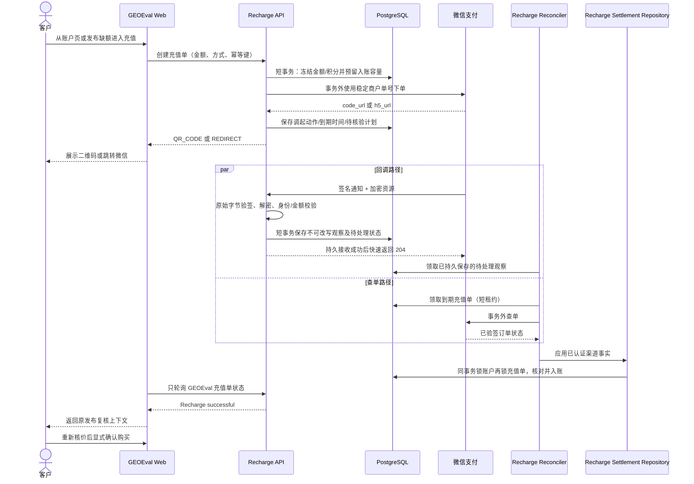
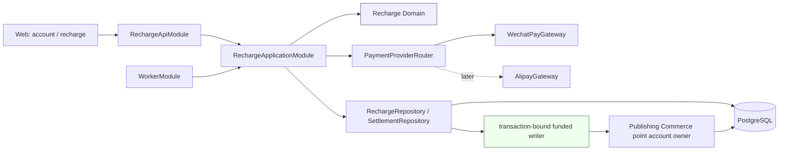
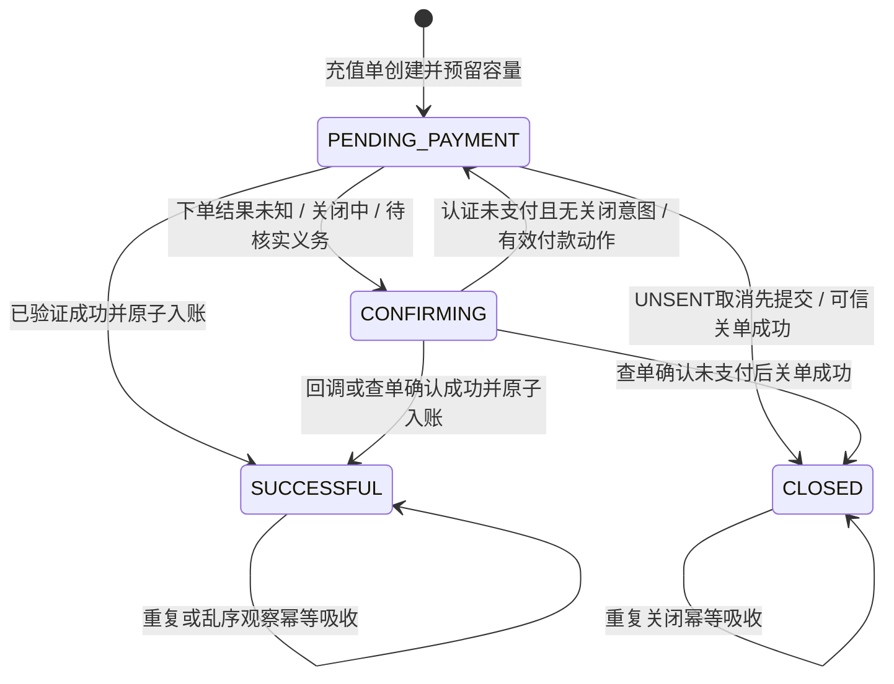

# Recharge payments design

方案日期：2026-09-08。架构 owner：[Issue #77《建立真实充值核心与微信网页支付链路》](https://github.com/ZETAVI/GEOEval/issues/77)；申请与资产准备继续属于 [Issue #75](https://github.com/ZETAVI/GEOEval/issues/75)。

Status: A0/B0 and unregistered C1 implemented; N1/H5/operational activation remain proposed; no live recharge activation. Control: [proposal](proposal.md). Sequence: [tasks](tasks.md). This file replaces the local research candidate and does not replace current specs.

本次批注已确认 PC Native → 手机外部浏览器 H5 的推进顺序，并明确认可在 Publishing Commerce 内独立装配积分能力。Node 实现已在协议例证验证后选用标准 crypto 与窄 HTTP Adapter；一个活动充值单和实际异常资金处置细节不视为自动获批。本文在原位置修正，不建立第二版架构文件；具体协议证据由 [微信 APIv3 接口简报](source-brief.md)持有。

## 1. 建议结论

建立一个业务能力明确的 `Recharge` 模块，由它拥有充值订单、支付渠道协调、支付事实核验、异常恢复和成功入账编排。微信支付、支付宝是 `Recharge` 内部的 Provider Adapter；不要先创建一个能处理任意资金业务的通用 `Payment Platform`。

Publishing Commerce 继续拥有积分账户和追加式积分流水，并向 Recharge 的 PostgreSQL 基础设施暴露一个窄的、事务绑定的 funded writer。支付成功的外部证据先在数据库事务外完成验签、解密或查单，随后由 Recharge settlement repository 打开一个短事务，在同一事务中锁定充值单和积分账户、推进充值成功、写一条 `RECHARGE` 类型的 funded 流水并更新余额。任何 Provider 网络调用都不得进入该事务；领域层和应用层也不暴露数据库 transaction client。

首批实现按两条独立验证切片推进：

1. 微信 Native：覆盖 PC 网页二维码、回调、查单、关单和一次入账；
2. 微信 H5：覆盖 iOS/Android 外部手机浏览器的跳转、返回确认和恢复。

微信内网页需要 JSAPI，不属于 H5 的兼容模式；只有产品确认首批必须在微信内闭环时才单独纳入。支付宝沿用同一个 `Recharge` 核心，后续增加电脑网站支付和手机网站支付适配器。

## 2. 当前项目事实与不变边界

当前受保护 `main@bcb81db5f567c5f0c3bced0c57df7b3dd8b83aa6` 的代码/规范与已批准产品方向形成以下边界；其中真实充值仍未激活：

- 客户充值人民币整数，按 `1 元 = 10 积分`增加 funded 积分；只有确认支付成功才入账；
- 客户可见充值状态是 **待支付 / 确认中 / 充值成功 / 已关闭**；取消、失败和过期不入账；
- 充值成功后返回既有发布订单复核上下文，重新检查价格与可用性并要求客户再次确认，不能自动购买；
- Publishing Commerce 拥有账户级 `grantedBalance`、`fundedBalance`、账户序号和追加式 PointChange；
- 发布购买已经通过一个 PostgreSQL 短事务完成账户、选择、文章、套餐、媒体、流水和订单的一致提交；Provider、队列和用户交互都不得在其中发生；
- 当前真实支付未启用，前端充值入口仍禁用，当前规范也没有真实支付成功、退款或发票能力。

本方案不改变上述语义，也不把充值与发布购买合并为一个长事务。支付和消费是两个由客户明确触发、可分别恢复的业务过程。

## 3. 术语与所有权

| 名称 | 含义 | 所有者 |
| --- | --- | --- |
| Recharge Order | 客户以固定人民币金额购买固定 funded 积分的业务单 | Recharge |
| Payment Attempt | 针对某个充值单，在具体 Provider/产品上发起支付的可恢复尝试；首批一个充值单只允许一个活动尝试 | Recharge |
| Authenticated Payment Observation | 已证明来自渠道的事实；是否匹配本地充值单必须由 Recharge 再校验 | Provider Adapter 认证；Recharge 保存和应用 |
| Point Account / Point Change | 账户积分余额、序号和不可改写流水 | Publishing Commerce |
| Publishing Selection / Purchase | 保存的发布意图、重新报价和显式购买 | Publishing Commerce |

删除测试：如果未来删除微信适配器，Recharge Order、funded 入账、发布复核与支付宝适配器仍应成立；如果删除 Recharge，Publishing Commerce 的积分购买仍能工作。这个结果说明业务能力和渠道协议没有互相吞并。

首批不单建 PaymentAttempt 表；一个 RechargeOrder 上保存唯一活动渠道身份和调起状态即可。只有出现同一业务单多次独立扣款尝试、跨渠道切换或退款生命周期后，才根据真实复用需求拆出独立实体。

## 4. 端到端链路



浏览器不直接查 Provider，也不把二维码扫描、H5 返回、JS Bridge 返回或客户端文案视为成功。浏览器只读取 GEOEval 自己的充值订单状态。

## 5. 模块与依赖方向



建议目录形态：

```text
apps/backend/src/recharge/
  domain/
    recharge-order.ts
    payment-gateway.ts
    verified-payment-observation.ts
  application/
    recharge.service.ts
    payment-confirmation.service.ts
    recharge-reconciler.ts
  infrastructure/
    postgres-recharge.repository.ts
    postgres-recharge-settlement.repository.ts
    wechat-pay.gateway.ts
    alipay.gateway.ts              # 后续
  presentation/
    recharge.controller.ts
    wechat-pay-callback.controller.ts
  recharge-application.module.ts
  recharge-api.module.ts
```

`RechargeApplicationModule` 供 API 和 Worker 共用，不能依赖 HTTP Controller；`RechargeApiModule` 只装配客户接口和 Provider 回调。Worker 不应为复用 Recharge 而加载文章、媒体或 Web 表现层。

### 5.0 与现有模块的冲突及最小收束

当前基线已包含 #76 正常履约。已核对 [PR #79@770a764](https://github.com/ZETAVI/GEOEval/pull/79)的实际模块和测试，以及该固定版本下的退点设计；#79 已在 [bcb81db 集成](https://github.com/ZETAVI/GEOEval/pull/79#issuecomment-5587460726)，本任务已从主干消费；退点仍是其后续能力。

| 责任 | 明确 owner / 入口 | 跨模块边界 |
| --- | --- | --- |
| 登录、角色、用户停用、客户请求 CSRF | Identity | Recharge 消费 Principal；回调仅使用精确路由的公开访问/CSRF 豁免与渠道密码学验证 |
| 充值金额、订单、收款事实、收单恢复 | Recharge | 不拥有发布承诺、履约状态、积分消费规则 |
| 余额、积分来源、账务序号、流水、容量预留 | Publishing Commerce 内部的积分账户能力 | 赠点、购买、充值、订单退点都经过同一个账户规则；不能由 Recharge 另写一套余额算法 |
| 发布选择、价格复核、购买与原消费 | Publishing Commerce | 支付完成不直接调用购买命令 |
| 责任人、发布结果、协商退点意图/资格 | Publication Delivery | 不写积分余额；退点实际执行仍由 Commerce 拥有 |
| 公网通知解析、请求签名、响应验签 | Recharge 的渠道适配器 | 返回已认证渠道事实；与本地订单的最终匹配由 Recharge settlement 在事务中执行 |

#79 对第一步的重构已经到位：独立 `CommercePointsModule` 迁入现有服务、仓储、两个积分 Controller 和 useExisting 映射，仅导出 PointAccountService；没有改变账务或购买事务。它切断文章/媒体/履约装配依赖，仍依赖根 Identity/Persistence。此前要求在机械提取阶段同时交付预留/writer 的描述过宽，在此收束。

现有 PointAccountService 负责 HTTP 错误映射、Identity 查询和管理/客户读写；PostgresPointAccountRepository.adjust 自己开启事务。Recharge 不调用该赠点服务完成系统入账。优先在 Commerce 的基础设施公开一个受控的事务绑定入口，返回仅供充值的 reserve/consume/release 能力；其实现不导入 HTTP service、Controller、IdentityModule 或 Recharge 模块。传入的数据库事务由 Recharge 持有，绑定入口不另行提交。该函数/小对象即可满足当前真实变点，无需先增加 CoreModule、全局 UnitOfWork 或通用 postDelta 框架。若未来消费者确实需要共享运行时 providers，再把已有实现装配为无 HTTP 的 CoreModule；那时移动 Controller 应保持原 API 注册一次。

赠点和购买的公共接口保留，内部改用同一个 Commerce 容量策略；退点也须在自己的实际实施片消费该策略。#79 不因尚未实现未来结算而被判为不合格，也不由 #77 重复提取。

原方案“RechargeOrder → PointAccount”的锁顺序统一改为 **PointAccount → RechargeOrder/Delivery settlement → 当前操作的观察或执行记录**，与购买 wallet-first 和 #73 退点 wallet-first 对齐。后台领取任务的短事务可以只锁任务行，但必须提交后才执行 settlement；禁止持有任务锁再反向获取钱包锁。

### 5.1 方案比较

| 方案 | 优点 | 主要代价 | 结论 |
| --- | --- | --- | --- |
| Recharge 拥有业务单，Commerce 暴露窄 funded writer | 充值语义集中；复用现有积分账本；Provider 可替换；发布购买不感知微信 | 需要固定一个跨模块事务端口 | **推荐** |
| 全部放进 Publishing Commerce | 少一个顶层模块 | 支付协议、回调、对账和发布购买耦合；Worker 需加载无关依赖 | 不采用 |
| 先建通用 Payment Platform，再由 Recharge 调用 | 理论上可扩到退款、订阅、分账 | 当前没有第二种稳定资金语义；接口会由猜测驱动 | 暂不采用；出现真实复用边界再提取 |

跨模块事务端口已经有先例：当前发布购买让文章和媒体窄 reader 使用 Commerce 打开的同一 transaction connection。这里沿用同一依赖原则，但写入所有者仍是积分账户模块。

## 6. 核心接口草案

### A0 实现卡：独立微信协议适配

- 已确认执行范围：[Decision](https://github.com/ZETAVI/GEOEval/issues/77#issuecomment-5582243258)。首次实施为 main-direct/base 0552aa7，已同步 a550fc4，A0 当前 dfe98bc；运行时没有装配或环境变量读取，不依赖 Nest/Prisma/Commerce。
- 业务 gateway 拥有 Native 发起、按商户单号查单、关单；协议入口另接受原始通知和未合并头部。内部拆分成熟 crypto 原语、单次 HTTPS 传输和微信字段解释；测试在真实外部 I/O seam 替换 transport，生产默认固定官方 HTTPS origin/TLS。
- 查询携带被冻结的 merchant/app/order/amount 期望值。普通查单文档已成功读到：非成功状态可缺少 transaction_id/trade_type/amount；不得要求未支付单包含支付成功字段。SUCCESS 要形成可用支付证据则至少具备订单金额、币种、交易号和支付时刻；query 的选填 payer 字段保留 nullable，通知的必填 payer_total/payer_currency 不混用 query 规则。
- 下单结果只给 QR 动作与原订单到期时刻，不以调用时刻不断延长二维码期限。关闭只认对应请求上下文的已验签空 204。Notification 证明渠道来源并保留原商户身份，匹配本地充值与持久化仍由下一切片负责。
- 失败只返回有界类型码和必要 HTTP 状态；不带原文、Authorization、OpenID 或异常 cause。所有 Provider 调用最多一次，超时/错误不能释放容量。原始报文验签先于解码/字段解释，调用输入与配置快照不受外部后续修改影响。
- 配置只经明确构造参数进入，使用 Node KeyObject/32-byte APIv3 key 与复制的可信 key 集合；无 HTTP downgrade、通用 skip-signature 或不验证 TLS 的产品配置。测试 CA/路由改写只存在于测试传输替身。
- 无数据迁移；退出是移除未装配模块或保持不装配。最小反证：官方独立固定签名、成功/未支付字段差异、错身份/金额、204、密文/重复头/时效、请求体变更、TLS/截断/总时限、每次调用一个请求。实际 A0 测试不由旧 probe 成绩替代。

### 6.1 Provider 端口

A0 已实现的业务接口与类型由 [payment-gateway.ts](../../../apps/backend/src/recharge/application/payment-gateway.ts)持有，不在这里复制另一份签名。PaymentGateway 提供 Native initiate/query/close；PaymentNotificationVerifier 是独立协议入口，接受原始 Buffer 与未合并的头部值列表。WechatPayGateway 不依赖数据库或应用装配。

查询核对调用前复制的冻结 merchant/app/order/amount；通知返回原有渠道身份，允许后续 inbox 将未知/错配订单作为差异处理，不能直接入账。关单结果与支付事实分开，只有对应调用的已验签空 204 形成 CLOSE_ACKNOWLEDGED。QR 动作返回原订单支付期限，不承诺每次调用都获得新的二维码有效期。

内部 HTTPS transport 返回有界原始响应；gateway 验签后才交给具体操作解释。配置快照、严格类型错误、一次请求、总时限、原始字节、可信 key 和 TLS 限制以实现和 [验证](verification.md)为准。任何成功证据仍须由 Recharge 在后续 settlement 事务中匹配并应用。H5/支付宝扩展进入各自切片；JSAPI/通用支付平台不在当前接口中预置。

### 6.2 积分写入端口与事务责任

C1 已实现的应用合同由 [recharge-order.ts](../../../apps/backend/src/recharge/domain/recharge-order.ts)与 [RechargeCoreService](../../../apps/backend/src/recharge/application/recharge-core.service.ts)持有：创建、本人读取、UNSENT 取消、通知及已认证成功查单的应用。返回业务结果，不返回 Prisma client；当前应用未注册。可信关单与调度仍待 N1。

| 入口 | 责任和前置事实 | 同一事务的效果 |
| --- | --- | --- |
| Recharge 创建 | 读取客户与显式金额策略、冻结金额/商户身份/期限；同客户键先恢复原单，再限制新单 | 锁账户 → 建充值单 → Commerce 保留该单的积分容量与一个未来流水槽位；不得调用 Provider |
| Commerce 事务绑定 writer：reserve | 同一事务内已锁账户；唯一 recharge/account 引用和固定点数 | 写 HELD reservation、增加账户 R/S；不改可用余额或账务序号 |
| writer：consume | Recharge 已核对已认证成功与冻结订单；reservation 属于同账户/订单且点数完全一致 | 仅增加 funded、减少该单 R/S、推进一次账务序号、追加该单唯一 RECHARGE 流水；没有任意余额覆盖入口 |
| writer：release | Recharge 在其事务内确认从未领取发送权，或已取得可信关闭依据 | 仅将该单 HELD 转 RELEASED、减少 R/S；重复释放无效果，不产生虚构点数流水 |
| Recharge settlement | 拥有业务单/渠道事实匹配、重复交易与通知处理结论 | 关联真实支付事实、保存交易身份、消费 reservation、订单成功、receipt 处理结果一起提交；局部失败整体回滚 |

绑定入口采用显式 `bind(tx)` 或等价小函数，生命周期仅在调用者事务内，账户锁由同一入口取得。Recharge 不能自己更新 PointAccount/PointChange；Commerce 不解析微信报文或拥有充值状态机。购买和退点保留各自已批准事务编排，仅共享账户锁、容量计算、余额/流水持久化规则。无跨模块 callback 让 Commerce 反向调用 Recharge。

两种接口比较：扩展 HTTP PointAccountService 并再次开事务会破坏原子性且带入 Identity；泛用 applyDelta 暴露任意点数来源和业务关联。推荐的窄基础设施入口沿用本项目 transaction-bound reader 的依赖方向，增加真实需要的业务写能力。

### 6.3 请求重试与系统入账身份

现有 PointChange 的 account/idempotencyKey 唯一约束同时保护赠点与购买；其旧冲突语义保留。RechargeOrder 创建请求仍按 account/clientKey 幂等，但**系统到账的去重主体是 rechargeOrderId 与稳定外部交易身份**。不能把客户键、公开充值 UUID 或其可推导 UUID 直接塞进旧客户端键空间：另一次合法购买可能先占用同值，使已收款入账永久冲突。

推荐的最小 schema 方向：RECHARGE 流水的客户端 idempotencyKey 为 NULL，使用独立非空 rechargeOrderId 唯一约束与 account 复合外键；现有赠点/购买/未来管理员退点仍必须有各自真实客户端请求键。相比给所有历史键重分命名空间，这保留旧唯一索引和旧调用者语义。PostgreSQL 默认 UNIQUE 的 NULL 互不相等，须由 kind-specific CHECK 明确哪些行允许 NULL，不能仅移除 NOT NULL 后放松旧约束。

同样明确自动到账的 actor：推荐新 actorKind=SYSTEM、actorAccountId=NULL，旧操作回填/保持 ACCOUNT 与非空 actor。客户发起身份留在 RechargeOrder；系统确认引用真实通知/查询证据。旧 kind 的约束必须显式要求 actor/request key 非空，避免 SQL CHECK 的 UNKNOWN 被当作通过。查询和客户 DTO 不得泄露内部预留或来源；管理员历史可表达系统到账。这套迁移已在 C1 受控窗口实现并验证，当前应用未启用真实充值。

## 7. 数据模型与完整性约束

### 7.1 RechargeOrder 候选字段

| 字段组 | 候选字段 |
| --- | --- |
| 身份 | `id`、客户可见 `number`、`accountId`、`accountSequence`（如需要列表顺序） |
| 冻结商业事实 | `amountYuan` 整数、`amountFen` 整数、`fundedPoints` 整数、`pointRate=10`、`currency=CNY` |
| 渠道身份 | 不可变 `provider`、`providerMerchantId`、`providerAppId`、`method`、`merchantOrderNo`、`providerTransactionId?`；另保存凭证配置引用 |
| 状态 | `status`、`paidAt?`、`closedAt?`、`expiresAt`、`revision` |
| 调起与核验 | `actionKind?`、受限保存的调起 URL/到期时间、`nextVerificationAt?`、`verificationAttempts`、`verificationLeaseUntil?` |
| 恢复 | `lastErrorCategory?`、`operationalReviewReason?`、`createdAt`、`updatedAt` |

约束：

- `(accountId, idempotencyKey)` 唯一，并保存归一化请求摘要；同键同意图恢复原单，同键异意图冲突；
- 一个账户最多一个非终态 RechargeOrder 仍是待确认的产品限制，不把它混同为安全必要条件；必要条件是有界活动单数/总预留、限频、稳定原单恢复和取消核验；
- `merchantOrderNo` 在本系统唯一，并符合具体 Provider 长度/字符规则；
- `(provider, providerMerchantId, providerTransactionId)` 在非空时唯一；商户单号也按稳定商户身份约束。凭证 alias、key id 或版本轮换不能改变交易幂等身份；
- `amountYuan > 0`、`amountFen = amountYuan * 100`、`fundedPoints = amountYuan * 10`，全程检查整数溢出；
- `SUCCESSFUL` 必须有外部交易号、支付时间和唯一 PointChange 关联；
- 一个 RechargeOrder 最多对应一条成功入账 PointChange；新增独立 `RECHARGE` 关联并使用 `(rechargeOrderId, accountId)` 复合 FK，保留原购买负流水/退点专属关联约束；系统入账使用专属充值业务唯一关联，不占用客户端请求键空间（见 6.3），避免另一种操作先占键而阻止已收款入账；
- 已保存的金额、汇率、商户订单号和成功外部交易身份不可修改。

### 7.2 预留 funded 入账容量

当前积分总额上限是 `2,147,483,647`。如果只在支付成功后检查上限，会出现“客户已经付款，但并发管理员赠点令账户无法入账”的资金完整性缺口。

由 Commerce 统一拥有 G=granted、F=funded、V=已提交账务序号、R=HELD 充值点数总额、S=HELD 充值流水槽位总数。推荐账户保存 R/S 汇总，另以唯一 recharge/account reservation 保留明细和 HELD → CONSUMED/RELEASED 的一次转换。任何改动都先锁账户，明细和汇总同事务；明细合计用于对账，不能让两个 writer 各维护一套算法。

不可变式：`G,F,R,S,V >= 0`、`G+F+R <= M`、`V+S <= M`，M 是现有积分整数上界。数据库 CHECK 用扩大后的算术类型验证总和；R/S 默认 0 保持历史钱包。跨行汇总不伪装为普通 CHECK，而由同事务 writer 与对账检查承担。PointBalance 的客户/管理员读取仍只给现有字段；R/S 属内部容量快照。

| 操作 | 容量/余额转换 | 序号处理 |
| --- | --- | --- |
| 预留 q 点充值 | R += q，S += 1；必须在付款发起前成立 | V 不变，没有余额变动流水 |
| 正常赠点、消费、订单退点 | 核对变化后的 G+F+R；消费仍先 granted 后 funded，退点仍按原消费来源 | V += 1，且新的 V+S 不超上限；扣点也不能占用留给已付款到账的最后槽位 |
| 确认本单到账 q 点 | F += q，R -= q，S -= 1；只消费自己的 HELD 明细 | V += 1，因此 V+S 不增加 |
| 安全关闭本单 | R -= q，S -= 1；不改 G/F | V 不变；保留 reservation 转换记录 |
| 已提交业务结果重放 | 恢复原结果，不重新通过可变余额/新单额度 Gate | 不再推进 V 或 S |

两个最小反例规定下一片必须改所有实际写入口：余额 M-20、R=20 时，旧赠点 +1 算法会挤占预留；V=M-1、S=1 时，旧购买算法会占用最后一个到账序号。它们是新增预留后会出现的风险，不是已启用产品的付款事故。

#73 退点也是增加 G/F 的操作，必须保留已批准的原来源、一次实际返还和停用客户旧义务规则。容量不足或序号被预留时保持待退点可见，不能挪用充值 R/S、伪造赠点、修改原消费或自动释放未知支付。本轮不把所有未来退点提前变成容量 reservation，也不改变 #73 的受限义务处理决定。

如果不做预留，就必须接受“已收款但积分无法自动到账”的人工负债，这不符合首版资金链路的完整性目标。预留只保护积分数值容量，不锁价格、媒体库存或发布选择。创建接口还需设账户级速率限制、批准的单笔最小/最大充值额和到期恢复；否则攻击者可以用未支付订单长期占用容量。

### 7.3 支付观察日志

建议增加 append-only `PaymentObservation`：

下列是全链路候选模型。B0 只实现已认证成功通知的观察/receipt，不伪造查单通知 ID；后续查询、关单和账单观察的 source/type 与迁移由 N1 收束后扩展，不声称 B0 已持有全部来源。

- 来源：`INITIATION_RESPONSE` / `NOTIFICATION` / `QUERY` / `CLOSE_RESPONSE` / `BILL_RECONCILIATION`；
- 归一状态、商户单号、平台交易号、订单总额、付款人实付额及各自币种、支付时间、Provider 配置别名；
- 验签使用的公钥 ID/证书序列号、原始报文摘要、标准化事实版本与摘要、收到时间；处理状态由独立可更新游标承担，不改写原事实；
- 不保存完整回调原文、payer OpenID、身份证、银行卡、APIv3 密钥或私钥。

签名无效或无法解密的请求只进入受限安全遥测；验真成功但商户/订单/金额不匹配的通知进入受限差异记录，不入账。可信观察和实际入账是两个事实。

原始正文摘要只追踪本次报文，不充当业务相等性。标准化事实采用明确版本和固定字段顺序，包含稳定 merchant/app/order/transaction、tradeType/state、订单总额/实付额/币种和规范化支付时刻；排除签名时间、nonce、密文、JSON 排版、收到时间与配置 alias。同一通知身份、同版本同事实可幂等 ACK；同身份不同业务事实不得覆盖原记录，进入受限冲突处理。不同 notification id 的同一交易可保留多个观察，后续结算仍以稳定交易/充值/流水唯一约束防重。事实版本升级必须能比较旧投影，不能单凭版本变化判定付款冲突。

微信成功通知中的 total 与 payer_total/payer_currency 都有各自含义，不能用一个 amount 字段覆盖。积分额度匹配冻结订单总额；实际支付金额单独保留以支持未来获授权的发票/财务读取，不把“积分÷10”当真实付款证据，也不由此引入优惠活动或发票模块。商户优惠/出资与异常金额的财务处置在真实启用前另行核定；本轮只防止丢失已认证资金事实。

## 8. 状态机



`PENDING_PAYMENT` 与 `CONFIRMING` 都不是失败。调用 `time_expire`、浏览器超时、客户返回或关单请求成功发出，都不能单独把本地订单置为 `CLOSED`。对于 MAY_EXIST，只有已验证的 Provider 状态/关单结果才能关闭并释放预留；UNSENT 取消先提交是 C1 已验证的本地例外。

晚到通知本身并不意味着 Provider 在成功关单后仍可付款。关单成功与同一外部交易成功相矛盾时，应先核对不可变商户身份、订单号、观察时序并主动查单；保存已收到的事实，禁止仅以到达顺序覆写终态。推荐对仍未关闭的正常晚到成功自动幂等入账；已确认关闭后的矛盾进入明确的财务差异处理，补入账或退款决策不由 webhook 自动猜测。

## 9. 事务、幂等与不确定结果

### 9.1 创建与下单

以下为 N1 的实施合同，尚未实现；C1 的固定运行时不因此改变。

1. 客户创建请求只提交金额、方式和幂等键。短事务创建/恢复本地订单并预留容量；只在新单通过资格/限额后安排首次发起，同键重试先恢复已有结果。
2. 第一次发起前冻结 `description`、`notify_url` 与已有商户/AppID/单号/金额/支付截止时间；订单不随配置更新改参数。保留显式凭证定位能力用于旧商户义务；密钥轮换允许替换认证材料，不改变原请求的业务参数。
3. 执行者在短事务核对取消意图、支付截止、状态与有效 generation，创建一次 INITIATE attempt，并将 UNSENT 不可逆推进为 MAY_EXIST，再提交。标记不声称网络已经送达，但之后取消不能再使用 C1 的本地 UNSENT 释放路径。
4. 在事务外执行一次 Adapter 请求。发送前再次检查许可可以减少陈旧发送，但检查与网络之间不存在跨系统原子锁；必须承认暂停进程恢复后仍可能发送。lease 只分配本地工作，不是微信侧 fence。
5. 单独短事务保存 attempt 结果，当前 generation 才可发布二维码或改变后续计划；取消/终态已经赢得竞争时不再展示迟到二维码。晚到的认证成功事实仍交 C1 匹配/结算，不能仅因 generation 过期而丢弃真实付款。
6. 未知响应保留原商户单号并先查单；允许重试时始终使用同一冻结参数。查询未支付但 QR 丢失/过期时才请求受控同号重取；到期或取消意图禁止重新发起。没有任何错误分支自动生成另一张可收费订单。

数据选择：在 RechargeOrder 上增加本轮真正需要的取消意图、generation、due/lease 和当前支付动作引用；新增 Recharge 自有 attempt 记录，保存操作/请求摘要、发起与结束时刻、有限诊断及认证结果引用。订单状态仍只有一个可变权威。相比再引入一张同义 execution 主记录，这样少一个发起/关闭状态同步问题；相比只保存最后一次错误，attempt 能保留进程丢响应时的未决外部义务。具体 SQL 在 N1 实施窗口固定，不提前增加通用支付队列或任意事件 JSON 仓库。迁移对旧 UNSENT 不伪造已发起；已有 MAY_EXIST 缺请求快照时只允许核验/关闭，不从当前配置猜造一份历史重试参数。

attempt 的成功付款引用 C1 observation；NOTPAY/CLOSED/REFUND 与关单 ACK 使用真实来源的受限结果结构，不能编造 transactionId、payer、通知 ID，也不能把未认证错误写成支付事实。客户端、下单尝试和成功交易有各自幂等键，不复用一个键代替所有业务身份。

### 9.1a 取消、到期与安全终止

取消先在账户→订单锁内设置持久关闭意图、使旧 generation 失效并移除 QR；相同请求重复执行返回当前状态。

| 证据 | 允许的动作 | 容量/客户状态 |
| --- | --- | --- |
| 从未取得首次发起权，取消或到期先提交 | 使用 C1 本地关闭 | 原子释放本单预留，已关闭 |
| MAY_EXIST，认证查询为 NOTPAY 且已取消/到期 | 调用关单；网络在事务外 | 仍保留预留，确认中 |
| 认证关单空 204，或身份匹配的认证查询 CLOSED | 在锁内核对当前终态/冲突，保存关闭证据并释放 | 同事务已关闭；不得撤销已有成功 |
| 认证 SUCCESS（包括取消期间或旧 attempt 迟到） | 复用 C1 唯一到账事务 | 成功；不因客户曾点取消而丢弃付款 |
| NOT_EXIST、超时、验签失败、4xx/5xx、lease 到期 | 有界查询/退避，达到运营阈值后可见待核查 | 不自动释放、不宣告已关闭 |
| REFUND 或 Native 收到付款码专属状态 | 保留认证证据并进入受限核查 | 不自动入账、退点或释放 |

安全终止不依赖“等够 N 秒”：官方会把过近的 time_expire 调整到下单后至少一分钟。因此，即使本地 deadline 已过，延迟到微信的请求也可能仍产生可支付窗口。N1 在首次/再次发起前要求剩余时长满足官方最小值并留出请求预算与时钟裕量；这只减少风险，不能作为迟到请求不可能生效的证明。MAY_EXIST 仍需认证关闭证据；持续未查到的义务保留人工核查，不无限高频重试，也不靠猜测释放。

支付期限使用创建时冻结值。二维码期限只控制展示；本地倒计时、客户端取消微信收银台和关闭浏览器均不是商户关单。若安全关闭后客户重新充值，才通过显式新意图取得新幂等键和新单号；旧记录保持可查。异常关闭/成功矛盾沿用 C1 待核查边界，最终补入账或现金处置需要财务决定。

### 9.2 成功确认事务

1. 验签/解密或查询在事务外完成。通过稳定 merchant/order 引用找到不可变本地账户信息；未知订单先保存待核查原因，不借用回调自报账户创建钱包。
2. 同一短事务按 **PointAccount → RechargeOrder → 本单 reservation → 当前 receipt/处理记录** 锁定；复核账户、商户、应用、商户单号、冻结订单总额/币种及真实外部交易身份。
3. 先判断是否是相同已提交的业务结果并恢复；同一充值收到不同交易/金额等事实进入可见差异，不把“本地已经成功”当成忽略新冲突的理由。另一充值占用相同外部交易身份时不得转账或二次入账。
4. 通知路径在锁内重读 hasConflict 与处理状态，验证引用的不可变事实；不得只相信 listPending 的旧快照。查单使用真实 QUERY 来源的观察，不伪造 notificationId 或完整付款人字段；与 B0 通知观察共享规范化事实投影，source-kind 的具体 schema 扩展在该片确定。
5. Commerce writer 消费本单 reservation，更新余额/序号并追加唯一 RECHARGE 流水；Recharge 同事务保存支付事实关联、交易身份、成功状态和处理完成标记。
6. 任一步失败整体回滚；提交后丢响应只重取同一个成功结果。队列/Provider/用户交互不进入事务，后台领取任务的短事务在此之前已提交并释放任务锁。

重复回调、查单与回调竞争、进程在响应前退出，都只会恢复同一成功结果。

创建充值要求有效客户身份；支付后客户停用不能让已收款事实消失或被赠点的 `TARGET_INACTIVE` 规则拒绝。对已有合法订单推荐继续结算到原账户，保持停用状态；另外记录客户发起人和系统确认来源，不能把自动回调伪装成客户再次操作。Identity/财务有明确冻结规定时进入可见义务处理，不直接忽略付款。

## 10. 回调、查单、关单与后台恢复

### 10.1 微信回调入口

- Nest API 用 `rawBody: true` 保留原始字节；验签串严格使用 `timestamp + "\n" + nonce + "\n" + rawBody + "\n"`。框架可以解析传输 JSON，但业务只能在原始字节验签成功后使用其字段；
- 通过微信支付公钥 ID 或平台证书序列号选择可信公钥，未知或已吊销标识拒绝；
- 使用 APIv3 key 解密 `resource`，再核对 `mchid`、`appid`、`out_trade_no`、`transaction_id`、金额、币种和成功状态；
- 现有 `AccessGuard` 和 `CsrfGuard` 默认要求 session、Origin 和 `x-geoeval-request`；仅回调 handler 复用 `PublicAccess`/`CsrfExempt` 并强制渠道验签，客户 create/cancel/verify 仍保留认证、账户归属和 CSRF；
- 签名、解密和最低字段检查成功后，短事务持久保存通知 id、不可改写安全字段、摘要和待处理标记；提交后在官方 5 秒期限内应答 200/204，后台再入账。存储失败返回非 2xx；不能先 ACK 再依赖内存任务；
- 原有 PaymentObservation 复用为 durable inbox，不再增加第二份同义消息表：可信事实不可改写，处理游标/失败次数可以更新。Redis 不可用时数据库扫描仍能恢复；
- 同 notification id 同标准化事实快速确认；raw digest 改变本身不是业务冲突。同身份不同事实不能直接覆盖，须保留受限冲突与处置入口。签名无效或 SIGNTEST 拒绝；可信但未知订单/金额不匹配要保存受限差异证据并告警，不入账；签名不可信的噪声不进入业务 inbox。

接收仓储必须将不可改写观察和可恢复处理状态放在同一事务。PostgreSQL Read Committed 下，ON CONFLICT DO NOTHING 可能因另一事务的唯一键而跳过插入，但当前语句快照看不到那行；用随后语句读取已存在事实再判断幂等，不使用一条 CTE 中 fallback SELECT 的“没读到”作为未接收结论。只有事务提交完成才给成功 ACK；提交结果未知时不先 ACK，后续同通知重试恢复已有事实。工程实现用连接池/参数化查询和有界事务时限，不能照搬实验中的逐次 docker/psql 启动。

[通知持久性实验](verification.md)覆盖真实 raw HTTP/验签解密、并发唯一插入、提交前阻塞和接收进程 SIGKILL；它没有 Nest/Identity 装配、业务订单匹配、Worker lease 或 funded writer，不宣称上述后续链路已实现。实验使用观察与游标两张临时表，只验证逻辑原子性，不冻结最终 Prisma 物理表形态。

### 10.1a 接收后的处理结果与公平恢复

B0 的 ACCEPTED/204 只代表接收。C1 使用 processedAt/appliedRechargeOrderId 与独立 reviewReason/hasConflict 表达处理结果：待处理扫描排除已处理或待核查记录；已成功后仍可以出现新增差异，两者不强制塞进互斥状态。准确字段由实际 repository/schema 持有。验证成功却找不到本地订单、字段不匹配、冲突或已释放后迟到付款都进入具备原因的受限待核查记录，不通过设置 processedAt 虚报到账。已有成功后出现的新差异保留历史成功与新增告警事实，不自动撤销或再记分。

临时数据库/传输失败仍可按行级 due time 有界重试；不能把最早的 100 条无法处理通知永远留在 pending 队首、饿死后续有效付款。扫描每轮读取当前可执行状态，不持久推进只增时间水位；运营另能找回待核查义务。处理状态与 ledger/order 的关系必须由同一 settlement 事务或明确的无资金效果审查事务确定。

### 10.2 主动查单

前台查询本地状态与后台查询微信分离；它们的频率不是一对一关系。页面打开、手动核验和恢复焦点只给已有订单合并一次尽快核验提示，不各自直接发起微信请求。

- PostgreSQL 的 nextActionAt、attempt、generation 与有界 lease 是恢复权威。Worker 先短事务领取并释放任务锁，再出站调用，最后在新事务应用结果；需要积分写入时保持账户→订单→预留→receipt 顺序，不持有任务锁反向等待账户。
- 单订单同一代只安排一个有效操作；多实例共享租约，但承认旧网络调用可迟到。过期执行者不可覆盖新 QR/关闭意图，认证资金事实仍保存并经过 C1。
- due 扫描具有页数、单轮时长、商户并发和重试预算；临时故障只后移该行，不堵住队首。查单认证失败或配置失配暂停该商户的发起，保留已有义务及安全诊断。429 降速，不让用户刷新绕过商户级预算。
- 同步配置的测试 profile 可采用官方举例的前台 2 秒/60 秒有界轮询；后台采用明确退避数组和抖动。这是工程配置，不是微信 SLA 或已批准的运营时限。终态、离开页面或失去会话立即停前台轮询；页面隐藏暂停，恢复后先读本地状态。后台恢复不依赖页面存在。
- 取消/到期后按 9.1a 查关单；认证关单 204 已是独立关闭证据，后续查询是额外恢复或冲突核验，不是为每次 204 强制再造一份成功付款对象。

### 10.3 与现有 Background Work 的关系

现有 `ProductOutboxEvent`、`ProductWorkProcessor` 和队列语义由 Evaluation 工作拥有，事件类型和依赖都不是通用支付设施。不要为了代码复用把支付事件塞进该 owner。

| 候选 | 评价 |
| --- | --- |
| 扩展现有 evaluation outbox 为通用支付 outbox | 改变既有 owner 和失败语义，耦合无关模块；不推荐 |
| 独立 Recharge due-state reconciler，由 Worker 组合层定时唤醒 | DB 状态直接表达待查单事实，恢复路径清楚，改动小；**首批推荐** |
| 新建完整 payment outbox/queue 子系统 | 若后续出现退款、账单、事件订阅等多类 durable command 再评估；首批证据不足 |

## 11. 客户 API 与 Web 交互

候选 API：

| 方法 | 路径 | 语义 |
| --- | --- | --- |
| `GET` | `/recharges/options` | 当前可用方式、整数元范围、快捷金额及创建可用性；不含商户/密钥 |
| `POST` | `/recharges` | 以 `{amountYuan, method, idempotencyKey}` 创建或恢复充值单 |
| `GET` | `/recharges/:id` | 只读本人本地状态、安全详情和当前可展示动作，不触发 Provider |
| `GET` | `/recharges` | 分页返回客户自己的充值记录 |
| `POST` | `/recharges/:id/verify` | 用户返回或等待时提示后端尽快查单；限频、幂等、只调度 |
| `POST` | `/recharges/:id/cancel` | 幂等关闭意图；仅 UNSENT 可本地关闭，其余按 9.1a 核验 |
| `POST` | `/recharges/providers/wechat/notify` | 微信服务端回调；密码学鉴权、原始 body 验签 |

响应中的调起动作使用判别联合类型。客户 DTO 不直接序列化 C1 内部 RechargeOrder：仅订单号、整数元/积分、四种业务状态、创建/截止/成功时刻、允许的操作及安全提示；QR 动作只含原 code_url 与展示截止。无商户凭证、proof、内部预留、generation、Provider 错误或 reviewReason。GET 使用 no-store；同一页面只保留一个在途轮询，忽略旧请求/旧订单响应，取消后的旧 QR 不能重新出现。

充值选项由 Recharge 的策略 owner 提供，服务端创建再次校验，前端不是规则权威。管理员维护快捷金额属于该策略边界，不耦合发布套餐价格或账户写入；受控测试可以显式配置，正式页面启用前需具备已批准的值与维护入口。

所有客户接口沿用 session、终端客户角色、账户归属及写操作 CSRF；外账户记录按未找到处理。verify 仅合并调度请求，成功 HTTP 202 表示接受提示，不表示支付成功。create 在本地订单提交后即可返回，二维码尚未准备时有明确等待态；重复 key 恢复原单。历史分页有上限，充值单不是公开收银台。

### 11.1 PC Native

- 入口为现有积分区域与发布余额不足提示；桌面 QR 页展示金额、到账积分、状态和“使用微信扫一扫”。手机单机页面在 H5 未完成时明确当前入口限制，不以长按/相册识别冒充 Native 支持。
- 仅将已认证、当前订单/有效 generation 的 code_url 在本地生成二维码，保持字节值，不拼接、不交给第三方二维码服务、不把它作为浏览器跳转目标或普通外链。Adapter 已修复旧 host/path 的过严校验，两种官方 /up URI 与旧链接的支持以实际 gateway/tests 为准；scheme/凭据/端口/控制字符等必要拒绝规则保留。这不代表二维码页面或实际扫码已完成。
- 二维码展示截止取订单支付期限与本动作保守 QR 期限的较早者。官方 QR 有效期为两小时，但响应没有 issuedAt；按相应请求的已持久发起时刻保守计时，不按页面重载或收到旧响应重新续期。重复返回同一 URL 不证明续期；缺少可证明的新动作时隐藏旧 QR，提供受控核验/重取和客服路径。刷新新动作不修改金额、商户单号或支付截止。
- 待支付可以显示有效 QR；下单未知、取消中或支付截止后显示“正在确认支付结果”，停止展示 QR。轮询预算结束只提示稍后查订单，不伪装失败/关闭。只有本地 C1 成功提交后显示充值成功并刷新余额。
- 显式选择取消只记录关闭意图，未核实前不承诺取消成功；离开页面不自动取消。已成功/已关闭停止展示动作；所有结果保留订单历史与统一客服入口，真实联系方式上线前提供。
- 余额不足时先保存现有发布选择，再进入充值；返回引用限于账户拥有的 brand/selection 与允许的本地页面，不能接受任意 return_url。现有 pending-publishing-purchase 保存的是已确认购买请求，且 purchaseIntent 会拒绝 shortfall；不可拿它伪造待充值购买。使用轻量、按账户隔离的发布返回引用，恢复时重新读取保存的选择/文章及当前价格。原品牌与当前品牌不同则提示客户选择原上下文，不静默替换当前品牌。只有客户重新确认才提交购买。

### 11.2 手机外部浏览器 H5

- 服务器调用 `/v3/pay/transactions/h5`，准确传递真实用户 IP 和 H5 场景；
- 从已配置 H5 域名页面跳转完整 `h5_url`，不得截断或修改；如加 `redirect_url`，只作为页面返回位置；
- 当前 `h5_url` 有效期 5 分钟；`time_expire` 表示不能继续支付的时间，并不等同关单；
- 返回页展示“已完成支付”并触发后端核验，仍以回调/查单结果为准；
- iOS Safari、Android Chrome/系统浏览器和微信未安装/无法调起等真实路径分开验收。

若访问来自微信内浏览器，页面明确说明当前 H5 不支持该入口并提供外部浏览器指引；产品选择 JSAPI 后再增加 `BRIDGE` 动作和 OpenID/AppID 边界。

## 12. 支付宝后续适配

支付宝网站支付是页面签名链接/表单流程，不能因为官方 SDK 支持 API v3 就把 `page.pay/wap.pay` 当普通 REST JSON 下单。优先使用 SDK 页面链接能力映射 `REDIRECT`；若选表单模式，在受控支付跳转页消费，避免通用前端渲染任意 HTML。通知的表单解码与验签独立于微信的 raw JSON + AES-GCM，只有业务事实归一后才复用 Recharge 入账；`return_url` 不入账。各 query/notification 具有不同身份字段，按对应接口规则核对，不能要求每种应答都凭空包含全部字段。

Node 侧优先评估支付宝官方 `alipay-sdk`。其官方仓库说明支持 API v3、签名/验签、CommonJS/ESM 和 TypeScript；当前项目 Node 24 满足其版本要求。正式引入前仍需锁定版本、审许可证/传递依赖并用官方沙箱或账户能力验证。

首版使用现有 Node 标准 crypto 与窄 HTTP Adapter，依据是已核清的官方协议/固定例证、现有 Node 运行时及最小部署成本。证据及一条样例差异见 source brief，不把 probe 直接当生产代码。微信官方组织提供 Java/Go/PHP SDK 和 curl/Java/Go 示例，也提供接入质量参考；缺少 Node SDK 不等于缺少官方协议或可以直接编码。官方资料中的通用高可用目标也不自动成为 GEOEval 的可用性承诺。

## 13. 配置与密钥边界

建议增加独立 Payment/Recharge runtime config，供 API 和 Worker 共用：

```text
RECHARGE_PROVIDER_MODE=disabled|deterministic|wechat
RECHARGE_CREATE_ENABLED=false
WECHAT_PAY_MERCHANT_ID=...
WECHAT_PAY_APP_ID=...
WECHAT_PAY_MERCHANT_CERT_SERIAL=...
WECHAT_PAY_PUBLIC_KEY_ID=...
WECHAT_PAY_PRIVATE_KEY_SECRET_REF=...
WECHAT_PAY_PUBLIC_KEY_SECRET_REF=...
WECHAT_PAY_API_V3_KEY_SECRET_REF=...
WECHAT_PAY_NOTIFY_URL=https://.../recharges/providers/wechat/notify
WECHAT_PAY_H5_DOMAIN=...
```

- 配置对象保存 secret reference 或进程内受限值，不在启动日志、健康接口、异常、Issue、聊天或 Git 输出 secret；
- 私钥、APIv3 key 和可信公钥由 secret manager/受控挂载注入；文件权限、轮换、吊销和双钥过渡要有 runbook；
- `disabled` 仅适用于没有未结支付义务的环境；真实交易存在后停用新单用 `RECHARGE_CREATE_ENABLED=false`，继续回调、inbox 消费、查单/关单和对账；`deterministic` 只允许隔离测试；
- 订单冻结稳定商户/AppID，API 与 Worker 按该身份定位可信凭证版本，不能用可变 alias 充当商户身份；密钥轮换不迁移订单身份；
- 时钟同步、TLS、出站域名、主/备 API 域名和回调公网 HTTPS 属于部署前检查项。

## 14. 观测、运营恢复与对账

至少记录以下不含敏感值的指标：

- 创建、下单明确失败、下单未知、各 Provider 状态数量；
- 回调验签/解密失败、未知 key id、身份/金额不匹配、重复通知；
- 待查单数量和最老延迟、查询 429/5xx、租约超时；
- 已验证支付到本地入账的延迟、入账幂等恢复次数、事务冲突；
- `SUCCESSFUL` 无 PointChange、Provider 成功而本地未成功、账单差异等完整性告警。

官方建议结合通知、主动查单和 T+1 交易账单。首批上线前需要一个受限运营视图，以充值单号、商户单号和外部交易号查询状态与处理记录；运营人员不能直接把充值单改成功或直接改 funded 余额。修复只能通过可审计的“应用已验证观察”或后续批准的退款/人工债务流程。

## 15. 失败与恢复矩阵

| 故障 | 本地状态 | 自动动作 | 禁止动作 |
| --- | --- | --- | --- |
| Provider 下单明确拒绝 | Pending/Confirming，随后核实关闭 | 保存错误类别，按规则关闭并释放预留 | 伪造成成功或换号自动重付 |
| 下单超时/5xx | Confirming | 同商户单号查单；必要时同参数重试 | 当作未收费、立即建新单 |
| 回调丢失 | Pending/Confirming | Worker 主动查单 | 依赖客户刷新才能到账 |
| 重复/乱序回调 | 原状态或 Successful | 验签后幂等吸收并留观察 | 重复记分 |
| 回调签名或身份错误 | 不变 | 安全遥测、告警、拒绝 | 解析后入账 |
| 入账事务失败 | Confirming | 重试同一已验证观察 | 只更新订单或只更新余额 |
| 进程提交后未响应 | Successful | 同一事件恢复已有结果 | 再写流水 |
| 客户 H5 返回/Native 超时 | 不变 | 查询本地状态，调度受限查单 | 根据前端结果入账 |
| 到期订单 | Pending/Confirming | 查单 → 关单 → 查最终状态 | 只看本地时间直接释放预留 |
| 可信迟到成功与 Closed 冲突 | 运营审查 | 保留事实并告警，执行批准恢复 | 丢弃、静默退款或客服改余额 |
| T+1 账单差异 | 运营审查 | 逐单核对、补入账或退款按批准流程 | 改历史 observation/ledger |

## 16. 迁移、开关与回滚

首批建议按 expand → prove → enable：

1. 新增 Recharge 表、observation、积分预留字段和 `RECHARGE` 流水引用；现有账户 `reservedFundedPoints=0`；
2. 部署时 Provider mode 保持 `disabled`，先重放空库迁移并恢复生产形态备份到隔离库验证；
3. 用 deterministic adapter 验证合同、并发、崩溃恢复和 Web，但明确它不证明渠道连通；
4. 在批准测试环境注入微信配置并做签名向量、公网回调和真实浏览器联调；
5. 最小真实金额需要单独批准商户、金额、次数、资金处置和停止条件；
6. 生产启用是独立 Gate。回滚关闭新建充值和新的支付发起，继续已有单的回调、查询、关单、入账和对账；绝不回滚/删除充值单、观察或积分流水。若凭证受损需暂停相关验证/调用，保留义务并按事件处置恢复，不声称正常停服可清空支付责任。

迁移回滚脚本不能简单删除支付事实。若 schema 回退会丢失已收款或已入账记录，只能向前修复。

## 17. 实施包与验证证据

用户已在 [A0 Decision](https://github.com/ZETAVI/GEOEval/issues/77#issuecomment-5582243258)确认独立适配器构建的当前非冲突执行窗口，#77 据此进入这一有界实现包。#73 保持主要履约交付与共享 schema/API/Commerce 的单 writer；后续组合、积分与资金启用不沿用 A0 的独立写入许可。

| 阶段 | 可合并边界 | 关键证据 |
| --- | --- | --- |
| P0 架构与合同 | OpenSpec proposal/design/spec、状态机、端口、schema 约束、恢复矩阵 | Critical architecture review；产品/财务/技术 owner 决策 |
| P1 Recharge 核心 | 订单、预留、funded writer、deterministic adapter、API 合同 | PostgreSQL 并发/崩溃/幂等/上限测试，空库迁移和恢复演练 |
| P2 微信协议适配 | APIv3 签名、验签、解密、Native/H5 下单/查单/关单 | 官方测试向量；错误映射；无 secret 日志；Node 24 验证 |
| P3 PC Native | 二维码、状态轮询、返回发布上下文 | 真实 HTTP、桌面浏览器、缺回调、重复回调、二维码到期 |
| P4 手机 H5 | 域名跳转、返回确认、受限核验 | iOS/Android 外部浏览器、Referer/域名、取消/完成/恢复 |
| P5 运营恢复与对账 | due-state reconciler、查询/关单、账单差异入口 | Redis/Postgres 重启、429/5xx、T+1 对账演练、告警 |
| P6 受控资金验证 | 最小真实金额与财务核对 | 客户扣款、商户交易、本地单、唯一 funded 流水、账单一致 |
| P7 生产启用 | 配置、密钥、监控、客服 runbook、发布/回滚 | 明确生产批准、命名环境浏览器证据、值班和回滚证明 |

每个完成主张必须区分：本地合成验证、微信测试/真实商户联调、合并到 main、部署到命名环境、生产启用和真实资金通过。前一项不能替代后一项。

## 18. 架构审批前的决策清单

当前决策以 #77 Issue 为准。模块所有权、预留、Native→H5 和继续受控设计/开发已获确认，不重新提问；下面仅保留将来对应 Gate 的核对范围：

1. 已确认 Recharge/Commerce 所有权；N1 延续 C1 窄事务边界；
2. C1 已实施账户预留与统一容量；#73 退点在自己的实施窗口消费；
3. 是否接受首批一个账户最多一个非终态充值单，并确定单笔最小/最大金额和频率限制；
4. 已确认首批 PC Native → 手机外部浏览器 H5；JSAPI 未纳入当前实现批次；
5. 已关闭后的矛盾付款保留待核查，具体补入账/退款政策在真实启用前由财务确认；正常未关闭的迟到成功沿用 C1 到账；
6. 首批订单支付期限、查单退避、关单时点和运营处理时限；
7. 微信技术选型已收束为标准 Node crypto 与窄 HTTP Adapter；支付宝后续优先评估官方 Node SDK；
8. secret manager、技术安全联系人、轮换 owner、测试商户与生产商户的环境边界；
9. 实际生产域名、H5 支付域名、回调域名和公网部署环境；
10. 最小真实金额测试的金额、次数、测试人、资金去向及财务对账 owner。

## 19. 官方来源

### 微信支付

- [Native 产品介绍](https://pay.wechatpay.cn/doc/v3/merchant/4012791874)
- [Native 开发指引](https://pay.wechatpay.cn/doc/v3/merchant/4012791891)
- [Native 下单](https://pay.wechatpay.cn/doc/v3/merchant/4012791877)
- [H5 下单](https://pay.wechatpay.cn/doc/v3/merchant/4012791834)
- [H5 调起支付](https://pay.wechatpay.cn/doc/v3/merchant/4012791835)
- [支付回调和查单实现指引](https://pay.wechatpay.cn/doc/v3/merchant/4012075249)
- [回调通知注意事项](https://pay.wechatpay.cn/doc/v3/merchant/4012075420)
- [APIv3 签名验签总述](https://pay.wechatpay.cn/doc/v3/merchant/4012365342)
- [普通商户模式开发必要参数](https://pay.wechatpay.cn/doc/v3/merchant/4013070756)
- [APIv3 密钥](https://pay.wechatpay.cn/doc/v3/merchant/4012072195)

### 支付宝

- [API v3 接入概述](https://opendocs.alipay.com/open-v3/053sd1)
- [电脑网站支付](https://opendocs.alipay.com/open-v3/2423fad5_alipay.trade.page.pay)
- [手机网站支付](https://opendocs.alipay.com/open-v3/1a957be0_alipay.trade.wap.pay)
- [异步通知说明](https://opendocs.alipay.com/open/064jha)
- [统一收单交易查询](https://opendocs.alipay.com/open-v3/34849591_alipay.trade.query)
- [统一收单交易关闭](https://opendocs.alipay.com/open-v3/518cd726_alipay.trade.close)
- [支付宝官方 Node.js SDK](https://github.com/alipay/alipay-sdk-nodejs-all)

## 20. 当前停止点

P0 已收束到本正式 change；已确认的入口与积分模块方向不再反复询问。下一动作由 [tasks](tasks.md)持有，SDK、活动订单上限、资金差异处置和共享写入窗口只在影响下一步时提出具体决定。当前材料属于拟议设计，官方离线例证通过不表示运行时或渠道联通。

## 21. 本轮接缝回执与可实施的取消规则

#73 履约 agent 已明确接受 CommercePointsModule 无行为变化提取的唯一执行 owner，安排在当前结果片稳定提交之后、订单退点实现之前；#77消费稳定 revision 并负责充值协议/Adapter。下一退点片会改专属流水、原来源分配、余额上限和 wallet-first writer。#77 的 A0 阶段不并发写共享 schema/API/Commerce；后续 B0 仅在第 22 节的显式窗口新增通知表，不预设退点端口已存在。

本地发起事实使用 UNSENT / MAY_EXIST，独立于客户可见状态。第一次领取发送权前先持久标为 MAY_EXIST，此后超时、lease 失效、重启和 abort 都不能降回 UNSENT。cancelRequested 仅禁止未来发起，不等于远端关闭。

- 取消以 wallet → order 加锁；若从未领取发送权，则同事务禁止发起、关闭本地单并释放预留，无需伪造远端关单。
- 一旦进入 MAY_EXIST，取消必须查询/关单；不能从一次 NOT_EXIST 推导永久未创建。下单参数和 time_expire 首次发起前冻结，未知重试不延长期限。
- verified SUCCESS 进入幂等 settlement；关闭意图不能撤销已付成功。verified CLOSED 或已验签关单成功才释放已发起订单的 reservation。
- 持续 MAY_EXIST + NOT_EXIST 到期后保留可见待核查义务和财务账单核对，不写固定 N 次失败自动释放的猜测。负责人员可读原单、尝试、最后查询、预留和下一动作。
- 本地 generation 可拒绝陈旧状态写入，但不能远程撤销已发送请求。验证必须覆盖“领取后停顿 → 取消/NOT_EXIST → 原请求才到达 Provider”，并核对稳定 out_trade_no 防重与关单语义。

P0 本轮协议结果及限制见 [verification](verification.md)。正式实现顺序以 tasks 为准；上述保守终止边界不声明所有异常都能自动结束。

## 22. B0 通知接收实施边界

B0 已在 [PR #80](https://github.com/ZETAVI/GEOEval/pull/80)交付并[交还窗口](https://github.com/ZETAVI/GEOEval/pull/80#issuecomment-5584078408)。本节保留其固定边界，不是 C1 的共享写入许可。本片在 main@a550fc4 与 A0@dfe98bc 上线性叠加；[共享 schema 窗口](https://github.com/ZETAVI/GEOEval/issues/77#issuecomment-5583465643)仅授权 Recharge 新表和 additive migration。#73 继续拥有 CommercePointsModule 提取；本片不修改 API/Identity 装配、PointAccount/PointChange 或退点。独立 Nest 测试宿主装配真实 Controller/Repository，当前应用不注册支付路由。

Recharge 拥有不可变 `RechargePaymentObservation` 与唯一 `RechargeNotificationReceipt`。观察按 provider/merchant/notification/factsSha256 去重，保留同一通知的不同可信事实；receipt 的复合外键只指向同身份的第一份观察。原始密文、付款人 OpenID 和密钥不持久化。金额用 bigint 保存并约束到安全整数范围；标准化事实版本固定为 1，由同一序列化函数供 Adapter 与 Repository 使用。数据库拒绝观察 UPDATE/DELETE，以及 receipt 身份/首份事实改写、冲突标记回退。

接收事务使用 READ COMMITTED：插入观察（冲突不覆盖）→ 插入 receipt（冲突不覆盖）→ 后续独立语句读取 receipt → 必要时标记 hasConflict → 提交。后续读取避免同一 SQL 快照看不到并发胜者。已持久化重复与冲突都返回 204；ACK 只代表可靠接收。冲突保留并排除自动处理，不修改第一份事实。这取代 P0 临时实验的冲突 409 选择。数据库错误/提交结果未知返回 503，重试通过唯一约束恢复。

Repository 仅提供 accept、getReceipt、有限 listPending/listConflicts；没有 markProcessed、入账或队列接口。pending 每轮从头扫描未处理且无冲突的记录，不用持久时间游标跳过迟提交事务。扫描不提供领取或结算保证；未来 settlement 必须在自己的事务中再次锁定核对 receipt/订单/账户。

Controller 只在通知 handler 豁免 session/CSRF，使用 rawBody 与原始多值签名头。宿主须启用 Nest rawBody 和 JSON parser（2 MiB、inflate:false）；缺失 rawBody 为配置错误并拒绝 ACK。应用服务设置 3.5 秒处理预算，Prisma 事务限制等待和执行时间，PostgreSQL 另限制锁/语句等待。响应截止不声称撤销数据库事务；迟提交后渠道重试仍安全。

多角度前置审查结论：边界 ready；验证须证明真实 HTTP 在提交前不 ACK、并发幂等/冲突保留、事务回滚、响应丢失后重试、连接重建后扫描、安全字段投影和已有身份规则。商户联调、当前 API 激活、Worker 与 funded 入账不属于本片完成主张。迁移只增表；有支付事实后不做丢表回滚。

## 23. C1 实现与当前下一步

[用户批准](https://github.com/ZETAVI/GEOEval/issues/77#issuecomment-5587176110)及 [#73 窗口](https://github.com/ZETAVI/GEOEval/issues/73#issuecomment-5587081614)覆盖本片。余额/流水/预留规则仍归 Commerce，订单/渠道匹配/receipt 处理归 Recharge；#73 不并发改共享账务文件，后续退点消费同一规则。当前绑定函数无需导入 HTTP-facing PointAccountService，也未新增通用钱包/UnitOfWork。

执行契约的唯一实现位置：[容量检查](../../../apps/backend/src/publishing-commerce/domain/point-account.ts)、[事务绑定](../../../apps/backend/src/publishing-commerce/infrastructure/recharge-points-access.ts)、[充值 repository](../../../apps/backend/src/recharge/infrastructure/postgres-recharge.repository.ts)、[C1 migration](../../../apps/backend/prisma/migrations/20260908180100_atomic_recharge_core/migration.sql)。数据库行级 CHECK 保护总容量，延迟约束触发器核对 reservation 明细/汇总和订单/账本/支付事实的最终事务图；旧 actor/key 非空语义被保留。新 enum 在前一独立 migration 提交后再使用。

QUERY 与 NOTIFICATION 共享成功支付事实表，但保留各自的真实字段 profile；查询没有 notificationId，不补造缺少的付款人金额/币种。观察不可改写，已确认 ledger/终态不可反向改写。可信差异使非终态进入 Confirming 并保存 reviewReason，Closed/Successful 保留原终态及新增差异；不自动处理已关闭后迟到资金。

当前只有显式配置的测试宿主装配核心；API/Worker、Native 调起/查单恢复/关单、客户二维码和 H5 页面、真实商户/资金均未启用。核心测试使用合成真实签名与真实 PostgreSQL；不能把它称为已完成网页支付或真实商户联调。下一步按 tasks 的 N1 推进，真实限额、异常资金处置和生产 Gate 仍独立。
