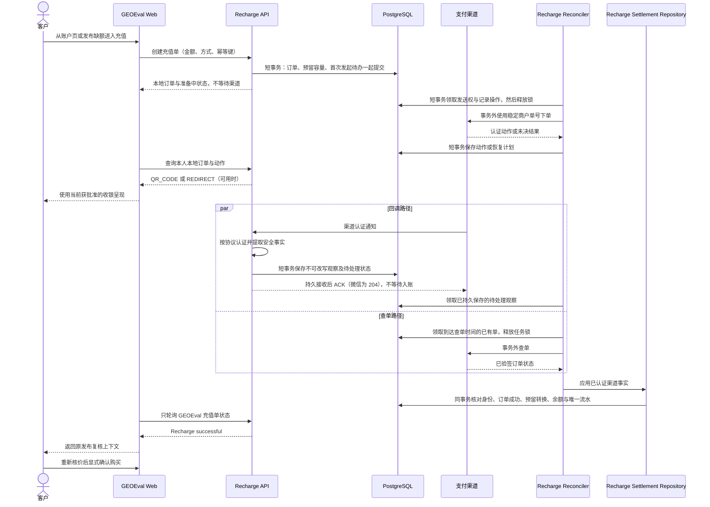
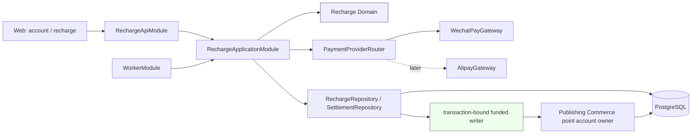
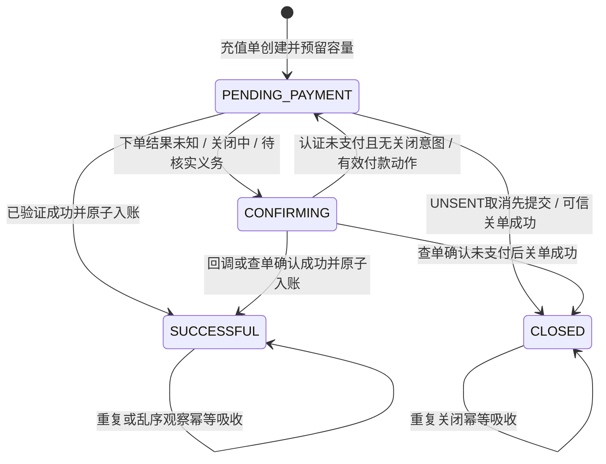
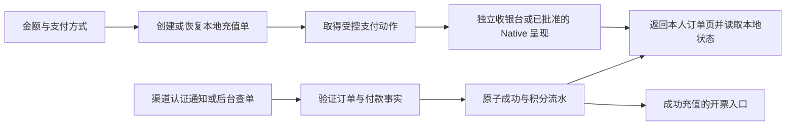

# Recharge payments design

方案日期：2026-09-09。架构 owner：[Issue #77《建立真实充值核心与微信网页支付链路》](https://github.com/ZETAVI/GEOEval/issues/77)；申请与资产准备继续属于 [Issue #75](https://github.com/ZETAVI/GEOEval/issues/75)。

Status: A0/B0/C1 and the N1 recovery runtime are implemented. N2 connects authenticated customer API/history and controlled desktop checkout; N3 adds an explicitly configured resident worker with verified process recovery; N4 adds durable post-settlement notices and account-safe customer navigation. W1 has reached real signed no-funds WeChat query and protected server credential custody; W2 adds a dedicated callback-only host but is not yet deployed. Current customer semantics are reconciled into the [Recharge spec](../../specs/recharge/spec.md). Real prepay/funds, Worker activation, H5, invoices and operational acceptance remain proposed. Control: [proposal](proposal.md); sequence and evidence: [tasks](tasks.md), [verification](verification.md). Earlier slice sections below are historical implementation boundaries, not current activation claims. The [current integration decision](https://github.com/ZETAVI/GEOEval/issues/77#issuecomment-5628184476) supersedes their earlier merge-authority limitations.

已批准以 PC Native → 手机外部浏览器 H5 验证渠道能力，并在 Publishing Commerce 内独立装配积分能力。用户进一步确认收银形式可替换，当前重点是账户、订单、支付、积分与开票的业务逻辑，以及同步/异步和恢复边界；具体服务商不阻挡共用链路设计。Node 协议实现沿用标准 crypto 与窄 HTTP Adapter；活动单限额和实际异常资金处置细节不视为自动获批。本文原位更新，具体协议与参考站证据由 [source-brief](source-brief.md)持有。

## 1. 建议结论

建立一个业务能力明确的 `Recharge` 模块，由它拥有充值订单、支付渠道协调、支付事实核验、异常恢复和成功入账编排。微信支付、支付宝是 `Recharge` 内部的 Provider Adapter；不要先创建一个能处理任意资金业务的通用 `Payment Platform`。

Publishing Commerce 继续拥有积分账户和追加式积分流水，并向 Recharge 的 PostgreSQL 基础设施暴露一个窄的、事务绑定的 funded writer。支付成功的外部证据先在数据库事务外完成验签、解密或查单，随后由 Recharge settlement repository 打开一个短事务，在同一事务中锁定充值单和积分账户、推进充值成功、写一条 `RECHARGE` 类型的 funded 流水并更新余额。任何 Provider 网络调用都不得进入该事务；领域层和应用层也不暴露数据库 transaction client。

首批实现按两条独立验证切片推进：

1. 微信 Native：覆盖 PC 网页二维码、回调、查单、关单和一次入账；
2. 微信 H5：覆盖 iOS/Android 外部手机浏览器的跳转、返回确认和恢复。

微信内网页需要 JSAPI，不属于 H5 的兼容模式；只有产品确认首批必须在微信内闭环时才单独纳入。支付宝沿用同一个 `Recharge` 核心，后续增加电脑网站支付和手机网站支付适配器。

## 2. 当前项目事实与不变边界

以下保留设计起点 `main@bcb81db5f567c5f0c3bced0c57df7b3dd8b83aa6` 的历史边界。当前已实现行为以本文首段链接的 Recharge、Commerce 和 Notification 规范及源码为准；真实充值仍未激活：

- 客户充值人民币整数，按 `1 元 = 10 积分`增加 funded 积分；只有确认支付成功才入账；
- 客户可见充值状态是 **待支付 / 确认中 / 充值成功 / 已关闭**；取消、失败和过期不入账；
- 充值成功后返回既有发布订单复核上下文，重新检查价格与可用性并要求客户再次确认，不能自动购买；
- Publishing Commerce 拥有账户级 `grantedBalance`、`fundedBalance`、账户序号和追加式 PointChange；
- 发布购买已经通过一个 PostgreSQL 短事务完成账户、选择、文章、套餐、媒体、流水和订单的一致提交；Provider、队列和用户交互都不得在其中发生；
- 当前运行时未启用真实支付，前端充值入口仍禁用；产品定义已规定充值与电子普票的未来语义，不应把“尚未实现”写成“没有产品规范”。

本方案不改变上述语义，也不把充值与发布购买合并为一个长事务。支付和消费是两个由客户明确触发、可分别恢复的业务过程。

## 3. 术语与所有权

| 名称 | 含义 | 所有者 |
| --- | --- | --- |
| Recharge Order | 客户以固定人民币金额购买固定 funded 积分的业务单 | Recharge |
| Payment Action / Session | 本单当前可展示的 QR 或跳转动作；服务商确实提供会话时关联其真实会话身份，不成为第二个充值单 | Recharge；外部格式归 Adapter |
| Payment Operation Attempt | 一次 INITIATE/QUERY/CLOSE 网络调用的请求与结果记录；同一充值单可有多条恢复记录，不代表多次独立收费意图 | Recharge |
| Authenticated Payment Observation | 已证明来自渠道的事实；是否匹配本地充值单必须由 Recharge 再校验 | Provider Adapter 认证；Recharge 保存和应用 |
| Point Account / Point Change | 账户积分余额、序号和不可改写流水 | Publishing Commerce |
| Publishing Selection / Purchase | 保存的发布意图、重新报价和显式购买 | Publishing Commerce |

删除测试：如果未来删除微信适配器，Recharge Order、funded 入账、发布复核与支付宝适配器仍应成立；如果删除 Recharge，Publishing Commerce 的积分购买仍能工作。这个结果说明业务能力和渠道协议没有互相吞并。

本单冻结一个收单身份，首批只保留一个当前支付动作；不为二维码、会话再建同义充值订单。第 9 节的操作 attempt 记录是已确定的恢复需要，用于逐次网络调用及未决结果，不能再与“独立付款意图”混称为一个活动尝试。操作历史可多条，不因此允许并开不同金额、单号或渠道的付款路径。N1 的物理 schema 由 RechargeOrder 与 RechargeOperationAttempt 持有；C1 原子到账仍是唯一积分写入路径。

## 4. 端到端链路



浏览器不直接查 Provider，也不把二维码扫描、H5 返回、JS Bridge 返回或客户端文案视为成功。浏览器只读取 GEOEval 自己的充值订单状态。

### 4.1 同步与异步选择

推荐“同步提交本地意图 + 异步处理外部支付 + 同步读取本地结果”。跨渠道是最终一致；订单成功、积分、流水和预留在同一个 PostgreSQL 短事务中强一致。异步不意味着先显示成功、后补账，也不承诺消息恰好投递一次；重复投递由唯一身份和原子事务收敛成一次业务效果。

| 步骤 | 执行方式与提交边界 | 调用方可以相信什么 |
| --- | --- | --- |
| 创建充值 | HTTP 内完成鉴权、金额/方式校验、同键恢复及订单/容量/发起待办提交 | 本地意图已存在；动作暂未生成不等于创建失败 |
| 发起/查单/关单 | Worker 短事务领取 → 释放锁 → 渠道 I/O → 新短事务应用；数据库可重扫 | 操作失败保留未知义务，页面和 Redis 不是恢复前提 |
| 支付通知 | 请求内协议认证和 inbox 持久提交后 ACK；匹配/入账由后台处理 | ACK 证明已接收；不证明本地已成功入账 |
| 结算积分 | Worker 调用 C1，在账户→订单→预留→receipt 的短事务中提交全部资金效果 | SUCCESSFUL 已包含一次真实账务提交；失败整笔回滚 |
| 页面 read / verify / cancel | read 只读本地；verify 持久合并核验调度再接受；cancel 提交关闭意图，UNSENT 可原子关闭 | 接受命令不代表最终支付/关闭；数据库写失败不得虚报已接受 |
| 通知与开票 | 通知从持久待办异步送达；开票申请本地提交后由运营按既定流程办理 | 通知迟到不撤销到账；未开票不阻挡已有积分使用 |

同步等待渠道下单虽可能少一次页面读取，但把客户 HTTP 生命周期与外部延迟绑定，还必须另建丢响应恢复分支；本项目优先采用上述单一持久执行路径。暂不增加同步快捷通道或工作流引擎。任何唤醒通知都只加速数据库已提交的工作；进程内 fire-and-forget 或单独写 Redis 不能替代持久待办。

### 4.2 放回完整业务链路

免费评价和文章确认不因充值而自动重跑。发布缺额只保存已有选择并给出充值入口；充值到的是账户余额，既不锁媒体/价格，也不创建发布订单。客户返回后重新读取文章、选择、报价与余额，再显式购买；购买事务与履约入池延续 Commerce/Delivery 既有责任。履约 RETURN 恢复原消费来源，不能改写充值流水或推定现金退款。代理佣金基于履约后的合格消费，不能因充值成功提前产生可提现佣金。开票绑定成功充值实际付款，不绑定之后消费了多少积分。

这些能力组成一条用户旅程，但不组成横跨支付、发布、履约和开票的长事务。每一步保留自己的业务记录与可追溯关联；沿用已验证的 CommercePointsModule 和窄事务绑定，当前没有证据支持重建钱包服务或大范围重构。

## 5. 模块与依赖方向



建议目录形态：

```text
apps/backend/src/recharge/
  domain/
    recharge-order.ts
    payment-gateway.ts
    verified-payment-observation.ts
  application/
    recharge.service.ts
    payment-confirmation.service.ts
    recharge-reconciler.ts
  infrastructure/
    postgres-recharge.repository.ts
    postgres-recharge-settlement.repository.ts
    wechat-pay.gateway.ts
    alipay.gateway.ts              # 后续
  presentation/
    recharge.controller.ts
    wechat-pay-callback.controller.ts
  recharge-application.module.ts
  recharge-api.module.ts
```

`RechargeApplicationModule` 供 API 和 Worker 共用，不能依赖 HTTP Controller；`RechargeApiModule` 只装配客户接口和 Provider 回调。Worker 不应为复用 Recharge 而加载文章、媒体或 Web 表现层。

### 5.0 与现有模块的冲突及最小收束

当前基线已包含 #76 正常履约。已核对 [PR #79@770a764](https://github.com/ZETAVI/GEOEval/pull/79)的实际模块和测试，以及该固定版本下的退点设计；#79 已在 [bcb81db 集成](https://github.com/ZETAVI/GEOEval/pull/79#issuecomment-5587460726)，本任务已从主干消费；退点仍是其后续能力。

| 责任 | 明确 owner / 入口 | 跨模块边界 |
| --- | --- | --- |
| 登录、角色、用户停用、客户请求 CSRF | Identity | Recharge 消费 Principal；回调仅使用精确路由的公开访问/CSRF 豁免与渠道密码学验证 |
| 充值金额、订单、收款事实、收单恢复 | Recharge | 不拥有发布承诺、履约状态、积分消费规则 |
| 余额、积分来源、账务序号、流水、容量预留 | Publishing Commerce 内部的积分账户能力 | 赠点、购买、充值、订单退点都经过同一个账户规则；不能由 Recharge 另写一套余额算法 |
| 发布选择、价格复核、购买与原消费 | Publishing Commerce | 支付完成不直接调用购买命令 |
| 责任人、发布结果、协商退点意图/资格 | Publication Delivery | 不写积分余额；退点实际执行仍由 Commerce 拥有 |
| 公网通知解析、请求签名、响应验签 | Recharge 的渠道适配器 | 返回已认证渠道事实；与本地订单的最终匹配由 Recharge settlement 在事务中执行 |

#79 对第一步的重构已经到位：独立 `CommercePointsModule` 迁入现有服务、仓储、两个积分 Controller 和 useExisting 映射，仅导出 PointAccountService；没有改变账务或购买事务。它切断文章/媒体/履约装配依赖，仍依赖根 Identity/Persistence。此前要求在机械提取阶段同时交付预留/writer 的描述过宽，在此收束。

现有 PointAccountService 负责 HTTP 错误映射、Identity 查询和管理/客户读写；PostgresPointAccountRepository.adjust 自己开启事务。Recharge 不调用该赠点服务完成系统入账。优先在 Commerce 的基础设施公开一个受控的事务绑定入口，返回仅供充值的 reserve/consume/release 能力；其实现不导入 HTTP service、Controller、IdentityModule 或 Recharge 模块。传入的数据库事务由 Recharge 持有，绑定入口不另行提交。该函数/小对象即可满足当前真实变点，无需先增加 CoreModule、全局 UnitOfWork 或通用 postDelta 框架。若未来消费者确实需要共享运行时 providers，再把已有实现装配为无 HTTP 的 CoreModule；那时移动 Controller 应保持原 API 注册一次。

赠点和购买的公共接口保留，内部改用同一个 Commerce 容量策略；退点也须在自己的实际实施片消费该策略。#79 不因尚未实现未来结算而被判为不合格，也不由 #77 重复提取。

原方案“RechargeOrder → PointAccount”的锁顺序统一改为 **PointAccount → RechargeOrder/Delivery settlement → 当前操作的观察或执行记录**，与购买 wallet-first 和 #73 退点 wallet-first 对齐。后台领取任务的短事务可以只锁任务行，但必须提交后才执行 settlement；禁止持有任务锁再反向获取钱包锁。

### 5.1 方案比较

| 方案 | 优点 | 主要代价 | 结论 |
| --- | --- | --- | --- |
| Recharge 拥有业务单，Commerce 暴露窄 funded writer | 充值语义集中；复用现有积分账本；Provider 可替换；发布购买不感知微信 | 需要固定一个跨模块事务端口 | **推荐** |
| 全部放进 Publishing Commerce | 少一个顶层模块 | 支付协议、回调、对账和发布购买耦合；Worker 需加载无关依赖 | 不采用 |
| 先建通用 Payment Platform，再由 Recharge 调用 | 理论上可扩到退款、订阅、分账 | 当前没有第二种稳定资金语义；接口会由猜测驱动 | 暂不采用；出现真实复用边界再提取 |

跨模块事务端口已经有先例：当前发布购买让文章和媒体窄 reader 使用 Commerce 打开的同一 transaction connection。这里沿用同一依赖原则，但写入所有者仍是积分账户模块。

## 6. 核心接口草案

### A0 实现卡：独立微信协议适配

- 已确认执行范围：[Decision](https://github.com/ZETAVI/GEOEval/issues/77#issuecomment-5582243258)。首次实施为 main-direct/base 0552aa7，后续同步与固定实现以 A0 的 PR/checkpoint 为准；运行时没有装配或环境变量读取，不依赖 Nest/Prisma/Commerce。
- 业务 gateway 拥有 Native 发起、按商户单号查单、关单；协议入口另接受原始通知和未合并头部。内部拆分成熟 crypto 原语、单次 HTTPS 传输和微信字段解释；测试在真实外部 I/O seam 替换 transport，生产默认固定官方 HTTPS origin/TLS。
- 查询携带被冻结的 merchant/app/order/amount 期望值。普通查单文档已成功读到：非成功状态可缺少 transaction_id/trade_type/amount；不得要求未支付单包含支付成功字段。SUCCESS 要形成可用支付证据则至少具备订单金额、币种、交易号和支付时刻；query 的选填 payer 字段保留 nullable，通知的必填 payer_total/payer_currency 不混用 query 规则。
- 下单结果只给 QR 动作与原订单到期时刻，不以调用时刻不断延长二维码期限。关闭只认对应请求上下文的已验签空 204。Notification 证明渠道来源并保留原商户身份，匹配本地充值与持久化仍由下一切片负责。
- 失败只返回有界类型码和必要 HTTP 状态；不带原文、Authorization、OpenID 或异常 cause。所有 Provider 调用最多一次，超时/错误不能释放容量。原始报文验签先于解码/字段解释，调用输入与配置快照不受外部后续修改影响。
- 配置只经明确构造参数进入，使用 Node KeyObject/32-byte APIv3 key 与复制的可信 key 集合；无 HTTP downgrade、通用 skip-signature 或不验证 TLS 的产品配置。测试 CA/路由改写只存在于测试传输替身。
- 无数据迁移；退出是移除未装配模块或保持不装配。最小反证：官方独立固定签名、成功/未支付字段差异、错身份/金额、204、密文/重复头/时效、请求体变更、TLS/截断/总时限、每次调用一个请求。实际 A0 测试不由旧 probe 成绩替代。

### 6.1 Provider 端口

A0 已实现的业务接口与类型由 [payment-gateway.ts](../../../apps/backend/src/recharge/application/payment-gateway.ts)持有，不在这里复制另一份签名。PaymentGateway 提供 Native initiate/query/close；PaymentNotificationVerifier 是独立协议入口，接受原始 Buffer 与未合并的头部值列表。WechatPayGateway 不依赖数据库或应用装配。

查询核对调用前复制的冻结 merchant/app/order/amount；通知返回原有渠道身份，允许后续 inbox 将未知/错配订单作为差异处理，不能直接入账。关单结果与支付事实分开，只有对应调用的已验签空 204 形成 CLOSE_ACKNOWLEDGED。QR 动作返回原订单支付期限，不承诺每次调用都获得新的二维码有效期。

内部 HTTPS transport 返回有界原始响应；gateway 验签后才交给具体操作解释。配置快照、严格类型错误、一次请求、总时限、原始字节、可信 key 和 TLS 限制以实现和 [验证](verification.md)为准。任何成功证据仍须由 Recharge 在后续 settlement 事务中匹配并应用。H5/支付宝扩展进入各自切片；JSAPI/通用支付平台不在当前接口中预置。

### 6.2 积分写入端口与事务责任

C1 已实现的应用合同由 [recharge-order.ts](../../../apps/backend/src/recharge/domain/recharge-order.ts)与 [RechargeCoreService](../../../apps/backend/src/recharge/application/recharge-core.service.ts)持有：创建、本人读取、UNSENT 取消、通知及已认证成功查单的应用。返回业务结果，不返回 Prisma client；当前应用未注册。可信关单与调度由本分支的 N1 内部 runtime 持有，尚未注册到当前 API/Worker。

| 入口 | 责任和前置事实 | 同一事务的效果 |
| --- | --- | --- |
| Recharge 创建 | 读取客户与显式金额策略、冻结金额/商户身份/期限；同客户键先恢复原单，再限制新单 | 锁账户 → 建充值单 → Commerce 保留该单的积分容量与一个未来流水槽位；不得调用 Provider |
| Commerce 事务绑定 writer：reserve | 同一事务内已锁账户；唯一 recharge/account 引用和固定点数 | 写 HELD reservation、增加账户 R/S；不改可用余额或账务序号 |
| writer：consume | Recharge 已核对已认证成功与冻结订单；reservation 属于同账户/订单且点数完全一致 | 仅增加 funded、减少该单 R/S、推进一次账务序号、追加该单唯一 RECHARGE 流水；没有任意余额覆盖入口 |
| writer：release | Recharge 在其事务内确认从未领取发送权，或已取得可信关闭依据 | 仅将该单 HELD 转 RELEASED、减少 R/S；重复释放无效果，不产生虚构点数流水 |
| Recharge settlement | 拥有业务单/渠道事实匹配、重复交易与通知处理结论 | 关联真实支付事实、保存交易身份、消费 reservation、订单成功、receipt 处理结果一起提交；局部失败整体回滚 |

绑定入口采用显式 `bind(tx)` 或等价小函数，生命周期仅在调用者事务内，账户锁由同一入口取得。Recharge 不能自己更新 PointAccount/PointChange；Commerce 不解析微信报文或拥有充值状态机。购买和退点保留各自已批准事务编排，仅共享账户锁、容量计算、余额/流水持久化规则。无跨模块 callback 让 Commerce 反向调用 Recharge。

两种接口比较：扩展 HTTP PointAccountService 并再次开事务会破坏原子性且带入 Identity；泛用 applyDelta 暴露任意点数来源和业务关联。推荐的窄基础设施入口沿用本项目 transaction-bound reader 的依赖方向，增加真实需要的业务写能力。

### 6.3 请求重试与系统入账身份

现有 PointChange 的 account/idempotencyKey 唯一约束同时保护赠点与购买；其旧冲突语义保留。RechargeOrder 创建请求仍按 account/clientKey 幂等，但**系统到账的去重主体是 rechargeOrderId 与稳定外部交易身份**。不能把客户键、公开充值 UUID 或其可推导 UUID 直接塞进旧客户端键空间：另一次合法购买可能先占用同值，使已收款入账永久冲突。

推荐的最小 schema 方向：RECHARGE 流水的客户端 idempotencyKey 为 NULL，使用独立非空 rechargeOrderId 唯一约束与 account 复合外键；现有赠点/购买/未来管理员退点仍必须有各自真实客户端请求键。相比给所有历史键重分命名空间，这保留旧唯一索引和旧调用者语义。PostgreSQL 默认 UNIQUE 的 NULL 互不相等，须由 kind-specific CHECK 明确哪些行允许 NULL，不能仅移除 NOT NULL 后放松旧约束。

同样明确自动到账的 actor：推荐新 actorKind=SYSTEM、actorAccountId=NULL，旧操作回填/保持 ACCOUNT 与非空 actor。客户发起身份留在 RechargeOrder；系统确认引用真实通知/查询证据。旧 kind 的约束必须显式要求 actor/request key 非空，避免 SQL CHECK 的 UNKNOWN 被当作通过。查询和客户 DTO 不得泄露内部预留或来源；管理员历史可表达系统到账。这套迁移已在 C1 受控窗口实现并验证，当前应用未启用真实充值。

## 7. 数据模型与完整性约束

### 7.1 RechargeOrder 候选字段

| 字段组 | 候选字段 |
| --- | --- |
| 身份 | `id`、客户可见 `number`、`accountId`、`accountSequence`（如需要列表顺序） |
| 冻结商业事实 | `amountYuan` 整数、`amountFen` 整数、`fundedPoints` 整数、`pointRate=10`、`currency=CNY` |
| 渠道身份 | 不可变 `provider`、`providerMerchantId`、`providerAppId`、`method`、`merchantOrderNo`、`providerTransactionId?`；另保存凭证配置引用 |
| 状态 | `status`、`paidAt?`、`closedAt?`、`expiresAt`、`revision` |
| 调起与核验 | `actionKind?`、受限保存的调起 URL/到期时间、`nextVerificationAt?`、`verificationAttempts`、`verificationLeaseUntil?` |
| 恢复 | `lastErrorCategory?`、`operationalReviewReason?`、`createdAt`、`updatedAt` |

约束：

- `(accountId, idempotencyKey)` 唯一，并保存归一化请求摘要；同键同意图恢复原单，同键异意图冲突；
- 一个账户最多一个非终态 RechargeOrder 仍是待确认的产品限制，不把它混同为安全必要条件；必要条件是有界活动单数/总预留、限频、稳定原单恢复和取消核验；
- `merchantOrderNo` 在本系统唯一，并符合具体 Provider 长度/字符规则；
- `(provider, providerMerchantId, providerTransactionId)` 在非空时唯一；商户单号也按稳定商户身份约束。凭证 alias、key id 或版本轮换不能改变交易幂等身份；
- `amountYuan > 0`、`amountFen = amountYuan * 100`、`fundedPoints = amountYuan * 10`，全程检查整数溢出；
- `SUCCESSFUL` 必须有外部交易号、支付时间和唯一 PointChange 关联；
- 一个 RechargeOrder 最多对应一条成功入账 PointChange；新增独立 `RECHARGE` 关联并使用 `(rechargeOrderId, accountId)` 复合 FK，保留原购买负流水/退点专属关联约束；系统入账使用专属充值业务唯一关联，不占用客户端请求键空间（见 6.3），避免另一种操作先占键而阻止已收款入账；
- 已保存的金额、汇率、商户订单号和成功外部交易身份不可修改。

### 7.2 预留 funded 入账容量

当前积分总额上限是 `2,147,483,647`。如果只在支付成功后检查上限，会出现“客户已经付款，但并发管理员赠点令账户无法入账”的资金完整性缺口。

由 Commerce 统一拥有 G=granted、F=funded、V=已提交账务序号、R=HELD 充值点数总额、S=HELD 充值流水槽位总数。推荐账户保存 R/S 汇总，另以唯一 recharge/account reservation 保留明细和 HELD → CONSUMED/RELEASED 的一次转换。任何改动都先锁账户，明细和汇总同事务；明细合计用于对账，不能让两个 writer 各维护一套算法。

不可变式：`G,F,R,S,V >= 0`、`G+F+R <= M`、`V+S <= M`，M 是现有积分整数上界。数据库 CHECK 用扩大后的算术类型验证总和；R/S 默认 0 保持历史钱包。跨行汇总不伪装为普通 CHECK，而由同事务 writer 与对账检查承担。PointBalance 的客户/管理员读取仍只给现有字段；R/S 属内部容量快照。

| 操作 | 容量/余额转换 | 序号处理 |
| --- | --- | --- |
| 预留 q 点充值 | R += q，S += 1；必须在付款发起前成立 | V 不变，没有余额变动流水 |
| 正常赠点、消费、订单退点 | 核对变化后的 G+F+R；消费仍先 granted 后 funded，退点仍按原消费来源 | V += 1，且新的 V+S 不超上限；扣点也不能占用留给已付款到账的最后槽位 |
| 确认本单到账 q 点 | F += q，R -= q，S -= 1；只消费自己的 HELD 明细 | V += 1，因此 V+S 不增加 |
| 安全关闭本单 | R -= q，S -= 1；不改 G/F | V 不变；保留 reservation 转换记录 |
| 已提交业务结果重放 | 恢复原结果，不重新通过可变余额/新单额度 Gate | 不再推进 V 或 S |

两个最小反例规定下一片必须改所有实际写入口：余额 M-20、R=20 时，旧赠点 +1 算法会挤占预留；V=M-1、S=1 时，旧购买算法会占用最后一个到账序号。它们是新增预留后会出现的风险，不是已启用产品的付款事故。

#73 退点也是增加 G/F 的操作，必须保留已批准的原来源、一次实际返还和停用客户旧义务规则。容量不足或序号被预留时保持待退点可见，不能挪用充值 R/S、伪造赠点、修改原消费或自动释放未知支付。本轮不把所有未来退点提前变成容量 reservation，也不改变 #73 的受限义务处理决定。

如果不做预留，就必须接受“已收款但积分无法自动到账”的人工负债，这不符合首版资金链路的完整性目标。预留只保护积分数值容量，不锁价格、媒体库存或发布选择。创建接口还需设账户级速率限制、批准的单笔最小/最大充值额和到期恢复；否则攻击者可以用未支付订单长期占用容量。

### 7.3 支付观察日志

建议增加 append-only `PaymentObservation`：

下列是全链路候选模型。B0 只实现已认证成功通知的观察/receipt，不伪造查单通知 ID；后续查询、关单和账单观察的 source/type 与迁移由 N1 收束后扩展，不声称 B0 已持有全部来源。

- 来源：`INITIATION_RESPONSE` / `NOTIFICATION` / `QUERY` / `CLOSE_RESPONSE` / `BILL_RECONCILIATION`；
- 归一状态、商户单号、平台交易号、订单总额、付款人实付额及各自币种、支付时间、Provider 配置别名；
- 验签使用的公钥 ID/证书序列号、原始报文摘要、标准化事实版本与摘要、收到时间；处理状态由独立可更新游标承担，不改写原事实；
- 不保存完整回调原文、payer OpenID、身份证、银行卡、APIv3 密钥或私钥。

签名无效或无法解密的请求只进入受限安全遥测；验真成功但商户/订单/金额不匹配的通知进入受限差异记录，不入账。可信观察和实际入账是两个事实。

原始正文摘要只追踪本次报文，不充当业务相等性。标准化事实采用明确版本和固定字段顺序，包含稳定 merchant/app/order/transaction、tradeType/state、订单总额/实付额/币种和规范化支付时刻；排除签名时间、nonce、密文、JSON 排版、收到时间与配置 alias。同一通知身份、同版本同事实可幂等 ACK；同身份不同业务事实不得覆盖原记录，进入受限冲突处理。不同 notification id 的同一交易可保留多个观察，后续结算仍以稳定交易/充值/流水唯一约束防重。事实版本升级必须能比较旧投影，不能单凭版本变化判定付款冲突。

微信成功通知中的 total 与 payer_total/payer_currency 都有各自含义，不能用一个 amount 字段覆盖。积分额度匹配冻结订单总额；实际支付金额单独保留以支持未来获授权的发票/财务读取，不把“积分÷10”当真实付款证据，也不由此引入优惠活动或发票模块。商户优惠/出资与异常金额的财务处置在真实启用前另行核定；本轮只防止丢失已认证资金事实。

## 8. 状态机



`PENDING_PAYMENT` 与 `CONFIRMING` 都不是失败。调用 `time_expire`、浏览器超时、客户返回或关单请求成功发出，都不能单独把本地订单置为 `CLOSED`。对于 MAY_EXIST，只有已验证的 Provider 状态/关单结果才能关闭并释放预留；UNSENT 取消先提交是 C1 已验证的本地例外。

晚到通知本身并不意味着 Provider 在成功关单后仍可付款。关单成功与同一外部交易成功相矛盾时，应先核对不可变商户身份、订单号、观察时序并主动查单；保存已收到的事实，禁止仅以到达顺序覆写终态。推荐对仍未关闭的正常晚到成功自动幂等入账；已确认关闭后的矛盾进入明确的财务差异处理，补入账或退款决策不由 webhook 自动猜测。

## 9. 事务、幂等与不确定结果

### 9.1 创建与下单

以下后端恢复合同已在 [Native runtime](../../../apps/backend/src/recharge/native-recovery.runtime.ts)、[应用端口](../../../apps/backend/src/recharge/application/native-recovery.ts)、[调度服务](../../../apps/backend/src/recharge/application/native-recovery.service.ts)与 [持久仓储](../../../apps/backend/src/recharge/infrastructure/postgres-native-recovery.repository.ts)实现。第 1 项的实际 HTTP 路由与定时 Worker 装配仍是下一片；当前只接受宿主显式构造和有界调用，不读环境凭据、不自动启动。

1. 客户创建请求只提交金额、方式和幂等键。短事务创建/恢复本地订单并预留容量；新单的首次 due 待办与订单同事务提交，HTTP 随后返回本地结果，不等待渠道。唤醒丢失或 API 在响应前退出后，Worker 仍可重扫已提交订单；同键重试先恢复已有结果，不重复冻结容量。
2. 第一次发起前冻结 `description`、`notify_url` 与已有商户/AppID/单号/金额/支付截止时间；订单不随配置更新改参数。保留显式凭证定位能力用于旧商户义务；密钥轮换允许替换认证材料，不改变原请求的业务参数。
3. 执行者在短事务核对取消意图、支付截止、状态与有效 generation，创建一次 INITIATE attempt，并将 UNSENT 不可逆推进为 MAY_EXIST，再提交。标记不声称网络已经送达，但之后取消不能再使用 C1 的本地 UNSENT 释放路径。
4. 在事务外执行一次 Adapter 请求。发送前再次检查许可可以减少陈旧发送，但检查与网络之间不存在跨系统原子锁；必须承认暂停进程恢复后仍可能发送。lease 只分配本地工作，不是微信侧 fence。
5. 单独短事务保存 attempt 结果，当前 generation 才可发布二维码或改变后续计划；取消/终态已经赢得竞争时不再展示迟到二维码。晚到的认证成功事实仍交 C1 匹配/结算，不能仅因 generation 过期而丢弃真实付款。
6. 未知响应保留原商户单号并先查单；允许重试时始终使用同一冻结参数。查询未支付但 QR 丢失/过期时才请求受控同号重取；到期或取消意图禁止重新发起。没有任何错误分支自动生成另一张可收费订单。

数据选择：在 RechargeOrder 上增加本轮真正需要的取消意图、generation、due/lease 和当前支付动作引用；新增 Recharge 自有 attempt 记录，保存操作/请求摘要、发起与结束时刻、有限诊断及认证结果引用。订单状态仍只有一个可变权威。相比再引入一张同义 execution 主记录，这样少一个发起/关闭状态同步问题；相比只保存最后一次错误，attempt 能保留进程丢响应时的未决外部义务。SQL 已在 N1 的增量迁移固定，不提前增加通用支付队列或任意事件 JSON 仓库。迁移对旧 UNSENT 不伪造已发起；已有 MAY_EXIST 缺请求快照时只允许核验/关闭，不从当前配置猜造一份历史重试参数。

attempt 的成功付款引用 C1 observation；NOTPAY/CLOSED/REFUND 与关单 ACK 使用真实来源的受限结果结构，不能编造 transactionId、payer、通知 ID，也不能把未认证错误写成支付事实。客户端、下单尝试和成功交易有各自幂等键，不复用一个键代替所有业务身份。

### 9.1a 取消、到期与安全终止

取消先在账户→订单锁内设置持久关闭意图、使旧 generation 失效并移除 QR；相同请求重复执行返回当前状态。

| 证据 | 允许的动作 | 容量/客户状态 |
| --- | --- | --- |
| 从未取得首次发起权，取消或到期先提交 | 使用 C1 本地关闭 | 原子释放本单预留，已关闭 |
| MAY_EXIST，认证查询为 NOTPAY 且已取消/到期 | 调用关单；网络在事务外 | 仍保留预留，确认中 |
| 认证关单空 204，或身份匹配的认证查询 CLOSED | 在锁内核对当前终态/冲突，保存关闭证据并释放 | 同事务已关闭；不得撤销已有成功 |
| 认证 SUCCESS（包括取消期间或旧 attempt 迟到） | 复用 C1 唯一到账事务 | 成功；不因客户曾点取消而丢弃付款 |
| NOT_EXIST、超时、验签失败、4xx/5xx、lease 到期 | 有界查询/退避，达到运营阈值后可见待核查 | 不自动释放、不宣告已关闭 |
| REFUND 或 Native 收到付款码专属状态 | 保留认证证据并进入受限核查 | 不自动入账、退点或释放 |

安全终止不依赖“等够 N 秒”：官方会把过近的 time_expire 调整到下单后至少一分钟。因此，即使本地 deadline 已过，延迟到微信的请求也可能仍产生可支付窗口。N1 在首次/再次发起前要求剩余时长满足官方最小值并留出请求预算与时钟裕量；这只减少风险，不能作为迟到请求不可能生效的证明。MAY_EXIST 仍需认证关闭证据；持续未查到的义务保留人工核查，不无限高频重试，也不靠猜测释放。

支付期限使用创建时冻结值。二维码期限只控制展示；本地倒计时、客户端取消微信收银台和关闭浏览器均不是商户关单。若安全关闭后客户重新充值，才通过显式新意图取得新幂等键和新单号；旧记录保持可查。异常关闭/成功矛盾沿用 C1 待核查边界，最终补入账或现金处置需要财务决定。

### 9.2 成功确认事务

1. 验签/解密或查询在事务外完成。通过稳定 merchant/order 引用找到不可变本地账户信息；未知订单先保存待核查原因，不借用回调自报账户创建钱包。
2. 同一短事务按 **PointAccount → RechargeOrder → 本单 reservation → 当前 receipt/处理记录** 锁定；复核账户、商户、应用、商户单号、冻结订单总额/币种及真实外部交易身份。
3. 先判断是否是相同已提交的业务结果并恢复；同一充值收到不同交易/金额等事实进入可见差异，不把“本地已经成功”当成忽略新冲突的理由。另一充值占用相同外部交易身份时不得转账或二次入账。
4. 通知路径在锁内重读 hasConflict 与处理状态，验证引用的不可变事实；不得只相信 listPending 的旧快照。查单使用真实 QUERY 来源的观察，不伪造 notificationId 或完整付款人字段；与 B0 通知观察共享规范化事实投影，source-kind 的具体 schema 扩展在该片确定。
5. Commerce writer 消费本单 reservation，更新余额/序号并追加唯一 RECHARGE 流水；Recharge 同事务保存支付事实关联、交易身份、成功状态和处理完成标记。
6. 任一步失败整体回滚；提交后丢响应只重取同一个成功结果。队列/Provider/用户交互不进入事务，后台领取任务的短事务在此之前已提交并释放任务锁。

重复回调、查单与回调竞争、进程在响应前退出，都只会恢复同一成功结果。

创建充值要求有效客户身份；支付后客户停用不能让已收款事实消失或被赠点的 `TARGET_INACTIVE` 规则拒绝。对已有合法订单推荐继续结算到原账户，保持停用状态；另外记录客户发起人和系统确认来源，不能把自动回调伪装成客户再次操作。Identity/财务有明确冻结规定时进入可见义务处理，不直接忽略付款。

## 10. 回调、查单、关单与后台恢复

### 10.1 微信回调入口

- Nest API 用 `rawBody: true` 保留原始字节；验签串严格使用 `timestamp + "\n" + nonce + "\n" + rawBody + "\n"`。框架可以解析传输 JSON，但业务只能在原始字节验签成功后使用其字段；
- 通过微信支付公钥 ID 或平台证书序列号选择可信公钥，未知或已吊销标识拒绝；
- 使用 APIv3 key 解密 `resource`，再核对 `mchid`、`appid`、`out_trade_no`、`transaction_id`、金额、币种和成功状态；
- 现有 `AccessGuard` 和 `CsrfGuard` 默认要求 session、Origin 和 `x-geoeval-request`；仅回调 handler 复用 `PublicAccess`/`CsrfExempt` 并强制渠道验签，客户 create/cancel/verify 仍保留认证、账户归属和 CSRF；
- 签名、解密和最低字段检查成功后，短事务持久保存通知 id、不可改写安全字段、摘要和待处理标记；提交后在官方 5 秒期限内应答 200/204，后台再入账。存储失败返回非 2xx；不能先 ACK 再依赖内存任务；
- 原有 PaymentObservation 复用为 durable inbox，不再增加第二份同义消息表：可信事实不可改写，处理游标/失败次数可以更新。Redis 不可用时数据库扫描仍能恢复；
- 同 notification id 同标准化事实快速确认；raw digest 改变本身不是业务冲突。同身份不同事实不能直接覆盖，须保留受限冲突与处置入口。签名无效或 SIGNTEST 拒绝；可信但未知订单/金额不匹配要保存受限差异证据并告警，不入账；签名不可信的噪声不进入业务 inbox。

接收仓储必须将不可改写观察和可恢复处理状态放在同一事务。PostgreSQL Read Committed 下，ON CONFLICT DO NOTHING 可能因另一事务的唯一键而跳过插入，但当前语句快照看不到那行；用随后语句读取已存在事实再判断幂等，不使用一条 CTE 中 fallback SELECT 的“没读到”作为未接收结论。只有事务提交完成才给成功 ACK；提交结果未知时不先 ACK，后续同通知重试恢复已有事实。工程实现用连接池/参数化查询和有界事务时限，不能照搬实验中的逐次 docker/psql 启动。

[通知持久性实验](verification.md)覆盖真实 raw HTTP/验签解密、并发唯一插入、提交前阻塞和接收进程 SIGKILL；它没有 Nest/Identity 装配、业务订单匹配、Worker lease 或 funded writer，不宣称上述后续链路已实现。实验使用观察与游标两张临时表，只验证逻辑原子性，不冻结最终 Prisma 物理表形态。

### 10.1a 接收后的处理结果与公平恢复

B0 的 ACCEPTED/204 只代表接收。C1 使用 processedAt/appliedRechargeOrderId 与独立 reviewReason/hasConflict 表达处理结果：待处理扫描排除已处理或待核查记录；已成功后仍可以出现新增差异，两者不强制塞进互斥状态。准确字段由实际 repository/schema 持有。验证成功却找不到本地订单、字段不匹配、冲突或已释放后迟到付款都进入具备原因的受限待核查记录，不通过设置 processedAt 虚报到账。已有成功后出现的新差异保留历史成功与新增告警事实，不自动撤销或再记分。

临时数据库/传输失败仍可按行级 due time 有界重试；不能把最早的 100 条无法处理通知永远留在 pending 队首、饿死后续有效付款。扫描每轮读取当前可执行状态，不持久推进只增时间水位；运营另能找回待核查义务。处理状态与 ledger/order 的关系必须由同一 settlement 事务或明确的无资金效果审查事务确定。

### 10.2 主动查单

前台查询本地状态与后台查询微信分离；它们的频率不是一对一关系。页面打开、手动核验和恢复焦点只给已有订单合并一次尽快核验提示，不各自直接发起微信请求。

- PostgreSQL 的 nextActionAt、attempt、generation 与有界 lease 是恢复权威。Worker 先短事务领取并释放任务锁，再出站调用，最后在新事务应用结果；需要积分写入时保持账户→订单→预留→receipt 顺序，不持有任务锁反向等待账户。
- 单订单同一代只安排一个有效操作；多实例共享租约，但承认旧网络调用可迟到。过期执行者不可覆盖新 QR/关闭意图，认证资金事实仍保存并经过 C1。
- due 扫描具有页数、单轮时长、商户并发和重试预算；临时故障只后移该行，不堵住队首。查单认证失败或配置失配暂停该商户的发起，保留已有义务及安全诊断。429 降速，不让用户刷新绕过商户级预算。
- 同步配置的测试 profile 可采用官方举例的前台 2 秒/60 秒有界轮询；后台采用明确退避数组和抖动。这是工程配置，不是微信 SLA 或已批准的运营时限。终态、离开页面或失去会话立即停前台轮询；页面隐藏暂停，恢复后先读本地状态。后台恢复不依赖页面存在。
- 取消/到期后按 9.1a 查关单；认证关单 204 已是独立关闭证据，后续查询是额外恢复或冲突核验，不是为每次 204 强制再造一份成功付款对象。

### 10.3 与现有 Background Work 的关系

现有 `ProductOutboxEvent`、`ProductWorkProcessor` 和队列语义由 Evaluation 工作拥有，事件类型和依赖都不是通用支付设施。不要为了代码复用把支付事件塞进该 owner。

| 候选 | 评价 |
| --- | --- |
| 扩展现有 evaluation outbox 为通用支付 outbox | 改变既有 owner 和失败语义，耦合无关模块；不推荐 |
| 独立 Recharge due-state reconciler，由 Worker 组合层定时唤醒 | DB 状态直接表达待查单事实，恢复路径清楚，改动小；**首批推荐** |
| 新建完整 payment outbox/queue 子系统 | 若后续出现退款、账单、事件订阅等多类 durable command 再评估；首批证据不足 |

支付事实应用与外部网络操作分别有界领取和预算，避免慢查询/关单占满执行机会后饿死已收付款的入账。各自失败都保留下一执行时刻和有限诊断；瞬时基础设施错误退避，认证/身份差异进入受限核查，不能靠增加重试次数把差异变成成功。具体并发和时长使用明确测试 profile，生产值属于相应启用配置。

### 10.4 到账后的通知与页面刷新

复用现有 Notification 的持久通知和 app-shell SSE 刷新机制，不新增支付专用 WebSocket。当前 Notification 只实现 Evaluation kinds/targets，充值 kind/本人订单 target 仍须在对应接线片明确增加，不能声称目前已经通用。

采用成功充值上一个最小持久通知待办标记，与 SUCCESSFUL/流水同事务写入；Worker 按充值单业务身份向 Notification 幂等写入后再标记已处理。跨这两次提交中断只会重投，不能丢失或创建重复客户通知；通知不可用不回滚资金，保留可补投待办。具体标记与接口在客户 API/成功通知接线片落实，不扩展 Evaluation outbox 承担支付工作。

SSE 只提示重读，不携带入账权威；断线后本人订单/通知列表仍可读取。首次网页接线继续用已有有界轮询，SSE 仅在现有通知接线后改善刷新时机。看到 SUCCESSFUL 后使旧余额请求失效，再读取 Commerce 的 balance/revision；旧响应不得覆盖新余额，也不在浏览器做余额加法。余额暂未读到时显示正在更新，不能把已确认成功降成付款失败。

## 11. 客户 API 与 Web 交互

### 11.0 收银体验与支付方式

用户通过参考站实机体验进一步明确：我们页面负责选择充值金额和支付方式、确认订单；付款交互希望交给独立收银台，之后返回我们自己的订单状态页。具体观察由 [source-brief](source-brief.md) 的参考站学习记录持有；该偏好不等于批准使用其中的第三方收单服务，也不改变人民币/积分、成功证据或购买确认规则。



这里的“支付方式”是客户选择的微信/支付宝，“服务商/商户配置”是后端冻结的实际收单与身份边界，“动作”才是 QR_CODE 或 REDIRECT。三者不能互相替代；带微信标识的第三方页面不会自动变成微信官方接口。继续采用第 9 节的订单和 attempt 所有权，不另建同义钱包、收银订单总表或通用支付平台。

当前执行端口 [PaymentGateway](../../../apps/backend/src/recharge/application/payment-gateway.ts) 只实现直连 WECHAT/CNY/NATIVE 与 QR_CODE；虽然下列候选 API 留出了动作分支，**现有代码并未实现通用托管服务商**。托管接入必须先取得对应正式协议与商户能力，再评审身份、通知/查单证明、交易唯一性、金额币种、关单、账单和异常恢复；不能只换 URL 或把第三方通知伪装成微信 APIv3 事实。C1 的账务事务可复用，其付款事实入口按真实渠道合同适配。

进入客户页面实施前，收束以下边界：

- 选择金额/方式时展示充值人民币、将得积分；服务端根据已批准策略再次校验。方式在本单发起后冻结，换方式不能静默并开第二条可付款路径；按已有可信关闭/未决义务规则处理，再经显式新意图创建。
- REDIRECT 由服务器的受信任服务商响应或正式 SDK 产生，绑定本人订单、商户配置、action/attempt 和展示期限；浏览器不自带任意跳转地址。跳转链接可能带敏感令牌，不进入分析日志、持久浏览器存储或公开研究记录。
- 订单期限、支付动作期限和收银台倒计时分别处理。过期动作不续订单、不推定关闭；刷新/重取必须遵守同号恢复及旧动作失效规则。
- 在外部页面点击完成/取消、回跳参数、打开或关闭标签都只是 UI 事件。回跳只触发本人订单读取或有界 verify；支付成功仍由可信事实与 C1 提交确认。丢回跳、弹窗被拦或返回页卡住时，客户仍可从充值记录恢复。
- 充值记录保存未付/确认中/成功/关闭，积分明细只展示真实已提交账务；不得以“没有积分流水”推定不存在待付单。成功后继续使用账户限定的发布返回上下文，重新核价，不自动购买。

当前 Native 组件是已验证的直连呈现能力，不再把“原页面内嵌 QR”当成唯一产品交互。用户明确此次主要学习业务逻辑，具体收银形式不作为金额确认、本地订单、异步恢复、历史和开票设计的阻塞项。实际服务商合同仅约束其 Adapter/环境联调和启用；继续用现有 Native 与受控来源检验共用链路，不提前安装或假造第三方协议。

### 客户接口候选

候选 API：

| 方法 | 路径 | 语义 |
| --- | --- | --- |
| `GET` | `/recharges/options` | 当前可用方式、整数元范围、快捷金额及创建可用性；不含商户/密钥 |
| `POST` | `/recharges` | 以 `{amountYuan, method, idempotencyKey}` 创建或恢复充值单 |
| `GET` | `/recharges/:id` | 只读本人本地状态、安全详情和当前可展示动作，不触发 Provider |
| `GET` | `/recharges` | 分页返回客户自己的充值记录 |
| `POST` | `/recharges/:id/verify` | 用户返回或等待时提示后端尽快查单；限频、幂等、只调度 |
| `POST` | `/recharges/:id/cancel` | 幂等关闭意图；仅 UNSENT 可本地关闭，其余按 9.1a 核验 |
| `POST` | `/recharges/providers/wechat/notify` | 微信服务端回调；密码学鉴权、原始 body 验签 |

响应中的调起动作使用判别联合类型。客户 DTO 不直接序列化 C1 内部 RechargeOrder：仅订单号、整数元/积分、四种业务状态、创建/截止/成功时刻、允许的操作及安全提示；QR 动作只含原 code_url 与展示截止。无商户凭证、proof、内部预留、generation、Provider 错误或 reviewReason。GET 使用 no-store；同一页面只保留一个在途轮询，忽略旧请求/旧订单响应，取消后的旧 QR 不能重新出现。

充值选项由 Recharge 的策略 owner 提供，服务端创建再次校验，前端不是规则权威。管理员维护快捷金额属于该策略边界，不耦合发布套餐价格或账户写入；受控测试可以显式配置，正式页面启用前需具备已批准的值与维护入口。

所有客户接口沿用 session、终端客户角色、账户归属及写操作 CSRF；外账户记录按未找到处理。verify 仅合并调度请求，成功 HTTP 202 表示接受提示，不表示支付成功。create 在本地订单提交后即可返回，二维码尚未准备时有明确等待态；重复 key 恢复原单。历史分页有上限，充值单不是公开收银台。

### 11.1 PC Native

- 入口为现有积分区域与发布余额不足提示；桌面 QR 页展示金额、到账积分、状态和“使用微信扫一扫”。手机单机页面在 H5 未完成时明确当前入口限制，不以长按/相册识别冒充 Native 支持。
- 仅将已认证、当前订单/有效 generation 的 code_url 在本地生成二维码，保持字节值，不拼接、不交给第三方二维码服务、不把它作为浏览器跳转目标或普通外链。Adapter 已修复旧 host/path 的过严校验，两种官方 /up URI 与旧链接的支持以实际 gateway/tests 为准；scheme/凭据/端口/控制字符等必要拒绝规则保留。这不代表二维码页面或实际扫码已完成。
- 二维码展示截止取订单支付期限与本动作保守 QR 期限的较早者。官方 QR 有效期为两小时，但响应没有 issuedAt；按相应请求的已持久发起时刻保守计时，不按页面重载或收到旧响应重新续期。重复返回同一 URL 不证明续期；缺少可证明的新动作时隐藏旧 QR，提供受控核验/重取路径；独立客服入口按14.2保留后续讨论。刷新新动作不修改金额、商户单号或支付截止。
- 待支付可以显示有效 QR；下单未知、取消中或支付截止后显示“正在确认支付结果”，停止展示 QR。轮询预算结束只提示稍后查订单，不伪装失败/关闭。只有本地 C1 成功提交后显示充值成功并刷新余额。
- 显式选择取消只记录关闭意图，未核实前不承诺取消成功；离开页面不自动取消。已成功/已关闭停止展示动作；所有结果保留订单历史；客服作为独立常驻入口，其设计不与本单状态绑定，见14.2。
- 余额不足时先保存现有发布选择，再进入充值；返回引用限于账户拥有的 brand/selection 与允许的本地页面，不能接受任意 return_url。现有 pending-publishing-purchase 保存的是已确认购买请求，且 purchaseIntent 会拒绝 shortfall；不可拿它伪造待充值购买。使用轻量、按账户隔离的发布返回引用，恢复时重新读取保存的选择/文章及当前价格。原品牌与当前品牌不同则提示客户选择原上下文，不静默替换当前品牌。只有客户重新确认才提交购买。

### 11.1a 可独立验证的 Native 页面切片

已实现边界由 [controller](../../../apps/web/app/recharges/native-checkout-controller.ts) 与 [React 组件](../../../apps/web/app/recharges/native-checkout.tsx)持有，21 项行为回归见 [测试](../../../apps/web/test/native-checkout.spec.tsx)。实现证据和未接通部分统一记录在 verification，不把测试宿主当作客户支付页面。

本切片提供 Web 私有的 NativeCheckout 组件和单一客户端 controller。未来 API mapping 只需提供本人订单安全快照、read/verify/cancel 三个有界方法，不把 C1 内部对象直接传到页面；本片没有默认 HTTP 地址、支付路由或后台注册。快照包含服务端采样时间供展示计时，wire DTO 在共享窗口确定后映射。

选择单一可订阅 controller，而非多个互相触发的 React effect：它统一管理在途读取、操作失效标记、暂停/恢复、轮询预算与时间展示，React 只订阅稳定快照。源方法接受 AbortSignal；超时或旧请求失效不意味着远端操作被撤销。切换账户/订单和卸载立即失效旧结果，迟到响应不能恢复旧二维码或覆盖新订单。

取消先保存按账户和订单隔离的最小本地意图标记，再发送命令并隐藏 QR；刷新和另一标签页都恢复该意图，命令 ACK 不等于已关闭。标记只在服务端终态确认后清理，不保存 QR/金额/凭据。若本地恢复记录不可用，不发出无法恢复的取消命令、不展示可能过时的 QR，提供简短的安全重试提示；不将该局部失败绑定到客服入口。支付/关闭仍完全由服务端状态决定。

二维码由本地 SVG 库直接渲染，保留四模块静区，不嵌 logo 或外部图片。组件只暴露已批准的支付动作；移动窄屏不给长按/相册扫码承诺。独立测试宿主模拟本人订单读取与命令响应，必须明确其为合成场景；临时预览路由在验证后移除，产品不因预览而启用充值。

普通商户 Native 返回 code_url，由商户页面展示二维码，手机微信扫码进入微信收银台；该接口不提供可直接跳转的官方 PC 托管收银页 URL。商户自己的独立收银页或当前页面内嵌属于同一 UI 装配选择，不改变充值/付款证据边界。H5 才返回 h5_url，经过官方收银台中间页校验并调起支付；它不能代替 PC Native。第三方托管收银方案不在当前已确认接口范围内。来源见 source-brief。

### 11.2 手机外部浏览器 H5

- 服务器调用 `/v3/pay/transactions/h5`，准确传递真实用户 IP 和 H5 场景；
- 从已配置 H5 域名页面跳转完整 `h5_url`，不得截断或修改；如加 `redirect_url`，只作为页面返回位置；
- 当前 `h5_url` 有效期 5 分钟；`time_expire` 表示不能继续支付的时间，并不等同关单；
- 返回页展示“已完成支付”并触发后端核验，仍以回调/查单结果为准；
- iOS Safari、Android Chrome/系统浏览器和微信未安装/无法调起等真实路径分开验收。

若访问来自微信内浏览器，页面明确说明当前 H5 不支持该入口并提供外部浏览器指引；产品选择 JSAPI 后再增加 `BRIDGE` 动作和 OpenID/AppID 边界。

### 11.3 账户、订单、流水与开票的字段边界

下表是本项目的逻辑关系与 owner 映射，不是竞品数据库逆向结果，也不声明新表均已实现。已有物理模型以 code/Prisma 为准；支付 action/会话沿用第 9 节的订单/attempt，不提前增加第二个订单状态源。

| 概念与 owner | 最小信息/关系 | 必须保持的边界 |
| --- | --- | --- |
| 客户账户 / Identity | accountId、角色/状态、已有手机号等联系资料 | 登录身份和业务开票资料分开；支付商户凭据不属于客户资料；不因有开户行信息就扩展登录档案 |
| 充值单 / Recharge | accountId、整数元/分、币种、积分、支付方式/冻结商户路由、幂等身份、生命周期时刻 | 冻结金额与方式，当前只 CNY、1 元 10 分；外部会话/交易号不替代本地订单号 |
| 支付动作/attempt / Recharge | 本单关联、真实渠道/会话引用（接口需要时）、generation、动作种类/期限、请求与恢复信息 | 描述如何调起和恢复，不成为到账权威；具体服务商字段在正式接口选择后落实 |
| 可信付款观察 / Recharge | 来源、商户/订单/交易身份、认证证明、订单金额与真实支付金额/币种、支付时刻 | 本次浏览未取得第三方认证合同；不能复用微信验签的名字或凭空制造 proof |
| 积分账户/流水 / Commerce | 本客户账户、余额与追加流水、唯一充值关联 | 回调/查单竞争只记一次；充值、赠点、购买、订单 RETURN 的含义和来源保持独立 |
| 可复用开票资料 / 未来开票能力 | 个人姓名+收件邮箱，或企业名+税号+收件邮箱 | 与登录/通知邮箱可不同；资料修改不倒灌历史申请；本项目不收集地址、电话、银行信息 |
| 充值开票申请 / 未来开票能力 | 唯一 rechargeOrderId、提交时资料快照、真实已付人民币、Processing/Needs correction/Issued、补正原因与结果引用 | 成功单才可申请，一单一申请/一张电子普票；补正重提同一申请，不以客户输入/积分倒算开票额 |

开票产品意义继续由 [product-definition 的 money-information 场景](../../specs/product-definition/spec.md#requirement-two-bounded-money-information-routes)与 glossary 持有：提交后锁定；运营补正或在外部开票并发邮件后上传 PDF/票号/日期，客户查看下载并收到产品内通知。首批不由系统自动发邮件、不接税务平台、不支持专票/拆合票/自助撤回重开。参照站的付款前必填跨境 Invoice 和“我的回票”提现审核，不改变这份已确认合同。本 #77 支付实现只保留成功充值/实付事实的可靠读取边界，不趁调研提前建开票、提现或报表框架。

### 11.4 充值入口、等待与历史的具体规则

- 账户余额、充值入口、积分明细形成短路径；充值记录与积分明细相互可达但保持独立。借鉴参考站的金额确认与正负变动标识，不复制会员、兑换奖励、默认测试档或含糊的“后台充值”分类。
- 金额草稿只有一个选择来源：快捷金额或自定义原始输入。自定义为空、小数、非数字、零或超限时，显示对应错误并禁止创建，不能静默删字符、取整、裁剪金额或退回旧快捷值；切换快捷项须由客户明确操作。确认区同步显示人民币与积分，服务端仍以严格整数/策略校验为准。
- 缺额建议按实际短缺积分向上换算整数元，并明确适用的最低/最高金额；建议不是已创建订单，也不隐式拆成多单。未提供可用支付方式时明确尚未开放，不使用测试通道替代。
- 发出 create 前按账户保存最小幂等意图；提交未知时保留同键同内容恢复入口，不能换键重建。取得订单号后关联该意图；恢复到终态或服务器明确拒绝后才释放本地未知提交限制。存在其他未付单时给出继续查看入口，不按金额猜测哪笔是本次意图，也不强行把活动单策略改成固定只能一单。
- 收银准备中、页面读取失败、手动核验中和轮询结束是 UI 状态，不增添或重写订单的四种业务状态。等待有界，结束后提供刷新、本单记录或稍后查看；一次手动核验会返回可操作状态，不能永久占住按钮。离开页面只停止前台等待，后台义务继续。
- 不显示由客户按钮制造的“已扫码”事实。点击核验只提示正在核对；过期 QR、取消中的旧动作和过时响应不能重新变得可付款。支付或关闭终态均来自本地可信记录。
- 充值记录按本人归属、稳定时间/id 游标分页，展示金额/积分、支付方式、时间、状态和可用动作。若提供状态筛选，服务端先筛选再分页；否则明确只是当前已加载记录，不能把局部空结果写成“没有充值”。积分历史沿用 Commerce 序号游标、业务类型、正负变动、记账后余额及对应订单，不复制余额来源或单独维护第二套流水。
- 只有 SUCCESSFUL 单开放既定开票申请；没有填写开票资料不能阻止客户先充值。资料复用与每笔提交快照分开，未开票/补正不改变支付状态、余额或发布权限。浏览器显示 Invoice/凭证按钮不构成真实开票或邮件已送达证据。

## 12. 支付宝后续适配

支付宝网站支付是页面签名链接/表单流程，不能因为官方 SDK 支持 API v3 就把 `page.pay/wap.pay` 当普通 REST JSON 下单。优先使用 SDK 页面链接能力映射 `REDIRECT`；若选表单模式，在受控支付跳转页消费，避免通用前端渲染任意 HTML。通知的表单解码与验签独立于微信的 raw JSON + AES-GCM，只有业务事实归一后才复用 Recharge 入账；`return_url` 不入账。各 query/notification 具有不同身份字段，按对应接口规则核对，不能要求每种应答都凭空包含全部字段。

Node 侧优先评估支付宝官方 `alipay-sdk`。其官方仓库说明支持 API v3、签名/验签、CommonJS/ESM 和 TypeScript；当前项目 Node 24 满足其版本要求。正式引入前仍需锁定版本、审许可证/传递依赖并用官方沙箱或账户能力验证。

首版使用现有 Node 标准 crypto 与窄 HTTP Adapter，依据是已核清的官方协议/固定例证、现有 Node 运行时及最小部署成本。证据及一条样例差异见 source brief，不把 probe 直接当生产代码。微信官方组织提供 Java/Go/PHP SDK 和 curl/Java/Go 示例，也提供接入质量参考；缺少 Node SDK 不等于缺少官方协议或可以直接编码。官方资料中的通用高可用目标也不自动成为 GEOEval 的可用性承诺。

## 13. 配置与密钥边界

API 与独立 Recharge Worker 共用显式 provider 配置。当前实际变量为：

```text
RECHARGE_WECHAT_ACTIVATION=disabled|verify|live
RECHARGE_WECHAT_MERCHANT_ID=...
RECHARGE_WECHAT_APP_ID=...
RECHARGE_WECHAT_MERCHANT_CERT_SERIAL=...
RECHARGE_WECHAT_PUBLIC_KEY_ID=...
RECHARGE_WECHAT_PRIVATE_KEY_FILE=/protected/.../apiclient_key.pem
RECHARGE_WECHAT_PUBLIC_KEY_FILE=/protected/.../wechatpay_public.pem
RECHARGE_WECHAT_API_V3_KEY_FILE=/protected/.../api_v3.key
RECHARGE_WECHAT_NOTIFY_URL=https://.../recharges/providers/wechat/notify
RECHARGE_WECHAT_API_ORIGIN=https://api.mch.weixin.qq.com
RECHARGE_WECHAT_IP_FAMILY=auto|ipv4|ipv6
RECHARGE_WECHAT_TIMEOUT_MS=8000
RECHARGE_CALLBACK_PORT=3300
```

- 配置对象保存进程内受限值，不在启动日志、健康接口、异常、Issue、聊天或 Git 输出 secret；
- 私钥、APIv3 key 和可信公钥由 secret manager/受控挂载注入；文件必须是绝对路径、普通文件、权限 0400/0600，轮换、吊销和双钥过渡要有 runbook；
- `disabled` 不加载该渠道；`verify` 保留回调、inbox、查单/关单和既有义务但禁止新单；`live` 才开放微信 Native 新单与发起。隔离测试继续使用显式构造的内存密钥/网关，不增加生产 `deterministic` 模式；
- 订单冻结稳定商户/AppID，API 与 Worker 按该身份定位可信凭证版本，不能用可变 alias 充当商户身份；密钥轮换不迁移订单身份；
- 时钟同步、TLS、出站域名、主/备 API 域名和回调公网 HTTPS 属于部署前检查项。
- 网络族默认 `auto`；只有实际部署环境证明某一网络族不可达时才显式选择 `ipv4` 或 `ipv6`。该选择只进入微信 HTTPS Adapter，不通过全局 Node 参数影响其他渠道或基础设施。
- `recharge-callback-main` 只绑定 loopback，由反向代理精确暴露渠道通知路径；它只装配 PostgreSQL、raw-body parser、通知验签和 durable inbox，不装配 Identity、客户 API、后台 Worker、AI、媒体或 Redis。微信回调进程只读取微信支付公钥和 APIv3 密钥，不读取商户私钥、证书、AppID 或出站 API 配置。

凭证保管与轮换：

- 商户超级管理员拥有申请、重设和吊销权限，技术负责人保管密码管理器中的 APIv3 源记录；服务器副本只由无登录 `geoeval` 运行用户读取，主机 root/sudo 负责受控写入；
- 商户证书到期或疑似泄露时，先在 `verify` 停止新单，申请新证书并在临时路径核对证书/私钥，再同时切换私钥路径和序列号、重启并通过无资金查询，最后才吊销旧证书；
- 微信支付公钥的 ID 与 PEM 必须成对切换；APIv3 密钥重设前先停止新单，密码管理器与服务器文件同步更新并重启，完成真实回调解密验证后才恢复 `live`。当前运行配置一次只激活一组公钥/APIv3 材料，不能声称无停机双钥切换；
- 证书有效期和公钥/APIv3 变更由技术负责人纳入到期提醒；Git、Issue、聊天和日志只记录非敏感 ID、指纹、有效期和验证结果。

双渠道宿主以现有 `RechargePaymentGateway` 为变化接缝，不增加通用 Payment 服务：

- API 为每个配置渠道构造一个现有恢复 runtime；创建按请求 method 路由，已有订单的核验、取消和收银动作按订单冻结 method 路由。
- 回调模块注册 provider→verifier 映射，并只暴露已配置 provider 的控制器。微信 raw JSON/AES-GCM 与支付宝 form/RSA2 继续各自解析，持久付款事实才汇入同一结算边界。
- Worker 的 provider 下单/查单/关单并行推进，避免一个慢渠道阻塞另一个；通知与 settlement 仍是独立 lane。settlement 查询本身按持久记录携带 provider，不需要每个 provider 重复扫描。
- 共享金额范围、快捷金额和账户活动单上限必须一致；不同商户/AppID、动作类型、超时和激活状态保留在渠道内部。
- 旧 `Native*` 数据字段继续作为兼容持久实现名称，本片只增加中性组合层。删除或批量重命名数据库列不会减少真实复杂度，也会扩大迁移风险。

## 14. 可靠性恢复、状态提示与对账

R1 已按用户确认方向实现并通过本地验证，当前规则已归入 Recharge spec 和源码；PR #87 持有实时 CI/合并状态。目标是提高可靠性和可解释性，不承诺所有异常都自动解决。本片 R1 改善临时故障恢复及客户提示，管理端先定义只读视图；复杂人工命令、账单执行器及 H5 不并入 R1。

### 14.1 R1 自动恢复边界

变更前的可达问题：`NativeRecoveryRepository.complete` 在失败达到 `maxFailures` 后保存 RETRY_EXHAUSTED 并清除下一次调度；due 扫描跳过该行。客户 API 又将 reviewRequired 映射成 supportRequired，导致普通网络中断最终表现为联系客服。另一个实现细节是网关返回 `HTTP_ERROR + httpStatus`，旧 attempt 只保留 diagnosticCode；因此不能凭旧 HTTP_ERROR 推断旧故障是限流、服务故障还是配置错误。

已落实的接缝和责任：

- Recharge 持有按操作区分的故障分类、持久调度和客户安全投影。Commerce 的容量、唯一流水与事务锁序保持不变；Notification 仍独立恢复。
- 对连接超时、断连和经分类可重试的 429/5xx，短周期次数用尽后改为低频核验原单。低频阶段只以 QUERY 查明结果；到期或取消后，可信 NOTPAY 才安排 CLOSE，可信 SUCCESS 仍经 C1 到账。降频不重建订单、不延长支付期限、不释放未决预留。
- 认证失败、商户配置不符、业务身份/金额冲突、未知协议错误不被宽泛的“可重试”覆盖。它们保留受限分类和告警；修复配置后再有界恢复。未经认证的通知只拒绝并记安全遥测，不能被外部请求用来冻结某个正常订单。
- 操作完成事务同时保存有限故障分类、连续失败次数和下次执行时间。状态投影与调度使用同一持久事实；重启不重置次数/到期时间，客户刷新不清除退避，旧执行者不能覆盖新结果。
- 复用 due/lease/attempt 和当前 Worker 单通道单项在途机制；不建第二队列或通用工作流。慢恢复间隔由显式策略控制，复用现有单项领取与进程诊断。告警时长、接收责任和跨副本预算留待启用前固定；长时间未决仍按慢间隔继续恢复，不用“已经告警”冒充已安排人工处理，也不把有限次数耗尽当作资金终态。
- 本进程限速不等于商户全局限速。多副本部署前必须确定并验证共享预算；R1 不宣称已解决该部署门槛。
- 旧 RETRY_EXHAUSTED 不能批量清空：只前向恢复活动单、无资金核查原因、可证明为暂时故障的记录；旧 HTTP_ERROR 缺状态码时保留未决分类，不猜造历史证据。迁移必须保留账务、旧 attempt 和硬性冲突；回退展示或停新单仍保留已有处理义务。

### 14.1a R1 实施与兼容边界

精确字段及约束由 schema/migration 持有，分类由 `domain/native-recovery.ts`、调度由 `PostgresNativeRecoveryRepository` 持有；验证与复现见 verification。

- 完成结果保留 `errorHttpStatus`（可空）与有限 `failureClass`（可空，TEMPORARY / REJECTED / UNKNOWN）。仅 UNRESOLVED 完成结果可以携带这些字段；未完成及认证成功结果不携带。新运行实现完成失败时写入分类；数据库允许新旧宿主兼容的全空元数据，不能据此声称数据库强制旧宿主提供分类；完成后和其他结果字段一起不可变。
- TEMPORARY 白名单以现有受控传输类别 TIMEOUT / TRANSPORT / RESPONSE_INTERRUPTED，以及 HTTP_ERROR 的429/5xx。QUERY 的404保守安排原单核验，保留既有迟到成功恢复；不推断订单不存在或已关闭。INVALID_REQUEST、401/403、认证/身份/金额/协议验证失败保持限制；其他操作的404、其余4xx、缺状态码的 HTTP_ERROR 和未知组合归 UNKNOWN，不能猜测为临时失败。所有 HTTP 错误都不是可信支付或关闭事实。
- 可重试操作失败后，下一步先 QUERY 同一个商户订单。可信 NOTPAY 使当前临时故障恢复：期限已到/已取消则 CLOSE；仍在有效期且允许付款时，可按既有同参数规则恢复二维码。此处不增加新订单、支付期限或未核实的资金释放。
- 复用 `maxFailures` 作为短周期阈值，新增显式 `slowRetryDelayMs`，不得小于 `retryDelayMs`。阈值前保持原短间隔，达到阈值后使用慢间隔。次数、计划时间和结果分类同事务提交；成功查询后才清理连续失败状态，页面读取或进程重启不得清理。正式数值仍由宿主策略提供，合成测试值不默认用于生产。
- 迁移仅增加上述 attempt 结果元数据及不可变约束。旧行不补造 errorHttpStatus 或分类；已结束 attempt 不改写。旧耗尽单的恢复必须匹配活动订单、无资金冲突和确切当前 generation 的已完成可恢复证据；模糊旧 HTTP_ERROR 保留。恢复行写入 SLOW_RETRY 并保留原单 QUERY 待办，旧扫描器跳过此标记；升级演练已核对旧过滤结果。回退旧执行器会暂停这些行，必须保留记录并向前恢复，不能删除资金事实。
- 客户继续使用既有四种业务 status，不为低频恢复、暂停或核查新增公共 processingHint 或客户状态。内部分类只服务于调度、日志及后续管理端必要说明。保留既有操作权限与兼容合同；简化提示不能恢复被禁止的命令。
- 终态优先；客户提示按14.2的四种状态统一映射，不逐项展示内部恢复阶段。页面读取或操作失败是局部交互反馈，不改订单状态。API runtime 缺失不能证明独立 Worker 已停止，不新增面向客户的进程状态或心跳。

已验证分类、40→41迁移与旧扫描器兼容、越过阈值后的同单成功/关闭、慢阶段 SIGKILL 后计划不重置，以及现有取消/迟到事实/重复到账反例。真实浏览器本轮未重跑，混合版本实际部署与商户全局预算未验收；详见 verification 的范围。

### 14.2 简单一致的客户状态与独立客服入口

用户确认客户侧简单直接，不为后台恢复过程增加状态或长提示。详情、历史和二维码页共用以下四种业务状态及短文案；付款金额、期限和按钮可用性仍由实际订单/权限决定。

| 状态 | 默认短提示 |
| --- | --- |
| 待支付 | 请在有效期内完成支付 |
| 确认中 | 正在确认支付结果，请勿重复支付 |
| 充值成功 | 积分已到账 |
| 已关闭 | 订单已关闭，如需充值请重新下单 |

页面读取失败只提示“加载失败，请重试”，不覆盖已有订单状态；前端轮询停止不表示后台停止。按钮操作失败采用简短的局部反馈，不另建一套支付状态。已到账事实优先，消息投递失败不降级充值成功。

**联系客服是独立位置的常驻入口。** 其位置、样式、交互和服务渠道后续单独讨论；R1 不移动、增设、隐藏或按订单异常突出该入口，也不把“联系客服”写入支付状态短提示。既有 supportRequired 是兼容字段，不作为突出客服入口的触发器。

管理端首批只需订单状态、最近更新时间和必要的简短异常原因；重试阶段、下一次调度及错误码留在详情或日志。内部保留真实分类，不为尚无实际需求的场景增加客户提示、管理状态或处置流程。管理端实现不在本片；客户文案实现由 `recharge-status.ts` 持有。

### 14.3 对账：外部交易结果与本地到账记录相互核对

这是后续 O1 的设计边界，不是 R1 新执行器。官方来源见 source-brief 的“恢复与对账补查”。交易账单核对支付交易，资金账单/手续费/银行结算属于另一财务口径，不和客户充值积分混算。

1. 按商户、账单日期和类型取得交易账单，核验下载来源、文件完整性与覆盖范围；下载失败、生成中或缺文件不是“零交易”。文件取得、解析完整、逐笔匹配、差异处理分别记录，不以 HTTP 成功代表对账完成。
2. 按商户订单号和微信交易号关联本地 RechargeOrder，再关联该单唯一 RECHARGE 流水。比较身份、币种、订单总额、支付状态和本地到账；金额精确转为分，订单总额、用户实付、优惠、手续费不互相替代。按渠道账单业务日期/支付时点划分覆盖，不能按本地创单日期粗略判断跨日差异。
3. 一致的记录只登记已匹配。微信成功而本地未到账时，先重新查单获取并认证现行结果；身份、金额、订单可结算条件全部满足，且无硬冲突，才复用 C1 幂等到账。账单行不直接进入积分写入接口。
4. 本地成功而账单缺项，先排除商户、日期、类型和文件不完整；仍不符则查单并记录差异。绝不据此自动扣回积分。金额/归属不符、没有本地订单、Closed 与成功相冲突保留核查，不创建猜测订单或自动退款。
5. 重跑同日账单和反复发现同一差异不会重复加点、重复创建处置任务或覆盖原始证据。摘要、解析版本、覆盖范围及差异归属在 O1 实施前确定；真正无法安全判断的情况由负责人处理。

观测复用当前后台诊断，只暴露处理数量、最老未决时长、分类和调度时间。客户体验、管理端解释与后台动作一致是 R1 的验收目标；故障没有被掩盖、没有转嫁正常恢复责任，也没有承诺永远不需人工。

### 14.4 O1a 管理端只读充值查询（实施收束）

已按用户确认的范围实现，当前行为归入 [Recharge spec](../../specs/recharge/spec.md)，精确字段由 [管理端 DTO](../../../apps/backend/src/recharge/presentation/admin-recharge.dto.ts)与生成 OpenAPI 持有；PR #88持有实时CI/合并状态。这里保留接缝与限制，不再维护第二份字段合同。

- [RechargeAdminModule](../../../apps/backend/src/recharge/recharge-admin.module.ts)仅装配管理员查询服务/仓储与两个GET；不依赖客户命令、Native runtime、Worker或积分writer。普通API没有商户配置仍可使用。
- 仓储使用已有订单、账号、settledLedger、最近已完成QUERY和Recharge自有消息待办的最小投影。只读RepeatableRead事务使多次关系读取共用快照；实际并发结算反例见verification。付款时间、到账记录时间、查询时间和消息投递独立表达，不新增通用updatedAt或支付状态。
- `/admin/recharges`列表及详情复用AdminSidebar、账号查找和四状态标签；分页游标绑定操作者和筛选条件。角色/预期账号由服务器核验，浏览器请求有时限和代际隔离。查询失败保留筛选，缺付款引用显示尚未确认，消息待投递不降级到账。
- 本片没有新业务表/索引/队列、管理写命令、对账执行器或正式商户配置。仅在三个合成订单上核查查询计划，不能据此承诺大规模查询性能；后续数据量/查询条件变化时重新看计划。
- 回退只撤下新增管理端入口/GET装配，不改原付款事实、订单、流水或自动恢复义务。共享面在本片交付后归还；#77后续对账/H5/启用仍分别验收。

## 15A. 支付宝优先接入准备（2026-09-11）

用户确认企业支付宝注册及企业认证已完成，网站支付产品尚未核实开通，并决定优先支付宝。当前顺序为支付宝PC官网收银台，再手机网站支付；已合并微信Native保持原状，微信H5后移。此处是新范围的准备设计，当前运行规范仍只有已实现渠道。

### 接口与调用选择

固定方案：普通商户自研直连，先PC；采用官方alipay-sdk **4.14.0精确版本**、RSA2，优先公钥证书模式（已有有效公钥模式按回执匹配，不自动切换）。notify/return/生产与沙箱endpoint均由可信宿主配置，浏览器不能传商户、网关或任意回跳地址。应用、签约和真实资金验证分开。

| 操作 | 固定接口与责任 |
| --- | --- |
| 进入官方收银台 | pageExecute('alipay.trade.page.pay', 'POST', ...)，product_code=FAST_INSTANT_TRADE_PAY、qr_pay_mode=2、integration_type=PCWEB。使用冻结的out_trade_no、total_amount精确元字符串、固定服务标题和time_expire；notifyUrl/returnUrl是公共参数，不塞进bizContent。SDK结果是本地签名表单，无渠道应答proof |
| 查单 | SDK curl('POST', '/v3/alipay/trade/query', {body:{out_trade_no}})。仅用本地冻结订单号，已知交易号只作核对，避免同时传两种ID时优先级绕过原单关联。确认成功还必须有正确订单号、交易号、金额与可信商户/应用上下文 |
| 关单 | SDK curl('POST', '/v3/alipay/trade/close', {body:{out_trade_no}})。这是未付关单，不调用cancel或refund替代；明确成功且关联本次冻结请求才构成关闭依据，缺少可核对身份时继续核查，不填造响应字段 |
| 支付通知 | 独立Alipay HTTP入口，form原始字节有界读取、严格一次解码、拒绝重复键/错误编码；强制RSA2，checkNotifySignV2验签。四项业务归属核对后保存；只有持久接收成功才以200/text/plain返回纯success；失败不ACK成功 |
| 返回业务页面 | return_url只导航回本人充值单，忽略查询参数中的付款结论，重新读本地状态并合并受限查单。无会话时先登录再恢复原单，不凭订单号开放读取 |

页面接口在v3官方目录中仍要求pageExecute，查单/关单才是REST v3；不使用deprecated exec作为新实现默认，也不把网页支付改成条码alipay.trade.pay。页面timestamp/time_expire及通知的无时区日期按Asia/Shanghai显式格式化/解析，不依赖机器本地时区；v3请求时间由SDK使用Unix毫秒生成，不复用微信秒单位。SDK与本地接口的可选参数/大小/timeout以固定发布包验证；不得从“最新版”推断所有协议通用。

### 页面动作与持久恢复

- 继续一个充值业务单、一个固定渠道/商家/金额/截止时间，若要换支付方式，先明确处理原单义务，不在同一单上替换渠道。同客户幂等键遇到不同方式仍冲突。
- 最小公共动作扩为QR_CODE与CASHIER_PAGE两种；微信QR字段/旧路径保持兼容。Alipay的CASHIER_PAGE是本人可访问的本地只读表单页地址。通过已鉴权/CSRF保护的POST准备动作，后台先冻结并持久化当前表单及尝试，再允许该GET页面返回SDK生成的POST表单。GET不创建订单、不续期；不将HTML注入通用React组件，不接受客户端HTML。
- 表单页no-store、no-referrer，限制form-action到当前环境的支付宝官方网关；只允许受控自动提交脚本，并提供提交按钮回退。SDK输出大小以文档16384字符为依据设置界限并验证，表单只存受控字段，不加买家资料/开票/营销参数。生成时及读取时检查已支付、取消和期限，避免无意重新调起。
- 必须在可支付签名材料对浏览器可见前提交MAY_EXIST和恢复待办；它表示“可能被提交”，不表示远端已创建。动作准备失败但从未有可见材料时可保留UNSENT；已有材料或不确定时不退回UNSENT。进程强杀/提交响应丢失后仍恢复同号，旧表单与新表单共享绝对time_expire，不因刷新延长付款时间。恢复时若签名材料需更新，通过受保护POST产生同号的新动作generation，保持冻结金额/商户/绝对期限，不能简单永久缓存一张旧timestamp表单。
- 当前Native恢复仓储中可复用的due/lease/generation、结算及慢重试保留为一个编排实现；只把QR专属计算留给微信动作。按冻结provider+merchant/app选择明确配置，停新单时保留旧通道恢复。无需新增支付队列、钱包服务或可插拔路由框架。

### 事实、认证与兼容迁移

1. **金额**：账内仍为整数分，订单整元、1元10积分不变。元串用整数商/余数生成；输入金额按受限十进制串解析，禁止parseFloat再乘100、科学计数法和舍入容错。total_amount必须等于冻结总额；buyer_pay_amount、receipt_amount、invoice_amount和手续费分别保存必要事实，不用净结算或券后实付计算积分，不扩大为自动开票。
2. **身份**：通知中的app_id/seller_id必须实际存在且匹配订单。query不承诺返回这两项，使用完成商家绑定核对的服务端配置及本次认证请求关联，不假装响应返回了seller_id。交易号/订单号/总额缺失的“成功”不得入账；未来openid变化不影响核心到账，无需收集买家个人身份。
3. **时间**：通知gmt_payment、查询send_pay_date和本地确认到账时间各有来源，不强行互相等同。Alipay付款时间可空，本地creditConfirmedAt单独记录；正确认证的成功不能仅因可选付款时间缺失而永远不入账。重复事实按交易身份和金额一致性处理，可选信息缺失不冲突；同来源明确矛盾仍保留核查。不得用当前时间伪造渠道付款时间，也不因仅有“未付”旧观察回退成功。
4. **认证证据**：原WECHAT_V3 proof与factsVersion=1不可改写。Alipay使用明确的ALIPAY_FORM_RSA2和ALIPAY_V3_SDK证据变体及factsVersion=2。通知可保存原始体摘要/notify_time/验签key；SDK成功仅返回data/status/traceId，记录SDK版本、配置key标识、本次请求关联与规范化响应数据摘要，字段明确叫responseDataSha256，不把它叫原始报文摘要或声称可重新验签。签名算法和已验证状态由受控adapter产生，客户端不能提交proof。
5. **错误响应**：SDK4.14.0的HTTP>=400路径未走成功响应验签，错误只作重试诊断。ACQ.SYSTEM_ERROR即使HTTP400仍暂时重试；限流/网络错误有界退避并进入慢恢复。认证、身份或金额冲突保留保护。ACQ.TRADE_NOT_EXIST不能作为付款/关闭proof，不在SDK之外偷偷降级签名校验。
6. **数据库**：前向增加ALIPAY/ALIPAY_PC与动作/证据判别；扩大observation和receipt两处notify_id至128（保留原复合外键/唯一键），旧微信规则逐分支保留。对query可缺的字段使用Alipay条件约束，不能全局删掉微信的not-null语义。成功订单增加独立本地确认时间，允许Alipay渠道时间为空；更新成功CHECK、触发器、paid projection与重复事实比较。不重算旧事实摘要，不用复制当前配置回填历史商户/时间。仅局部调整当前Native命名耦合；既有QR存储可保留，新增current cashier payload/attempt引用，避免无关大规模列重命名。
7. **通知种类**：当前inbox只接成功事实，Alipay通知还要能持久记录已认证的非成功事件并ACK，不能为关闭事件编造PaymentFacts。成功事件继续同一settlement入口；通知notify_time不照搬微信短时效拒绝规则，必须允许官方重试及延迟到达，并靠签名、业务身份与持久幂等防重放。V2业务摘要排除通知发送时间/编码顺序等投递元数据，可选字段缺值与同字段明确矛盾分开。其他事件不加减积分，不让其永远进入通知重试。相同notify_id的重投幂等，不同ID的同笔支付也只有唯一RECHARGE流水；改变notify_time/编码或可选字段不得变成另一笔钱。

### 关闭与期限的准入约束

| 观察 | 系统动作 |
| --- | --- |
| 未发出过任何可支付材料的UNSENT取消 | 现有本地关闭与预留释放事务 |
| 验证通过的TRADE_SUCCESS / TRADE_FINISHED | 保存付款事实，复用一次到账；不得只看HTTP200 |
| WAIT_BUYER_PAY | 期限内等待；取消或停止支付时发关单，既有表单不延长期限 |
| 本次可关联、已认证的关单成功 | 按同一事务记录关闭依据并释放，处理与迟到成功的竞争 |
| 查询不存在、超时、无签名错误 | 保持未决，按既有预算自动恢复；不能只凭本地倒计时释放 |
| TRADE_CLOSED | 保存为关闭语义待核实，不能直接映射微信的未付CLOSED；已入账单不回退或自动扣点，未知单不凭缺失gmt_payment/send_pay_date判断未付 |

**必须完成的外部验证**：官网/资金未开放前验证“浏览器从未提交、期限后重放、自然超时、关单成功但响应丢失、全额退款后查询”的真实字段与同号行为，并取得能区分关闭原因或安全终结义务的依据。不能把每个正常过期单都永久转人工，不能把一直保留容量称作完整自动恢复。文档未证明这条自动收尾已解决；协议层可先实现，自动收尾与正式开放需先通过该专项。必要时向支付宝技术支持核对；退款查询需要退款请求号，不能拿它当无参数全量退款清单；对账也是后续独立证据，不把账单缺行当无资金证明。

### 实施顺序与验收

当前实现已经固定付款事实接缝并完成共享数据库迁移。V2金额身份的可执行所有者是application/payment-facts.ts，适配器的查询和通知实际消费它；只对SUCCESS输出版本与摘要。摘要固定覆盖provider、merchant、app、order、transaction、总金额和币种，不包含可选金额/日期、通知ID/发送时间或SUCCESS→FINISHED变化。原始可选值仍留在trade，认证证据仍留在proof；摘要相等不替代收据内容核对，数据库保留各次观察，并在同一可选字段两边均存在且矛盾时进入核查。微信V1函数保持原样，没有增加钱包或第二套恢复流程。

三个本地边界已经实现：①前向schema与成功观察/本地确认时间；②表单动作持久化与既有恢复编排；③客户API、本人表单页和历史恢复。真实签名查单进一步确认了正式APPID、公私钥配对、支付宝公钥、SDK传输和查询权限，但没有创建交易。公网回调、回跳实机、真实小额和自然关闭语义仍在正式启用前独立验证。

- A1a协议片已实现：实际边界与限制由 [adapter README](../../../apps/backend/src/recharge/infrastructure/alipay/README.md) 持有；临时密钥/证书、替代响应和本机HTTPS共同验证固定SDK。正式网关的无资金签名查单已通过；每次调用独立连接与取消信号，防止排队/握手时遗漏取消或中断另一笔请求。
- A1b已实现：最小schema/事实版本/本地确认时间迁移、动作持久化和统一恢复。隔离PG验证旧微信兼容、重复通知/查单一次到账、错身份/金额、可选时间缺失/后补及非成功通知不改积分。
- A1c已实现：客户API、受保护的POST授权与独立表单页、订单历史恢复和实际渠道展示。回跳参数不入账；浏览器只读本地四种状态。公网回跳实机仍归A1d。
- A1d：具名沙箱与商户配置、关闭专项、公网回调、真实小额与财务复核；通过后才允许正式启用。Alipay H5另片沿用核心，不把PC的qr_pay_mode/页面布局直接套到手机。

回退：关闭Alipay新建/动作发放，继续运行能理解两种历史格式的恢复宿主。已发出的材料与已接收付款不能被删除或回滚为旧程序不认识的记录。验证前不修改current Recharge spec声称已支持支付宝；实现后将本段已接受行为收束到实际代码/当前规范，不永久只留在设计文档。

### 简单官网准备边界

用户确认 geohdp.com 已备案且主体为本公司，域名和指定服务器均位于阿里云。本片只准备一页真实服务介绍，沿用项目产品语言，展示筹备状态与备案信息；按用户决定暂不公开公司名称或电话；不添加尚不可用的登录/支付入口，不要求完整后端上线或补生产登录作为前置。app.geohdp.com 暂时预留。

静态页面没有服务端依赖、表单或支付数据。它已部署在独立目录，以只匹配根域名的 Nginx 站点配置和独立HTTPS证书提供服务，不使用默认/通配站点，也不接管既有应用。首次部署可通过撤下本站配置回退，后续替换页面保留上一发布件，不触碰应用数据库。

精简页面并不保证支付宝审核通过。根据实际申请页面补所需经营资料，不制造支付已开通或功能已上线的印象。用户已提供网站备案号粤ICP备11067188号-12，按阿里云广东说明页脚展示主体备案号粤ICP备11067188号及工信部链接。部署前确认域名解析和独立 HTTPS；网站可访问后用于应用/产品申请，真实回调及资金验收继续走 A1。页面与部署边界由 [public-site](../../../deploy/public-site/README.md) 持有。正式官网接管后替换，不建立并行长期维护的官网实现。

## 15. 失败与恢复矩阵

| 故障 | 本地状态 | 自动动作 | 禁止动作 |
| --- | --- | --- | --- |
| Provider 下单拒绝或未知协议诊断 | Confirming，保留未决预留 | 保存分类，受限核查；可信终态才允许关闭 | 用错误响应释放预留、伪造成成功或换号重付 |
| 下单超时/可重试5xx | Confirming | 原单查单；短周期后按 R1 低频恢复 | 耗尽即永久暂停、换号重付或延长期限 |
| 回调丢失 | Pending/Confirming | Worker 主动查单 | 依赖客户刷新才能到账 |
| 重复/乱序回调 | 原状态或 Successful | 验签后幂等吸收并留观察 | 重复记分 |
| 回调签名或身份错误 | 不变 | 安全遥测、告警、拒绝 | 解析后入账 |
| 入账事务失败 | Confirming | 重试同一已验证观察 | 只更新订单或只更新余额 |
| 进程提交后未响应 | Successful | 同一事件恢复已有结果 | 再写流水 |
| 客户 H5 返回/Native 超时 | 不变 | 查询本地状态，调度受限查单 | 根据前端结果入账 |
| 到期订单 | Pending/Confirming | 查单 → 关单 → 查最终状态 | 只看本地时间直接释放预留 |
| 可信迟到成功与 Closed 冲突 | 运营审查 | 保留事实并告警，执行批准恢复 | 丢弃、静默退款或客服改余额 |
| T+1 账单差异 | 先排除覆盖/时间问题，再核验 | 满足原有安全条件时复用 C1；其余受限核查 | 账单直接加点、自动扣回、改历史 observation/ledger |

## 16. 迁移、开关与回滚

首批建议按 expand → prove → enable：

1. 新增 Recharge 表、observation、积分预留字段和 `RECHARGE` 流水引用；现有账户 `reservedFundedPoints=0`；
2. 部署时 Provider mode 保持 `disabled`，先重放空库迁移并恢复生产形态备份到隔离库验证；
3. 用 deterministic adapter 验证合同、并发、崩溃恢复和 Web，但明确它不证明渠道连通；
4. 在批准测试环境注入微信配置并做签名向量、公网回调和真实浏览器联调；
5. 最小真实金额需要单独批准商户、金额、次数、资金处置和停止条件；
6. 生产启用是独立 Gate。回滚关闭新建充值和新的支付发起，继续已有单的回调、查询、关单、入账和对账；绝不回滚/删除充值单、观察或积分流水。若凭证受损需暂停相关验证/调用，保留义务并按事件处置恢复，不声称正常停服可清空支付责任。

迁移回滚脚本不能简单删除支付事实。若 schema 回退会丢失已收款或已入账记录，只能向前修复。

## 17. 实施包与验证证据

用户已在 [A0 Decision](https://github.com/ZETAVI/GEOEval/issues/77#issuecomment-5582243258)确认独立适配器构建的当前非冲突执行窗口，#77 据此进入这一有界实现包。#73 保持主要履约交付与共享 schema/API/Commerce 的单 writer；后续组合、积分与资金启用不沿用 A0 的独立写入许可。

| 阶段 | 可合并边界 | 关键证据 |
| --- | --- | --- |
| P0 架构与合同 | OpenSpec proposal/design/spec、状态机、端口、schema 约束、恢复矩阵 | Critical architecture review；产品/财务/技术 owner 决策 |
| P1 Recharge 核心 | 订单、预留、funded writer、deterministic adapter、API 合同 | PostgreSQL 并发/崩溃/幂等/上限测试，空库迁移和恢复演练 |
| P2 微信协议适配 | APIv3 签名、验签、解密、Native/H5 下单/查单/关单 | 官方测试向量；错误映射；无 secret 日志；Node 24 验证 |
| P3 PC Native | 二维码、状态轮询、返回发布上下文 | 真实 HTTP、桌面浏览器、缺回调、重复回调、二维码到期 |
| P4 手机 H5 | 域名跳转、返回确认、受限核验 | iOS/Android 外部浏览器、Referer/域名、取消/完成/恢复 |
| P5 运营恢复与对账 | due-state reconciler、查询/关单、账单差异入口 | Redis/Postgres 重启、429/5xx、T+1 对账演练、告警 |
| P6 受控资金验证 | 最小真实金额与财务核对 | 客户扣款、商户交易、本地单、唯一 funded 流水、账单一致 |
| P7 生产启用 | 配置、密钥、监控、客服 runbook、发布/回滚 | 明确生产批准、命名环境浏览器证据、值班和回滚证明 |

每个完成主张必须区分：本地合成验证、微信测试/真实商户联调、合并到 main、部署到命名环境、生产启用和真实资金通过。前一项不能替代后一项。

## 18. 架构审批前的决策清单

当前决策以 #77 Issue 为准。模块所有权、预留、Native→H5 和继续受控设计/开发已获确认，不重新提问；下面仅保留将来对应 Gate 的核对范围：

1. 已确认 Recharge/Commerce 所有权；N1 延续 C1 窄事务边界；
2. C1 已实施账户预留与统一容量；#73 退点在自己的实施窗口消费；
3. 是否接受首批一个账户最多一个非终态充值单，并确定单笔最小/最大金额和频率限制；
4. 已确认首批 PC Native → 手机外部浏览器 H5；JSAPI 未纳入当前实现批次；
5. 已关闭后的矛盾付款保留待核查，具体补入账/退款政策在真实启用前由财务确认；正常未关闭的迟到成功沿用 C1 到账；
6. 首批订单支付期限、查单退避、关单时点和运营处理时限；
7. 微信技术选型已收束为标准 Node crypto 与窄 HTTP Adapter；支付宝后续优先评估官方 Node SDK；
8. secret manager、技术安全联系人、轮换 owner、测试商户与生产商户的环境边界；
9. 实际生产域名、H5 支付域名、回调域名和公网部署环境；
10. 最小真实金额测试的金额、次数、测试人、资金去向及财务对账 owner。

## 19. 官方来源

### 微信支付

- [Native 产品介绍](https://pay.wechatpay.cn/doc/v3/merchant/4012791874)
- [Native 开发指引](https://pay.wechatpay.cn/doc/v3/merchant/4012791891)
- [Native 下单](https://pay.wechatpay.cn/doc/v3/merchant/4012791877)
- [H5 下单](https://pay.wechatpay.cn/doc/v3/merchant/4012791834)
- [H5 调起支付](https://pay.wechatpay.cn/doc/v3/merchant/4012791835)
- [支付回调和查单实现指引](https://pay.wechatpay.cn/doc/v3/merchant/4012075249)
- [回调通知注意事项](https://pay.wechatpay.cn/doc/v3/merchant/4012075420)
- [APIv3 签名验签总述](https://pay.wechatpay.cn/doc/v3/merchant/4012365342)
- [普通商户模式开发必要参数](https://pay.wechatpay.cn/doc/v3/merchant/4013070756)
- [APIv3 密钥](https://pay.wechatpay.cn/doc/v3/merchant/4012072195)

### 支付宝

- [API v3 接入概述](https://opendocs.alipay.com/open-v3/053sd1)
- [电脑网站支付](https://opendocs.alipay.com/open-v3/2423fad5_alipay.trade.page.pay)
- [手机网站支付](https://opendocs.alipay.com/open-v3/1a957be0_alipay.trade.wap.pay)
- [异步通知说明](https://opendocs.alipay.com/open/064jha)
- [统一收单交易查询](https://opendocs.alipay.com/open-v3/34849591_alipay.trade.query)
- [统一收单交易关闭](https://opendocs.alipay.com/open-v3/518cd726_alipay.trade.close)
- [支付宝官方 Node.js SDK](https://github.com/alipay/alipay-sdk-nodejs-all)

## 20. 当前停止点

Alipay PC代码、前向迁移、客户与管理页面、回调、查询/关单恢复、独立Worker入口和默认关闭的宿主配置已随PR #89进入`main@d795002`。正式网关无资金签名查单已通过；这只证明配置和查询链路，不证明付款、回跳、公网通知或自动关闭。当前阶段只允许选择支付宝；微信入口保留可见但禁用，微信资格和真实接入暂停。下一动作由 [tasks](tasks.md)持有：先在可部署的应用域名提供回调/返回页，再执行有金额与总额上限的真实小额测试及关闭专项。双渠道宿主组合以及应用层`Native*`/旧微信接口的收束，在微信工作恢复时处理，不前置扩大本轮支付宝范围。活动订单和快捷金额仍在启用时由业务负责人确认，未授权前保持`disabled`或`verify`。

## 21. 本轮接缝回执与可实施的取消规则

#73 履约 agent 已明确接受 CommercePointsModule 无行为变化提取的唯一执行 owner，安排在当前结果片稳定提交之后、订单退点实现之前；#77消费稳定 revision 并负责充值协议/Adapter。下一退点片会改专属流水、原来源分配、余额上限和 wallet-first writer。#77 的 A0 阶段不并发写共享 schema/API/Commerce；后续 B0 仅在第 22 节的显式窗口新增通知表，不预设退点端口已存在。

本地发起事实使用 UNSENT / MAY_EXIST，独立于客户可见状态。第一次领取发送权前先持久标为 MAY_EXIST，此后超时、lease 失效、重启和 abort 都不能降回 UNSENT。cancelRequested 仅禁止未来发起，不等于远端关闭。

- 取消以 wallet → order 加锁；若从未领取发送权，则同事务禁止发起、关闭本地单并释放预留，无需伪造远端关单。
- 一旦进入 MAY_EXIST，取消必须查询/关单；不能从一次 NOT_EXIST 推导永久未创建。下单参数和 time_expire 首次发起前冻结，未知重试不延长期限。
- verified SUCCESS 进入幂等 settlement；关闭意图不能撤销已付成功。verified CLOSED 或已验签关单成功才释放已发起订单的 reservation。
- 持续 MAY_EXIST + NOT_EXIST 到期后保留可见待核查义务和财务账单核对，不写固定 N 次失败自动释放的猜测。负责人员可读原单、尝试、最后查询、预留和下一动作。
- 本地 generation 可拒绝陈旧状态写入，但不能远程撤销已发送请求。验证必须覆盖“领取后停顿 → 取消/NOT_EXIST → 原请求才到达 Provider”，并核对稳定 out_trade_no 防重与关单语义。

P0 本轮协议结果及限制见 [verification](verification.md)。正式实现顺序以 tasks 为准；上述保守终止边界不声明所有异常都能自动结束。

## 22. B0 通知接收实施边界

B0 已在 [PR #80](https://github.com/ZETAVI/GEOEval/pull/80)交付并[交还窗口](https://github.com/ZETAVI/GEOEval/pull/80#issuecomment-5584078408)。本节保留其固定边界，不是 C1 的共享写入许可。本片在 main@a550fc4 与 A0@dfe98bc 上线性叠加；[共享 schema 窗口](https://github.com/ZETAVI/GEOEval/issues/77#issuecomment-5583465643)仅授权 Recharge 新表和 additive migration。#73 继续拥有 CommercePointsModule 提取；本片不修改 API/Identity 装配、PointAccount/PointChange 或退点。独立 Nest 测试宿主装配真实 Controller/Repository，当前应用不注册支付路由。

Recharge 拥有不可变 `RechargePaymentObservation` 与唯一 `RechargeNotificationReceipt`。观察按 provider/merchant/notification/factsSha256 去重，保留同一通知的不同可信事实；receipt 的复合外键只指向同身份的第一份观察。原始密文、付款人 OpenID 和密钥不持久化。金额用 bigint 保存并约束到安全整数范围；标准化事实版本固定为 1，由同一序列化函数供 Adapter 与 Repository 使用。数据库拒绝观察 UPDATE/DELETE，以及 receipt 身份/首份事实改写、冲突标记回退。

接收事务使用 READ COMMITTED：插入观察（冲突不覆盖）→ 插入 receipt（冲突不覆盖）→ 后续独立语句读取 receipt → 必要时标记 hasConflict → 提交。后续读取避免同一 SQL 快照看不到并发胜者。已持久化重复与冲突都返回 204；ACK 只代表可靠接收。冲突保留并排除自动处理，不修改第一份事实。这取代 P0 临时实验的冲突 409 选择。数据库错误/提交结果未知返回 503，重试通过唯一约束恢复。

Repository 仅提供 accept、getReceipt、有限 listPending/listConflicts；没有 markProcessed、入账或队列接口。pending 每轮从头扫描未处理且无冲突的记录，不用持久时间游标跳过迟提交事务。扫描不提供领取或结算保证；未来 settlement 必须在自己的事务中再次锁定核对 receipt/订单/账户。

Controller 只在通知 handler 豁免 session/CSRF，使用 rawBody 与原始多值签名头。宿主须启用 Nest rawBody 和 JSON parser（2 MiB、inflate:false）；缺失 rawBody 为配置错误并拒绝 ACK。应用服务设置 3.5 秒处理预算，Prisma 事务限制等待和执行时间，PostgreSQL 另限制锁/语句等待。响应截止不声称撤销数据库事务；迟提交后渠道重试仍安全。

多角度前置审查结论：边界 ready；验证须证明真实 HTTP 在提交前不 ACK、并发幂等/冲突保留、事务回滚、响应丢失后重试、连接重建后扫描、安全字段投影和已有身份规则。商户联调、当前 API 激活、Worker 与 funded 入账不属于本片完成主张。迁移只增表；有支付事实后不做丢表回滚。

## 23. C1 实现与当前下一步

[用户批准](https://github.com/ZETAVI/GEOEval/issues/77#issuecomment-5587176110)及 [#73 窗口](https://github.com/ZETAVI/GEOEval/issues/73#issuecomment-5587081614)覆盖本片。余额/流水/预留规则仍归 Commerce，订单/渠道匹配/receipt 处理归 Recharge；#73 不并发改共享账务文件，后续退点消费同一规则。当前绑定函数无需导入 HTTP-facing PointAccountService，也未新增通用钱包/UnitOfWork。

执行契约的唯一实现位置：[容量检查](../../../apps/backend/src/publishing-commerce/domain/point-account.ts)、[事务绑定](../../../apps/backend/src/publishing-commerce/infrastructure/recharge-points-access.ts)、[充值 repository](../../../apps/backend/src/recharge/infrastructure/postgres-recharge.repository.ts)、[C1 migration](../../../apps/backend/prisma/migrations/20260908180100_atomic_recharge_core/migration.sql)。数据库行级 CHECK 保护总容量，延迟约束触发器核对 reservation 明细/汇总和订单/账本/支付事实的最终事务图；旧 actor/key 非空语义被保留。新 enum 在前一独立 migration 提交后再使用。

QUERY 与 NOTIFICATION 共享成功支付事实表，但保留各自的真实字段 profile；查询没有 notificationId，不补造缺少的付款人金额/币种。观察不可改写，已确认 ledger/终态不可反向改写。可信差异使非终态进入 Confirming 并保存 reviewReason，Closed/Successful 保留原终态及新增差异；不自动处理已关闭后迟到资金。

当前只有显式配置的宿主装配核心与 Native 后端恢复 runtime；Native 发起/查单/关单已可在受控网关和真实 PostgreSQL 上执行。当前 API/Worker、客户支付路由、H5 页面、真实商户/资金均未启用。核心测试使用合成真实签名与真实 PostgreSQL；不能把它称为已完成网页支付或真实商户联调。下一步按 tasks 的 N1 推进，真实限额、异常资金处置和生产 Gate 仍独立。


## N1 后端执行边界的落实

此次线性上层以 #81 的功能提交 `990ece2781dcb2b08281f24282f698ed4635be22` 为基线，消费已交还的 Delivery/ORDER_RETURN，而不是反向修改 #82。共享新增仅 Recharge 的 schema/迁移及必要的测试清理清单；Commerce 的预留/消费/释放实现和 RETURN 约束不另建副本。

异步不是用户强制的架构要求。本片选择持久接收后确认、出站网络与账务事务分离，是为了让已有 B0 的应答预算和 C1 的短事务成立，并让未知网络结果可以恢复。`runOrders` 与 `runSettlements` 是分开的有界调用；实际 Worker 的周期、全局时长/并发预算与商户告警仍在宿主接线片配置，不声称当前已有常驻支付进程。

成功 QUERY 先持久保存真实观察和 PENDING 处理引用，再经 C1 原子提交订单/预留消费/余额/唯一流水。执行记录的 APPLIED 标记允许稍后提交：若两次提交之间中断，重新送入 C1 恢复同一账务结果；它不是第二个到账权威。B0 通知则继续由 C1 同事务推进原 receipt。两个来源按各自 due 时刻合并选取，临时失败单独后移，业务核查不占普通队首。

认证失败与协议/身份不符立即暂停该订单自动执行；传输未知按显式次数与间隔重试，耗尽后保留义务及待核查原因。新建订单开关与再次发起开关分开，关闭它们不阻止旧查询、关单和入账。runtime 要求显式派发窗口，最低门槛给现有 Adapter 默认请求预算和时钟留出余量；修改真实请求时限时须同步核对该窗口，不能把它当作远端关闭证明。

数据库新增约束保护冻结请求、取消意图、操作身份与完成结果不可改写；已发出订单转 CLOSED 要有本单真实 QUERY CLOSED 或关单 ACK 引用。旧历史已关闭订单不被伪造补证据；旧未决订单不从新配置补造发起参数。迁移是增量升级，停止新建/发起并保留恢复执行是回退方式；已有出站义务后不得删表、抹除预留或退回无法处理旧义务的宿主。

客户 HTTP/CSRF、充值历史、发布选择返回、Notification/SSE、商户级限流和人工处置入口仍由后续接线片实现。本片没有因为共享窗口开放而一并扩张这些边界。

## N2 客户接线实施卡

用户已批准客户 API、充值历史、二维码页面与受控桌面旅程。固定基线为 #83@9d27b92，本工作树使用其线性上层 `codex/issue-77-customer-recharge`；四条依赖已按单独授权合入 main@0c09041；#83 经 929633d 同步该主干，仅接收履约归档差异。N2 继续线性叠加 #83，不回写下层，也不取得 #83/N2 合并权限。

- **所有权与接口**：Recharge 增加 options/create/detail/list/verify/cancel 的客户合同；金额、订单与积分写入继续经过 N1/C1。查询仓储复用 Recharge 自有数据，不让 HTTP 直接接收内部订单、proof、商户信息、预留或任意回跳链接。Identity 继续是角色/会话/CSRF 权威；`x-geoeval-account` 只校验浏览器预期账号与真实 principal 一致，不能选择账户。
- **启用边界**：默认 ApiModule 只提供安全读取与已提交请求恢复，options 返回未开放，无 gateway/回调/后台定时器。受控宿主显式注入相同 API/Native runtime 与通知 verifier，启用 rawBody、明确测试提示；production 拒绝 controlled 配置。实际商户加载、运营预算和管理员快捷金额维护入口仍属正式启用片，不提供假默认密钥或生产测试档。
- **持久性**：历史在账户/状态筛选后以 createdAt/id 分页，游标绑定账户与筛选；只加相应索引，不改钱事实。GET 不出站、不续 QR。verify 只能合并既有 due，最近持久 attempt 与显式 queryInterval 约束出站频率，不能绕过失败退避；取消保持 N1 的原子关闭/未知义务规则。
- **Web 恢复**：金额保留单一原始草稿，非法小数/超限不改写或回退；先保存账户绑定的创建请求，再发送，未知结果只能以相同内容/key恢复。只保存必要意图/发布返回引用，不保存 QR、商户凭据或付款证明。默认入口可查看未开放说明和历史；Native 独立页面复用已有 controller，账号或订单变化使旧响应失效。
- **发布衔接**：只从已保存选择进入充值，保留账户限定 brand 引用，成功后恢复原上下文并重新读取报价；跨设备切换品牌时提示而不替用户更换。充值不会生成 pending purchase、自动扣点或提交发布订单。成功后的余额从服务器重读，旧余额响应失效。
- **最小反例**：真实 HTTP 的角色/账户/CSRF、敏感字段缺失、分页筛选和跨账户游标；默认未开放、关闭创建仍能恢复旧单；反复 verify 不提高网关频率。浏览器覆盖严格金额、创建丢响应重载、二维码、取消/迟到成功、历史重开、充值成功后的余额/发布重新核价；商户扫码、H5和真实资金明确不算通过。

作者架构审查结论：可在上述窗口实施；没有依据要求重构 Commerce 或改变 RETURN 合同。新增索引可前向部署，回退页面/新建入口时保留 N1 数据及旧义务处理；不得回滚或删除已确认账务。当前实际状态和证据继续由 tasks/verification 与本片 PR 持有。

## N3 常驻恢复与进程生命周期实施卡

用户在 N2 交付后批准继续既定主线。本片从 #84@89f0dbd 线性推进，只完成 Recharge 自有恢复 runtime 的独立 Nest 后台装配与故障验证，不修改通用/评测 Worker、Commerce/RETURN、schema、客户 API 或生产配置。

- **现有接缝**：N1 已持有 due/lease/attempt 和原子到账；本片只驱动 `runOrders` / `runSettlements`。相较塞入现有评测 Worker 或新建 BullMQ 支付队列，选择独立 RechargeWorkerModule + PostgreSQL 扫描：没有新的持久权威，Redis/网页/API/通知接收进程退出不会抹除支付待办。
- **生命周期/背压**：两条 lane 各一次只驱动一项工作、彼此独立；完成后按显式间隔继续扫描，不用异步 setInterval 叠加在途调用。进程本地间隔只控制本进程负载；持久领取与幂等仍由 N1/C1 决定，不声称多副本商户总 QPS 已限流。
- **退出**：收到停止请求后取消后续计时并通过 AbortSignal 在扫描/下一次领取之前停下；已开始领取/外部调用/结算仍等到真实完成，不向 gateway 传取消假象。Nest `beforeApplicationShutdown` 等 drain，Prisma 仍在 `onApplicationShutdown` 才关闭。等待超限报告一次 `DRAIN_PENDING`，继续等待、不声称完成或取消；外部 supervisor 可强杀，之后按持久义务恢复。
- **配置与可观测性**：宿主必须显式给出数据库、渠道/政策、两个扫描间隔、失败间隔与 drain 告警时限。模块不读 merchant 环境变量、不内建真商户或测试默认；controlled 在 production 被拒绝。只暴露进程阶段、lane 时间与计数快照，日志是固定分类与汇总，不输出原始错误、订单/商户/密钥/HTTP 内容。review-required 与基础设施失败分开。
- **验证**：虚拟时间证明独立 lane、无重入、失败间隔、停止与告警；真实 Nest 证明无 Web/Identity/AI/Redis 装配且 drain 先于断库；真实子进程证明 SIGTERM 在途完成、SIGKILL 后同单查询/一次到账、慢渠道期间通知到账照常进行，以及关闭新发起仍处理已有付款/关单。
- **迁移/恢复/剩余 Gate**：无 schema 迁移，不回滚账务；普通 API/Worker 无支付启用。正式 secret 装载、部署与多副本预算、客户通知和运营 HTTP/UI 留在后续片。真实资金、机器/存储崩溃不是本片子进程测试的完成主张。

前置作者架构审查：边界 ready，职责/数据锁与现有 N1/C1 一致。必须通过真实退出/重建证据后才声称常驻恢复有效；不以 timers 或配置存在证明进程级恢复。

## N4 到账通知实施卡

用户已确认继续既定到账通知主线。固定基线 #85@2bc8fd3；#77 单独拥有本片共享 schema/Notification/DTO/generated/notification-center 窗口，消费 M4 当前 #42 未占用回执，不修改其实验、依赖或评测 dispatcher。真实支付、生产、开票和受限运营处置仍是后续 Gate。

- **持久所有权**：选择一单一行的 Recharge 私有通知待办，而非再给已终结的支付订单叠加通知重试字段；付款与通知完成具有不同生命周期。待办仅含订单关联、事件时间、下次时间、已送达时间、失败计数和安全分类，不复制付款金额/证明，不建立通用队列。
- **原子性**：C1 首次成功事务同时写成功/余额/流水/通知待办；同一订单的重入不新建，迁移前成功单不自动补发。待办写入失败让未提交的钱事务一起回滚，既有可信观察仍可恢复。之后的通知物化和标记是两个短提交，任何通知失败不得撤销已经提交的资金。
- **接口**：Notification 新增 `RECHARGE_SUCCESSFUL`，target=`{kind:"RECHARGE_ORDER",rechargeOrderId}`，通过窄的 `publishRecharge` 入口校验收到的订单身份、接收账户、积分和事件时间。`sourceEventId` 使用服务器生成的充值单 UUID 作为本事件稳定业务身份；不接受客户幂等键。复用 source unique，重投不改消息或 readAt；遇到同身份的 recipient/kind/target 冲突则显式拒绝并留受限核查分类。
- **异步与恢复**：独立通知通道只处理已提交的待办，通过 Notification 成功持久化后再标记送达。唯一/幂等物化与条件标记已足够承受并发重投，不再增加领取租约；失败后移 due 防止饿死，已送达不被迟到失败回退。SOURCE_CONFLICT 停自动重投并保留问题；普通基础设施错误继续有界间隔重试。关闭通知通道保留所有待办，不影响查单/到账。
- **Worker**：以显式通知配置增加第三通道，复用 N3 的一项在途与 drain；不把通知放入 Native 协议服务，不依赖 Redis/AI。普通宿主仍未配置支付。策略值由宿主显式提供，配置缺失时不发送通知。
- **客户边界**：通知只提示已到账并打开本人订单；充值 target 不选品牌、不购买、不在浏览器计算余额。复用现有 SSE（仅 revision hint）和列表；HTTP 新客户端带可选 x-geoeval-account，SSE可选expectedAccountId只校验principal，均不选择owner。清空切换账户后的旧状态，对读/已读/导航作代际失效和请求时限保护。旧无预期账户参数的调用保持原鉴权行为。
- **数据库约束**：待办身份/事件时间不可改，必须关联已成功并有 RECHARGE 流水的订单；已送达单向推进。失败分类不能写金融 reviewReason。新增 enum只增值；迁移不在同一事务使用新增值、不补造历史通知。
- **验收**：成功事务中新待办失败回滚；重复/并发只有一份待办和消息；通知失败资金不变且后项推进；物化后ACK前强杀再启动、已读不重置；身份冲突保留待核查；默认不开通、旧数据升级不变、评测通知兼容；新旧账户/忽略abort的迟到响应/SSE断开/直接订单跳转真实HTTP与浏览器。

前置及实现后架构复核已完成；没有需要扩展 Commerce 或建设通用事件平台的依据。共享写入遵循主负责后端/schema/generated、前端执行者负责手写 client/通知组件与自有测试。实际接口与规则归 [Recharge spec](../../specs/recharge/spec.md)、[Notification spec](../../specs/notification/spec.md)及其实现；验证与浏览器复验限制归 [verification](verification.md)。

## W2 公网回调最小宿主实施卡

真实接入不启动完整 `ApiModule`。当前生产认证发送器仍未就绪，而回调本身只需要验签、解密和持久接收；公开完整 API 会无谓扩大路由、依赖和凭证边界。

- **进程边界**：`recharge-callback-main` 独立绑定 `127.0.0.1:RECHARGE_CALLBACK_PORT`。`RechargeCallbackModule` 只导入 `PersistenceModule` 和 `RechargeNotificationModule`；公网 Nginx 只代理精确的 `/recharges/providers/wechat/notify`。
- **最小凭证**：`WechatPayNotificationVerifier` 从完整 Gateway 中拆出被动验签/解密能力，只持有微信支付公钥与 APIv3 密钥。商户私钥、API 证书、AppID、notify URL 和出站 HTTP 不进入回调进程。
- **一致性**：HTTP 只在现有 inbox 事务提交后返回 `204`；无效签名为 `401`，无效报文为 `400`，数据库或处理预算不确定为 `503` 促使微信重试。按钮、回跳和客户端状态仍不能决定到账。
- **部署门槛**：服务器已有 Node 24、local-only PostgreSQL 16、DNS/TLS 和受保护微信材料，但尚无 GEOEval 数据库、callback systemd 进程或 Nginx upstream。部署包用专用 `geoeval-callback` 身份、systemd `LoadCredential=`、Unix peer 数据库角色和两张 inbox 表的最小权限；PostgreSQL 与 callback 都必须进入现有 `geo.slice`，并在共享宿主锁和单一写入窗口内变更。当前 HTTPS 域名仍以 `503` 明确表示后端未就绪；不得用内存、文件或现有 Redis 替代 durable inbox。
- **凭据与公网面**：callback 服务只获得微信支付公钥和 APIv3 credential 的只读副本，操作系统身份不能遍历商户私钥源；Nginx 只代理精确的微信通知路径，其余应用路径继续 `503`。商户私钥、证书、AppID 和出站网关配置留给后续独立的预下单/Worker 宿主。
- **资源与恢复**：首个 callback-only profile 保留 `geo.slice` 的 768 MiB 上限，GEOMonitor 256 MiB、PostgreSQL 320 MiB、callback 160 MiB 的 `MemoryMax` 总和为 736 MiB，保留 32 MiB 余量。callback 生产基线峰值约 136.6 MiB，`MemoryHigh` 设为 144 MiB，hard max 仍为 160 MiB；slice 的 512 MiB `MemoryHigh` 仍会先实施组级压力保护。失败先恢复 Nginx 的全路径 `503` 并停 callback；数据库、迁移和已接收付款事实保留，不以删表或回滚观察记录恢复。
- **回退**：停止或撤下 callback 进程/代理只会让微信重试，不能删除 observation、receipt 或已存在的订单义务；恢复后仍由同一幂等接收与结算路径处理。
