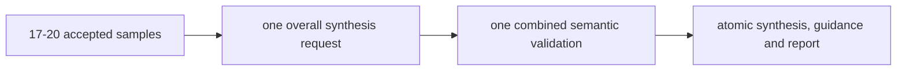
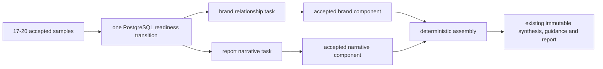

# Design: Evaluation Analysis Task Graph

## Review contract

This design owns the internal task topology, attempt identity, accepted-component
lifecycle, timing budget and progress projection for Issue #42. Issue #32 owns
per-sample interpretation; Issue #41 owns model-facing synthesis semantics and
customer quality; Issue #43 owns presentation. PostgreSQL remains business truth,
AI Execution remains technical attempt evidence, and BullMQ remains delivery.

Current baseline: `main@ddadf7718a6896c5682603be9ec87de77556a98d`.

## Current path and failure

One `AiSynthesisAttempt` is uniquely identified only by cycle and attempt number.
Its model output simultaneously owns brand grouping, assessment, perception,
themes, customer directions and internal guidance. A failure in any one concern
retries the whole request, and one accepted concern cannot survive another
concern's retry.

## Alternatives

| Option | Quality locality | Latency/retry | Persistence cost | Result |
| --- | --- | --- | --- | --- |
| Keep one broad synthesis | Low: one failure rejects unrelated work | One call when lucky; repeated 180s failures already observed | None | Reject: controlled Prompt 4.0 evidence disproved reliability |
| Parallel brand relationship + report narrative | High: two stable semantic owners | Two calls overlap; only failed task retries | One task-kind migration and one accepted-component table | Select |
| Sequential evidence analysis then report writing | Medium: separates grounding and prose | Two serial calls plus another broad intermediate contract | New generic analysis artifact and dependency | Defer: no evidence that the extra serial stage is necessary |

The selected option is the smallest split that follows the observed fault line.
It does not create a general Agent graph or reusable workflow DSL.

## Selected path

### Task contracts

| Task | Input | Model output | Program-owned validation | Must not own |
| --- | --- | --- | --- | --- |
| Brand relationship | Compact candidates with request-local IDs, observed forms and adjacent answer context | Every candidate exactly once in one merge group or an independent set, plus evidence-sized relationship rationale | Candidate coverage, uniqueness, local-reference resolution, uncertain-name independence | Metrics, themes, directions, external brand research or customer report prose |
| Report narrative | Frozen brand context, deterministic metric statements and compact accepted sample observations with local references | Assessment, perception, positive/negative themes, customer directions, internal guidance and limitations | Metric immutability, reference resolution, count/coverage consistency and final public-copy boundary | Brand identity grouping, sample mention/position, queue state or final metric calculation |

The two model outputs are not public contracts. #41 owns their exact Prompt and
Schema after this topology is approved. The canonical
`evaluation.overall-synthesis@1` report meaning remains stable: deterministic
assembly combines the accepted components into its current public shape.

## Ownership and dependency direction

- GEO Intelligence creates task facts, validates semantic results, retains
  accepted components and atomically creates the final report.
- AI Execution stores append-oriented transport, Provider, usage, latency and
  semantic-rejection evidence for a named task attempt.
- Background Work relays stable task identifiers. Redis state cannot decide
  whether a component or report exists.
- #41 may deepen the two model-facing contracts but cannot create queues,
  calculate metrics or change durable progress.
- #43 receives only the server-owned progress projection and cannot infer work
  from timers or BullMQ.

## Persistence and invariants

### Attempt identity

Add `taskKind` to `AiSynthesisAttempt` with values equivalent to
`LEGACY_OVERALL`, `BRAND_RELATIONSHIP` and `REPORT_NARRATIVE`. Existing rows and
the schema-aware compatibility path use `LEGACY_OVERALL`. The split path requires
uniqueness on `(cycleId, taskKind, attemptNumber)` instead of the legacy
`(cycleId, attemptNumber)` key.

### Accepted component

Add one GEO-owned `EvaluationSynthesisComponent` with:

- run, originating cycle and task kind;
- accepted attempt;
- input fingerprint;
- semantic contract version and accepted payload;
- optional final synthesis link and accepted time.

The run/task kind is unique. The input fingerprint covers the immutable
definition, ordered accepted interpretation identities and relevant contract
versions. A component is reusable across a synthesis-only retry only when that
fingerprint and decoder remain valid.

The final `EvaluationSynthesis` keeps its existing immutable payload and uses the
accepted report-narrative attempt as its primary attempt for backward
compatibility. The two component rows provide complete contribution provenance
and are linked to the final synthesis in the same transaction that creates
guidance, report, terminal run state and notification Outbox work.

### Completion

- Neither component alone can create a report or change customer metrics.
- Repeated task delivery returns the same started, terminal or accepted state.
- The first accepted result for a run/task kind wins; late results cannot replace
  it.
- Assembly is idempotent and requires both supported components for the same
  input fingerprint.
- Existing legacy accepted syntheses and reports remain readable without new
  component rows.

## Failure and retry

- Each task owns its own numbered attempt sequence and route budget.
- A Provider-successful but semantically rejected task attempt is recorded before
  scheduling the next attempt for that task only.
- If one task succeeds and the other exhausts, the accepted component remains;
  the run becomes `PLEASE_RETRY/SYNTHESIS_EXHAUSTED` with the failed task kind in
  protected failure state.
- A customer synthesis retry reuses the accepted component and schedules only
  the missing task when its fingerprint/contract remains supported.
- An ambiguous interruption follows the existing started-at deadline and cannot
  issue a concurrent duplicate request.

## Queue and concurrency

Reuse the current Product Outbox and `geoeval-product` queue. Readiness appends
two task-specific Outbox events in one database transaction; the existing Worker
may execute them concurrently under its current local concurrency of five.

Do not adopt `FlowProducer`: BullMQ parent/child state and job-return values would
duplicate the accepted-component lifecycle already owned by PostgreSQL. Do not
create separate purpose queues or a paid BullMQ Pro grouping boundary without
observed limiter pressure.

Phase B should set the existing queue's global concurrency to five so several
Worker processes cannot exceed the reviewed aggregate delivery concurrency.
Provider-call ceilings and retries remain task policy in GEO/AI Execution. Add a
queue-wide rate limiter or separate purpose queue only after a named 429/quota
observation shows the current shared ceiling is insufficient; BullMQ 6.2.1 does
not provide open-source per-group limiting in its installed Worker option.

## Timing and progress facts

Persist or derive these timestamps from PostgreSQL attempt/component/report
records:

- Outbox created and Provider attempt started: queue wait;
- attempt started/finished: Provider latency;
- Provider finish to component acceptance: projection/validation latency;
- both components accepted to report accepted: deterministic assembly latency;
- failed attempts and task kind: retry cost.

For each platform, the customer-safe projection uses durable sample state:

- `expected`: fixed question positions, normally four;
- `acquired`: canonical answers accepted;
- `analyzed`: positions whose interpretation is accepted or terminally
  unavailable;
- `available`: accepted interpretations included in report eligibility.

The overall stage is derived from durable question preparation, acquisition,
interpretation, the two synthesis components and report acceptance. Internal
task names, Provider, retries, queue and failures remain protected. #43 may ease
visual progress only inside the current stage and never advance these counts.

## Migration and rollback

- Add the component table and `taskKind` with a legacy default/backfill first;
  keep the old unique index while only legacy writes are enabled.
- Deploy schema-aware code that can read both modes, then replace the old unique
  index immediately before split activation.
- Rehearse migration against representative legacy attempts, syntheses and
  reports; prove old reads and retry remain intact.
- Runtime rollback uses the schema-aware legacy single-task mode; do not redeploy
  a pre-migration binary after parallel task attempts may exist. The component
  table is ignored in legacy mode and no accepted report is rewritten.
- Do not remove the legacy path until one controlled split comparison and the
  final #39 Gate pass. Later removal is a separate cleanup decision.

## Verification plan

1. Contract tests for each task and deterministic assembly.
2. Integration tests for parallel completion in both orders, one-task retry,
   one-task exhaustion, crash recovery, duplicate delivery, late result and
   synthesis-only retry reuse.
3. Migration rehearsal with legacy rows and rollback-compatible old reads.
4. Timing/progress contract tests from real database state.
5. Separately authorized controlled Y02/Y03 semantic probes under #41.
6. Separately authorized same-store 4x5 comparison under #42/#39.

Phase A stops after this design, delta specs, source evidence and fixed review
are approved and merged as a Partial PR.
